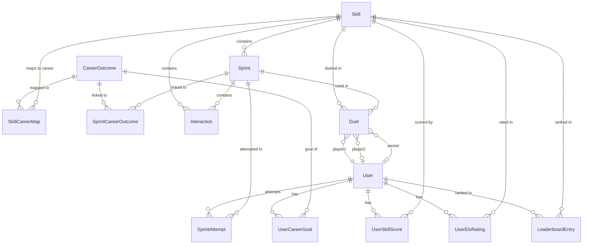

# Praxel Arena - Full Build Plan

> Learn. Practice. Compete. Credential.
> A skill credentialing platform for business professionals powered by Claude AI.

## Overview

Praxel Arena is a mobile-first web app where business professionals **learn** skills through micro-interactions, **practice** with adaptive challenges, and **compete** in head-to-head duels to build a public **Skill Graph** that replaces the college credential.

**Core inspiration:** Uxcel's skill graph + Matiks' competitive duels + Quantic's micro-interaction pedagogy -- for business skills.

**Build timeline:** 6 days (Feb 11-16, 2026), solo developer + Claude Code agent army.

---

## Critical Research Findings (Stack Corrections)

Research revealed **several breaking changes** from the original build document. These MUST be addressed before implementation begins.

### 1. Next.js 16 Breaking Changes (VERIFIED)

| Original Assumption | Reality (Next.js 16.1.x) |
|---|---|
| `middleware.ts` for auth | **DEPRECATED.** Rename to `proxy.ts`, export as `proxy` function |
| `params` are sync | **ALL `params`, `searchParams` are now async** -- must `await` everywhere |
| `cookies()`, `headers()` sync | **Now async** -- must `await` them |
| Turbopack via experimental flag | **Turbopack is the default bundler.** Config is top-level `turbopack: {}` in `next.config.ts` |
| `tailwind.config.ts` | **Tailwind v4 is likely default** -- uses CSS-based config (`@import "tailwindcss"` in globals.css) instead of JS config |
| React 18/19 | **React 19.2** ships with Next.js 16 -- includes View Transitions, `useEffectEvent()`, `<Activity />` |
| `next lint` available | **Removed.** Use ESLint or Biome directly |
| Node 18 supported | **Node 20.9+ required** |

### 2. Prisma Has Changed Significantly (VERIFIED via Context7)

| Original Assumption | Reality (Prisma 6.x) |
|---|---|
| `generator client { provider = "prisma-client-js" }` | **Now `prisma-client`** with `output` directive: `output = "../app/generated/prisma"` |
| Direct Prisma client | **Now uses `PrismaPg` adapter**: `import { PrismaPg } from '@prisma/adapter-pg'` |
| Seed in `package.json` | **Now configured in `prisma.config.ts`**: `seed: 'tsx prisma/seed.ts'` |
| Import from `@prisma/client` | **Import from generated path**: `from '../app/generated/prisma/client'` |
| `prisma.ts` singleton pattern | **Updated pattern** with PrismaPg adapter + globalThis caching |

### 3. Framer Motion Rebranded (VERIFIED)

| Original Assumption | Reality |
|---|---|
| `npm install framer-motion` | **`npm install motion`** |
| `import { motion } from 'framer-motion'` | **`import { motion } from 'motion/react'`** |
| `framer-motion` package still works but redirects | Use `motion/react` for new projects |

### 4. Clerk + Tailwind v4

| Original Assumption | Reality |
|---|---|
| Standard ClerkProvider | **Add `cssLayerName: 'clerk'`** for Tailwind v4 compatibility |
| `middleware.ts` | **Verify Clerk supports `proxy.ts`** -- may need to keep `middleware.ts` until Clerk updates |

### 5. shadcn/ui CLI

| Original Assumption | Reality |
|---|---|
| `npx shadcn-ui@latest init` | **`npx shadcn@latest init`** (old package name deprecated) |
| Tailwind v3 config | Handles Tailwind v4 automatically |

---

## Corrected Tech Stack

| Layer | Tool | Version to Verify |
|---|---|---|
| Framework | Next.js 16 (App Router) | `npm view next version` |
| Styling | Tailwind CSS v4 + shadcn/ui | `npx shadcn@latest init` |
| Animation | motion (formerly Framer Motion) | `npm install motion` |
| Auth | Clerk (@clerk/nextjs) | Check proxy.ts support |
| Database | PostgreSQL on Railway | Railway CLI |
| ORM | Prisma 6.x | `npm view prisma version` |
| Charts | Recharts | v2.x or 3.x |
| AI | Claude Opus 4.6 API | `@anthropic-ai/sdk` |
| Hosting | Railway | Nixpacks or Dockerfile |

---

## Corrected File Structure

Key changes from original:

```
praxel-arena/
+-- CLAUDE.md                          # Project Bible
+-- prisma.config.ts                   # NEW: Prisma 6 config file
+-- proxy.ts                           # RENAMED from middleware.ts
+-- prisma/
|   +-- schema.prisma                  # Updated generator config
|   +-- seed.ts
|   +-- migrations/
+-- app/
|   +-- generated/
|   |   +-- prisma/                    # NEW: Prisma client output dir
|   +-- layout.tsx                     # ClerkProvider with cssLayerName
|   +-- page.tsx                       # Landing page
|   +-- globals.css                    # Tailwind v4: @import "tailwindcss"
|   +-- (auth)/
|   |   +-- sign-in/[[...sign-in]]/page.tsx
|   |   +-- sign-up/[[...sign-up]]/page.tsx
|   +-- onboarding/
|   |   +-- page.tsx
|   +-- learn/
|   |   +-- page.tsx
|   |   +-- [skillSlug]/
|   |       +-- [sprintId]/page.tsx    # async params: await params
|   +-- practice/
|   |   +-- page.tsx
|   |   +-- [skillSlug]/
|   |       +-- [sprintId]/page.tsx
|   +-- compete/
|   |   +-- page.tsx
|   |   +-- [duelId]/page.tsx
|   +-- results/
|   |   +-- [attemptId]/page.tsx
|   +-- profile/
|   |   +-- page.tsx
|   |   +-- [userId]/page.tsx
|   +-- leaderboard/
|   |   +-- page.tsx
|   +-- api/
|       +-- sprints/
|       |   +-- route.ts
|       |   +-- generate/route.ts
|       +-- evaluate/
|       |   +-- route.ts
|       +-- duels/
|       |   +-- route.ts
|       |   +-- [duelId]/route.ts
|       +-- skills/
|       |   +-- route.ts
|       +-- leaderboard/
|       |   +-- route.ts
|       +-- profile/
|       |   +-- route.ts
|       +-- webhooks/
|           +-- clerk/route.ts
+-- components/
|   +-- interactions/
|   |   +-- SpotTheSignal.tsx
|   |   +-- ForcedTradeoff.tsx
|   |   +-- FillTheGap.tsx
|   |   +-- RankAndPrioritize.tsx
|   |   +-- Curveball.tsx
|   |   +-- TeachAndTest.tsx
|   |   +-- SprintRunner.tsx
|   |   +-- InteractionCard.tsx
|   |   +-- ProgressBar.tsx
|   +-- skill-graph/
|   |   +-- RadarChart.tsx
|   |   +-- SkillCard.tsx
|   |   +-- CareerMatchBar.tsx
|   +-- arena/
|   |   +-- DuelCard.tsx
|   |   +-- EloDisplay.tsx
|   |   +-- MatchResult.tsx
|   |   +-- Leaderboard.tsx
|   +-- onboarding/
|   |   +-- CareerSelector.tsx
|   |   +-- SkillAssessment.tsx
|   +-- layout/
|       +-- Navbar.tsx
|       +-- BottomNav.tsx
|       +-- ModeSelector.tsx
|       +-- SkillPicker.tsx
+-- lib/
|   +-- db.ts                          # Updated Prisma singleton with PrismaPg
|   +-- ai/
|   |   +-- client.ts
|   |   +-- prompts/
|   |   |   +-- learn-sprint.ts
|   |   |   +-- practice-sprint.ts
|   |   |   +-- compete-sprint.ts
|   |   |   +-- evaluate-attempt.ts
|   |   |   +-- evaluate-duel.ts
|   |   |   +-- adaptive-assess.ts
|   |   +-- generate.ts
|   +-- scoring/
|   |   +-- dimensions.ts
|   |   +-- evaluate.ts
|   |   +-- elo.ts
|   +-- content/
|   |   +-- static-sprints.ts
|   +-- utils/
|       +-- cn.ts
|       +-- constants.ts
+-- types/
|   +-- index.ts
+-- public/
|   +-- manifest.json
|   +-- icons/
+-- next.config.ts                     # output: 'standalone', top-level turbopack
+-- package.json
+-- Dockerfile
+-- docker-compose.yml
```

---

## Corrected Prisma Schema

```prisma
// prisma/schema.prisma

generator client {
  provider = "prisma-client"
  output   = "../app/generated/prisma"
}

datasource db {
  provider  = "postgresql"
  url       = env("DATABASE_URL")
  directUrl = env("DIRECT_URL")  // Railway pooled vs direct
}

// ... rest of schema unchanged from build doc
```

### New: prisma.config.ts

```typescript
// prisma.config.ts (project root)
import 'dotenv/config';
import { defineConfig, env } from 'prisma/config';

export default defineConfig({
  schema: 'prisma/schema.prisma',
  migrations: {
    path: 'prisma/migrations',
    seed: 'tsx prisma/seed.ts',
  },
  datasource: {
    url: env('DATABASE_URL'),
  },
});
```

### Updated Prisma Singleton

```typescript
// lib/db.ts
import { PrismaClient } from '../app/generated/prisma/client';
import { PrismaPg } from '@prisma/adapter-pg';

const adapter = new PrismaPg({
  connectionString: process.env.DATABASE_URL!,
});

const globalForPrisma = globalThis as unknown as {
  prisma: PrismaClient;
};

export const prisma =
  globalForPrisma.prisma ??
  new PrismaClient({ adapter });

if (process.env.NODE_ENV !== 'production') {
  globalForPrisma.prisma = prisma;
}
```

---

## Corrected Key Patterns

### proxy.ts (replaces middleware.ts)

```typescript
// proxy.ts (project root)
import { clerkMiddleware, createRouteMatcher } from '@clerk/nextjs/server';

const isPublicRoute = createRouteMatcher([
  '/',
  '/sign-in(.*)',
  '/sign-up(.*)',
  '/profile/(.*)',
  '/leaderboard(.*)',
  '/api/webhooks(.*)',
]);

// NOTE: If Clerk doesn't support proxy.ts yet, rename this file
// back to middleware.ts and use the standard export default pattern.
export default clerkMiddleware(async (auth, request) => {
  if (!isPublicRoute(request)) {
    await auth.protect();
  }
});

export const config = {
  matcher: [
    '/((?!_next|[^?]*\\.(?:html?|css|js(?!on)|jpe?g|webp|png|gif|svg|ttf|woff2?|ico|csv|docx?|xlsx?|zip|webmanifest)).*)',
    '/(api|trpc)(.*)',
  ],
};
```

### Root Layout with Clerk + Tailwind v4

```tsx
// app/layout.tsx
import { ClerkProvider } from '@clerk/nextjs';
import type { Metadata } from 'next';
import './globals.css';

export const metadata: Metadata = {
  title: 'Praxel Arena',
  description: 'Learn. Practice. Compete. Credential.',
};

export default function RootLayout({
  children,
}: {
  children: React.ReactNode;
}) {
  return (
    <ClerkProvider
      appearance={{
        cssLayerName: 'clerk', // Required for Tailwind v4
      }}
    >
      <html lang="en" className="dark">
        <body>{children}</body>
      </html>
    </ClerkProvider>
  );
}
```

### Async Params Pattern (Next.js 16)

```tsx
// app/learn/[skillSlug]/[sprintId]/page.tsx
export default async function SprintPage({
  params,
}: {
  params: Promise<{ skillSlug: string; sprintId: string }>;
}) {
  const { skillSlug, sprintId } = await params; // MUST await in Next.js 16
  // ...
}
```

### Motion (formerly Framer Motion) Imports

```tsx
'use client';
import { motion, AnimatePresence } from 'motion/react';
// NOT 'framer-motion'
```

### Claude API Client

```typescript
// lib/ai/client.ts
import Anthropic from '@anthropic-ai/sdk';

export const anthropic = new Anthropic({
  apiKey: process.env.ANTHROPIC_API_KEY,
});

// For sprint generation (non-streaming, need full JSON)
export async function generateJSON(systemPrompt: string, userPrompt: string) {
  const message = await anthropic.messages.create({
    model: 'claude-opus-4-6',
    max_tokens: 4096,
    messages: [{ role: 'user', content: userPrompt }],
    system: systemPrompt,
  });

  const text = message.content
    .filter((block) => block.type === 'text')
    .map((block) => block.text)
    .join('');

  return JSON.parse(text);
}
```

---

## Spec Gap Analysis

The following gaps were identified in the original specification. Each needs a decision before or during implementation.

### Critical Gaps (Must Decide Before Building)

| # | Gap | Recommendation |
|---|---|---|
| 1 | **Onboarding skip**: What if user closes browser during onboarding? | Store `onboardingComplete: Boolean` on User model. Redirect incomplete users from all routes to `/onboarding`. |
| 2 | **Sprint abandonment**: What if user quits mid-sprint? | Save partial SprintAttempt with `completedAt: null`. Allow resume from last interaction. Show abandoned attempts in profile as "incomplete". |
| 3 | **Duel timeout**: What if opponent never joins? | Auto-cancel duels after 15 minutes. Show "No opponent found" message. Offer to try again or switch to Practice mode. |
| 4 | **Duel one-sided completion**: What if Player 1 finishes but Player 2 doesn't? | 30-minute timeout after both players join. If one player doesn't complete, the other wins by forfeit. No Elo change on forfeit (prevents abuse). |
| 5 | **AI JSON reliability**: What if Claude returns invalid JSON? | Wrap `JSON.parse()` in try/catch with 2 retries. On 3rd failure, fall back to a static sprint from the pool. Log failures for monitoring. |
| 6 | **All LEARN sprints completed**: What happens when user finishes all static sprints for a skill? | Show "All sprints completed" badge. Suggest switching to Practice mode. Future: generate fresh LEARN sprints via AI. |
| 7 | **Duel async vs sync**: Must both players be online simultaneously? | **Async duels** for hackathon MVP. Player 1 creates duel + completes sprint. Player 2 joins later, completes same sprint. AI evaluates when both are done. Much simpler than real-time sync. |

### Data Model Fixes

| # | Issue | Fix |
|---|---|---|
| 1 | `Duel.player1Attempt` and `player2Attempt` are `String?` instead of relations | Keep as String? for simplicity. Add a helper function to fetch the actual SprintAttempt. Proper relations would create circular complexity. |
| 2 | No `onboardingComplete` field on User | Add `onboardingComplete Boolean @default(false)` to User model |
| 3 | No index on `SprintAttempt.userId` for "my attempts" queries | Add `@@index([userId, completedAt])` |
| 4 | No way to differentiate static vs AI-generated sprints in queries | `Sprint.isGenerated` already exists. Use `where: { isGenerated: false }` for static pool queries. |
| 5 | No `description` on CareerOutcome | Add `description String @default("")` |

### Edge Cases to Handle

| Scenario | Handling |
|---|---|
| User with 0 completed sprints visits profile | Show empty radar chart with "Complete your first sprint to see your Skill Graph" CTA |
| Two users with 400+ Elo difference in duel | Matchmaking: expand range from 200 to 400 after 60s waiting, then allow any match after 120s |
| Rate limiting on AI sprint generation | Client-side: disable "Create Duel" button for 5s after creation. Server-side: rate limit to 5 sprint generations per user per hour. |
| User tries Compete without any Practice | Allow it. The Elo system self-corrects. Beginners start at 1200 and will lose early matches, finding their level naturally. |
| Leaderboard minimum matches | Show all users. Add "Provisional" badge for users with < 10 matches. Sort provisional users below established ones at same Elo. |

---

## Implementation Phases

### Phase 0: Pre-Work (Tonight, Feb 11) -- YOU, Manually

**Duration:** 3-4 hours

#### Step 0.1: Project Scaffolding (30 min)

```bash
# Create project
npx create-next-app@latest praxel-arena --typescript --tailwind --app --src=false

cd praxel-arena

# Verify Next.js version
npm view next version  # Should be 16.x

# Install core dependencies
npm install @clerk/nextjs @prisma/client @anthropic-ai/sdk motion recharts svix swr
npm install -D prisma tsx @types/node

# Install shadcn/ui
npx shadcn@latest init
npx shadcn@latest add button card badge progress tabs avatar dialog

# Initialize Prisma
npx prisma init --datasource-provider postgresql
```

#### Step 0.2: Verify Stack Versions

```bash
# Run ALL of these and note versions:
npm view next version
npm view @clerk/nextjs version
npm view prisma version
npm view motion version
npm view recharts version
npm view @anthropic-ai/sdk version
```

**Decision point:** If Prisma is v7, check upgrade guide. If `@clerk/nextjs` doesn't mention `proxy.ts`, keep using `middleware.ts`.

#### Step 0.3: CLAUDE.md + Schema + Config (30 min)

1. Write `CLAUDE.md` (Project Bible from build doc, updated with corrections above)
2. Write `prisma/schema.prisma` (updated generator config)
3. Write `prisma.config.ts`
4. Write `proxy.ts` (or `middleware.ts` if Clerk doesn't support it)

#### Step 0.4: External Services (20 min)

1. Railway: create project + PostgreSQL, get `DATABASE_URL` and `DIRECT_URL`
2. Clerk: create project, get keys, set redirect URLs
3. Claude API key (from hackathon credits)
4. Set up `.env.local`

#### Step 0.5: AI Prompt Templates (2 hours)

Write all 6 prompt templates in `lib/ai/prompts/`:
- `compete-sprint.ts` -- (template provided in build doc)
- `learn-sprint.ts` -- include teaching preambles
- `practice-sprint.ts` -- harder, no teaching
- `evaluate-attempt.ts` -- score across 6 dimensions
- `evaluate-duel.ts` -- head-to-head comparison
- `adaptive-assess.ts` -- initial skill assessment

#### Step 0.6: Pre-Generate Static Content (1-2 hours)

For 3 launch skills (Guesstimation, GTM Strategy, Prioritization):
- 2 LEARN sprints each (8 interactions with teaching preambles) = 6 sprints
- 5 PRACTICE interactions per type per skill (30 per skill) = 90 interactions
- Store as `prisma/seed-data/` JSON files

#### Step 0.7: Migrate + Seed + Scaffold

```bash
npx prisma migrate dev --name init
npx prisma db seed

# Create all placeholder files
# (script to create empty files for every path in file structure)

git init && git add . && git commit -m "scaffolding complete"
git remote add origin <github-url>
git push -u origin main
```

### Phase 1: Agent Army Build (Feb 12) -- 5 Parallel Agents

**Goal:** Each agent builds their domain independently.

#### Agent 1: INTERACTION-ENGINE

**Files:** `components/interactions/*`

**Deliverables:**
- [ ] `InteractionCard.tsx` -- Base card wrapper with motion enter/exit animations (slide left on answer, slide in from right for next)
- [ ] `SpotTheSignal.tsx` -- Show data/metrics, 4 tappable option buttons, 10s target
- [ ] `ForcedTradeoff.tsx` -- Strategic choice with 2-4 options, explain tradeoffs, 15-20s target
- [ ] `FillTheGap.tsx` -- Fill-in-blank with 4 options, 10s target
- [ ] `RankAndPrioritize.tsx` -- Drag-to-reorder 4 items, touch-friendly drag handles, 15-25s target
- [ ] `Curveball.tsx` -- Same as ForcedTradeoff but with `priorContext` banner showing what changed
- [ ] `TeachAndTest.tsx` -- Teaching preamble (2-3 sentences) + then a test interaction
- [ ] `SprintRunner.tsx` -- Orchestrates 8-card sequence, manages state, collects responses + timing, handles completion
- [ ] `ProgressBar.tsx` -- Top bar showing current/total interactions + elapsed timer

**Constraints:**
- All components must be `'use client'`
- Import from `motion/react`, NOT `framer-motion`
- 375px min width, 44px min touch targets
- Card transitions: spring physics (`stiffness: 300, damping: 20`), < 200ms feel
- RankAndPrioritize: use HTML5 drag or @dnd-kit/sortable (simpler for touch)

#### Agent 2: AI-ENGINE

**Files:** `lib/ai/*`, `lib/scoring/*`

**Deliverables:**
- [ ] `lib/ai/client.ts` -- Anthropic SDK client singleton, `generateJSON()` helper with retry logic
- [ ] `lib/ai/generate.ts` -- Sprint generation orchestrator: LEARN/PRACTICE load from DB, COMPETE calls Claude API
- [ ] `lib/scoring/dimensions.ts` -- 6 scoring dimensions definition + types
- [ ] `lib/scoring/evaluate.ts` -- Takes SprintAttempt responses + sprint interactions, returns dimensional scores (0-100 each). For LEARN/PRACTICE: deterministic scoring based on correctAnswer/insightAnswer. For COMPETE: calls Claude API for nuanced evaluation
- [ ] `lib/scoring/elo.ts` -- Elo calculator (K=32 for < 20 matches, K=16 after, floor at 100)
- [ ] JSON validation wrapper -- Validate AI-generated sprint JSON against expected schema before returning

**Constraints:**
- Use `claude-opus-4-6` for sprint generation (quality matters for credentialing)
- Use `claude-sonnet-4-5-20250929` for evaluation (faster, cheaper, still good)
- Max 2 retries on JSON parse failure, then fall back to static pool
- All AI calls must happen server-side only (API routes or server components)

#### Agent 3: DATA-BACKEND

**Files:** `prisma/*`, `app/api/*`, `lib/db.ts`

**Deliverables:**
- [ ] `lib/db.ts` -- Prisma singleton with PrismaPg adapter
- [ ] `prisma/seed.ts` -- Seeds skills, careers, mappings, and static sprint content
- [ ] `GET /api/skills` -- All skills with career mappings
- [ ] `GET /api/sprints?skillSlug=X&mode=LEARN` -- Fetch sprints by skill + mode
- [ ] `POST /api/sprints/generate` -- Generate compete sprint via AI-ENGINE
- [ ] `POST /api/evaluate` -- Evaluate sprint attempt, update scores + Elo
- [ ] `POST /api/duels` -- Create or join duel (matchmaking within 200 Elo, expand to 400 after 60s)
- [ ] `GET /api/duels/[duelId]` -- Duel status (for polling)
- [ ] `GET /api/leaderboard?skillSlug=X` -- Leaderboard by skill, sorted by Elo desc
- [ ] `GET /api/profile` -- Own profile with skill scores + Elo + career match %
- [ ] `GET /api/profile/[userId]` -- Public profile
- [ ] `POST /api/webhooks/clerk` -- Clerk webhook for user sync (use `svix` for verification)

**Constraints:**
- All routes use `await auth()` from `@clerk/nextjs/server` for protection (except webhooks and public profile)
- All `await headers()` and `await params` (Next.js 16 async requirement)
- Rate limit sprint generation: 5/user/hour

#### Agent 4: SKILLGRAPH-PROFILE

**Files:** `components/skill-graph/*`, `components/arena/*`, `app/profile/*`, `app/leaderboard/*`

**Deliverables:**
- [ ] `RadarChart.tsx` -- Recharts RadarChart with 6 axes (scoring dimensions), gradient fill, animated transitions
- [ ] `SkillCard.tsx` -- Individual skill score display (name, icon, score bar, Elo rating)
- [ ] `CareerMatchBar.tsx` -- "85% match for Product Management" progress bar
- [ ] `EloDisplay.tsx` -- Animated number with green (up) / red (down) indicators
- [ ] `MatchResult.tsx` -- Head-to-head comparison: two radar charts side by side, per-dimension winner indicators
- [ ] `Leaderboard.tsx` -- Table with rank, avatar, name, Elo, matches. SWR polling every 5s
- [ ] `DuelCard.tsx` -- Card for duel lobby showing skill, Elo range, status
- [ ] `app/profile/page.tsx` -- Own profile: radar chart + per-skill Elo + career match %
- [ ] `app/profile/[userId]/page.tsx` -- Public profile (same layout, read-only)
- [ ] `app/leaderboard/page.tsx` -- Filterable by skill, with tabs

**Constraints:**
- All Recharts components must be `'use client'`
- RadarChart: domain [0, 100], use `fillOpacity={0.6}` with brand color gradient
- EloDisplay: use `motion/react` for counting animation
- Leaderboard: use SWR with `refreshInterval: 5000`

#### Agent 5: PAGES-FLOWS

**Files:** `app/layout.tsx`, `app/page.tsx`, `app/onboarding/*`, `app/learn/*`, `app/practice/*`, `app/compete/*`, `app/results/*`, `components/layout/*`, `components/onboarding/*`

**Deliverables:**
- [ ] `app/layout.tsx` -- Root layout with ClerkProvider (dark theme, `cssLayerName: 'clerk'`)
- [ ] `app/page.tsx` -- Landing page with CTA to sign up
- [ ] `app/(auth)/sign-in/[[...sign-in]]/page.tsx` -- Clerk SignIn component
- [ ] `app/(auth)/sign-up/[[...sign-up]]/page.tsx` -- Clerk SignUp component
- [ ] `components/layout/Navbar.tsx` -- Top bar with logo + UserButton
- [ ] `components/layout/BottomNav.tsx` -- Mobile bottom tab bar (Learn, Practice, Compete, Profile icons)
- [ ] `components/layout/ModeSelector.tsx` -- Learn/Practice/Compete tabs
- [ ] `components/layout/SkillPicker.tsx` -- Grid of skill cards for selection
- [ ] `components/onboarding/CareerSelector.tsx` -- Pick 1-3 career goals (card-based selection)
- [ ] `app/onboarding/page.tsx` -- Onboarding flow: career goals -> skill recommendations -> start first sprint
- [ ] `app/learn/page.tsx` -- Skill grid -> select -> see LEARN sprints -> start
- [ ] `app/learn/[skillSlug]/[sprintId]/page.tsx` -- SprintRunner in LEARN mode (async params!)
- [ ] `app/practice/page.tsx` -- Same pattern for PRACTICE
- [ ] `app/practice/[skillSlug]/[sprintId]/page.tsx` -- SprintRunner in PRACTICE mode
- [ ] `app/compete/page.tsx` -- Duel lobby: create or join duels
- [ ] `app/compete/[duelId]/page.tsx` -- Duel SprintRunner
- [ ] `app/results/[attemptId]/page.tsx` -- Score reveal + debrief + updated skill graph
- [ ] `proxy.ts` -- Clerk auth middleware (or `middleware.ts` if proxy not supported)

**Constraints:**
- Mobile-first: 375px min, bottom nav for mobile, hide on desktop or show sidebar
- Dark mode default: `className="dark"` on `<html>`
- No hover-dependent interactions
- viewport meta: `maximum-scale=1, user-scalable=no`
- Onboarding must redirect incomplete users (check `onboardingComplete` flag)

### Phase 2: Integration (Feb 13)

**Goal:** Wire everything end-to-end. Learn mode works fully by EOD.

**Priority order:**
1. PAGES-FLOWS wires Learn mode: Onboarding -> Skill selection -> Static sprint from DB -> SprintRunner (from INTERACTION-ENGINE) -> Evaluate (from AI-ENGINE) -> Results page
2. DATA-BACKEND + AI-ENGINE: Verify `GET /api/sprints` returns Sprint format that SprintRunner consumes
3. INTERACTION-ENGINE: Fix any integration issues discovered
4. Test full flow: Sign up via Clerk -> Onboarding -> Complete LEARN sprint -> See scores

**Integration test checklist:**
- [ ] Clerk signup creates user in Postgres via webhook
- [ ] Onboarding saves career goals to DB
- [ ] Skill picker loads skills from API
- [ ] Sprint loads interactions in correct order
- [ ] SprintRunner collects all 8 responses with timing
- [ ] Evaluation returns 6-dimension scores
- [ ] Results page renders radar chart with scores
- [ ] Profile page shows updated skill scores

### Phase 3: Practice + Compete + Skill Graph (Feb 14)

**Goal:** All three modes working. Duels functional.

**Tasks:**
- [ ] Practice mode: Same as Learn minus teaching preambles, adaptive difficulty selection, AI debrief at end
- [ ] Compete mode: AI generates fresh sprint, duel creation/joining, async completion, AI head-to-head evaluation, Elo update
- [ ] Skill Graph: RadarChart renders on profile, updates after each attempt
- [ ] Leaderboard: Per-skill rankings with polling
- [ ] Public profile: Shareable link works

### Phase 4: Polish (Feb 15)

**Goal:** Delightful UX. Hackathon-winning feel.

**Animation polish:**
- [ ] Card transitions: spring physics, Tinder-like swipe feel
- [ ] Score reveal: animated counting (0 -> actual score)
- [ ] Elo change: green pulse (up) / red pulse (down)
- [ ] Correct answer: satisfying pulse animation on the option
- [ ] Radar chart: animated draw on first render
- [ ] Page transitions: React 19.2 View Transitions or motion AnimatePresence

**Onboarding polish:**
- [ ] Career selection feels like picking RPG class
- [ ] Skill recommendations animate in based on career choice
- [ ] First sprint starts within 60s of signup

**Mobile polish:**
- [ ] Test at 375px width
- [ ] Bottom nav feels native (active state, smooth transitions)
- [ ] Cards fill viewport
- [ ] No horizontal scroll anywhere
- [ ] Touch drag for RankAndPrioritize works smoothly

**Shareable profile:**
- [ ] OG image generation via Next.js ImageResponse API
- [ ] Shows: name, radar chart, top Elo ratings
- [ ] Works when shared on LinkedIn/Twitter

### Phase 5: Demo + Submit (Feb 16)

**Morning: Record 4-minute demo**

Script:
1. [0:00-0:15] THE PROBLEM -- "No LeetCode for business skills"
2. [0:15-0:45] ONBOARDING -- Sign up, pick PM career goal, see skills
3. [0:45-1:30] LEARN MODE -- Teaching chain, 30-second rhythm
4. [1:30-2:15] PRACTICE MODE -- Harder, AI debrief
5. [2:15-3:15] COMPETE MODE -- Live duel generation, head-to-head, Elo update
6. [3:15-3:45] SKILL GRAPH -- Profile radar, career match %, shareable link
7. [3:45-4:00] VISION -- "Praxel Arena. Where business skills become visible."

---

## Elo Rating Implementation

```typescript
// lib/scoring/elo.ts
export function calculateElo(
  winnerRating: number,
  loserRating: number,
  winnerMatches: number,
  loserMatches: number
): { winnerNew: number; loserNew: number; change: number } {
  const kWinner = winnerMatches < 20 ? 32 : 16;
  const kLoser = loserMatches < 20 ? 32 : 16;

  const expectedWinner =
    1 / (1 + Math.pow(10, (loserRating - winnerRating) / 400));
  const expectedLoser = 1 - expectedWinner;

  const change = Math.round(kWinner * (1 - expectedWinner));

  return {
    winnerNew: winnerRating + change,
    loserNew: Math.max(
      loserRating - Math.round(kLoser * expectedLoser),
      100 // Rating floor
    ),
    change,
  };
}
```

**Elo parameters:**
- Initial rating: 1200
- K-factor: 32 for first 20 matches (provisional), 16 after (established)
- Rating floor: 100 (prevent negative)
- Matchmaking range: 200 Elo initially, expand to 400 after 60s waiting

---

## Duel Matchmaking (Async Pattern)

```
1. Player 1 creates duel for Skill X
2. Server checks for waiting duels in Skill X within 200 Elo
   - Found: Join that duel. Generate sprint. Both players get same sprint.
   - Not found: Create new duel with status WAITING
3. Player 1 completes sprint (status: IN_PROGRESS -> player1 done)
4. Player 2 finds duel in lobby, joins
5. Player 2 completes same sprint
6. Both done -> status: EVALUATING
7. AI evaluates head-to-head -> updates Elo -> status: COMPLETED
```

**Timeout:** Auto-cancel WAITING duels after 15 minutes. For IN_PROGRESS, if one player hasn't completed after 30 minutes, the other wins by forfeit (no Elo change).

---

## Railway Deployment

### next.config.ts

```typescript
import type { NextConfig } from 'next';

const nextConfig: NextConfig = {
  output: 'standalone',
  turbopack: {},
};

export default nextConfig;
```

### Dockerfile

```dockerfile
FROM node:20-alpine AS base

FROM base AS deps
WORKDIR /app
COPY package.json package-lock.json* ./
COPY prisma ./prisma/
COPY prisma.config.ts ./
RUN npm ci

FROM base AS builder
WORKDIR /app
COPY --from=deps /app/node_modules ./node_modules
COPY . .
RUN npx prisma generate
RUN npm run build

FROM base AS runner
WORKDIR /app
ENV NODE_ENV=production
RUN addgroup --system --gid 1001 nodejs
RUN adduser --system --uid 1001 nextjs
COPY --from=builder /app/public ./public
COPY --from=builder /app/.next/standalone ./
COPY --from=builder /app/.next/static ./.next/static
COPY --from=builder /app/prisma ./prisma
COPY --from=builder /app/prisma.config.ts ./
USER nextjs
EXPOSE 3000
ENV PORT=3000
ENV HOSTNAME="0.0.0.0"
CMD ["node", "server.js"]
```

### package.json build script

```json
{
  "scripts": {
    "build": "prisma generate && prisma migrate deploy && next build",
    "start": "next start",
    "dev": "next dev --turbopack",
    "postinstall": "prisma generate"
  }
}
```

---

## Acceptance Criteria

### Functional Requirements

- [ ] User can sign up via Clerk (Google/GitHub social login)
- [ ] User completes onboarding (pick 1-3 career goals)
- [ ] User can complete LEARN sprints with teaching + testing
- [ ] User can complete PRACTICE sprints with AI debrief
- [ ] User can create/join duels and compete head-to-head
- [ ] AI generates unique sprint content for each duel
- [ ] Elo ratings update correctly after duels
- [ ] Skill Graph radar chart renders on profile
- [ ] Leaderboard shows per-skill rankings
- [ ] Public profile is shareable with OG image

### Non-Functional Requirements

- [ ] Mobile-first: works at 375px width
- [ ] 30-second rule: every screen requires interaction within 30s
- [ ] Card transitions feel snappy (< 200ms perceived)
- [ ] All touch targets >= 44px
- [ ] Dark mode default
- [ ] AI sprint generation < 10s
- [ ] Page loads < 2s on 4G

### Quality Gates

- [ ] Full Learn mode works end-to-end (by Feb 13 EOD)
- [ ] All three modes work (by Feb 14 EOD)
- [ ] Polish pass complete (by Feb 15 EOD)
- [ ] Demo recorded and submitted (by Feb 16)

---

## Risk Analysis & Mitigation

| Risk | Likelihood | Impact | Mitigation |
|---|---|---|---|
| Clerk doesn't support `proxy.ts` | Medium | Low | Keep `middleware.ts` -- still works, just deprecated |
| Prisma 6 adapter pattern breaks something | Medium | Medium | Fall back to standard PrismaClient without adapter if needed |
| AI-generated sprint JSON is invalid | High | High | 2 retries + static fallback pool. Validate schema before returning. |
| Railway build fails with new Prisma | Low | Medium | Use Dockerfile instead of Nixpacks for full control |
| Touch drag for RankAndPrioritize janky | Medium | Medium | Use @dnd-kit/sortable -- battle-tested touch drag library |
| Agent army creates conflicting code | High | High | CLAUDE.md defines file ownership. Pre-create all placeholder files. Shared contracts (API shapes) prevent interface mismatches. |
| 5-day timeline too ambitious | Medium | High | Prioritize: Learn mode is the MVP. Practice is P1. Compete is P2. Profile/Leaderboard are P3. Cut Compete if behind schedule. |

---

## ERD (Entity Relationship Diagram)



---

## Version Verification Commands

Run these FIRST before any implementation:

```bash
npm view next version          # Expected: 16.x
npm view @clerk/nextjs version # Note major version
npm view prisma version        # Expected: 6.x
npm view motion version        # Note import path
npm view recharts version      # Note API stability
npm view @anthropic-ai/sdk version
node --version                 # Must be 20.9+
```

---

## References

### Verified Documentation (fetched Feb 11, 2026)
- Next.js 16 release notes: confirms proxy.ts, async params, Turbopack default
- Prisma docs (Context7): confirms PrismaPg adapter, prisma.config.ts, new generator
- Clerk Next.js quickstart (Context7): confirms ClerkProvider pattern, cssLayerName for Tailwind v4
- Next.js v16.1.5 docs (Context7): confirms route handler patterns, segment config

### Stack-Specific Notes
- Motion (formerly Framer Motion): import from `motion/react`
- Tailwind v4: CSS-based config, `@import "tailwindcss"` instead of `@tailwind` directives
- Railway: use `output: 'standalone'` in next.config.ts for Dockerfile builds
