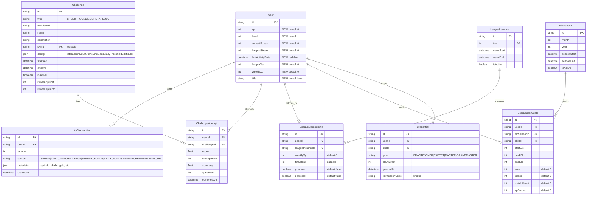

# feat: Add Gamification System

## Overview

Add a full gamification layer to Praxel Arena: XP currency, persistent streaks, timed challenges (speed rounds + score attacks), weekly XP leagues, monthly Elo seasons, and professional credentials. This transforms one-off sprint completion into a daily engagement habit with long-term progression goals.

**Dual currency model:** XP measures engagement (how much you play), Elo measures skill (how good you are). Each has its own leaderboard, progression system, and rewards.

## Problem Statement

Current engagement relies solely on Elo for competitive users. Casual users who complete LEARN/PRACTICE sprints have no progression beyond raw scores. No daily hooks (streaks), no social competition (leagues), no aspirational goals (credentials). The 30-second rule works within sprints but nothing brings users back tomorrow.

## Proposed Solution

Build all gamification systems upfront (schema, APIs, UI) as a single cohesive feature. The full schema is designed together to avoid migration debt, and all features integrate through the existing evaluate → scoring pipeline.

## Technical Approach

### Architecture

**Integration point:** All XP/streak/credential logic hooks into the existing `POST /api/evaluate` response. After a sprint attempt is created and skill scores updated, a new `processGamification()` function handles XP award, streak update, level check, credential check, and challenge progress -- all in a single Prisma transaction extension.

```
Sprint Complete → /api/evaluate → SprintAttempt + UserSkillScore (existing)
                                → processGamification() (new)
                                   ├── awardXp() → XpTransaction + User.xp update
                                   ├── updateStreak() → User.currentStreak update
                                   ├── checkLevelUp() → User.level update
                                   ├── checkCredentials() → Credential create (if threshold crossed)
                                   └── updateChallengeProgress() → ChallengeAttempt update
```

**Cron jobs:** Weekly league assignment (Mondays 00:00 UTC) and monthly season close (1st of month 00:00 UTC) use Next.js API routes triggered by Railway cron or Vercel cron.

### ERD (New + Modified Models)



### Implementation Phases

#### Phase 1: Schema + Core XP Engine

**Goal:** All database models created. XP awarded on sprint/duel completion. Levels calculated. No UI yet.

**Files:**

##### `prisma/schema.prisma` (modify)

Add new fields to `User` model and all new models from ERD above.

```prisma
// ─── Extend User model ─────────────────────────────────
model User {
  // ... existing fields ...

  // Gamification fields
  xp               Int      @default(0)
  level             Int      @default(1)
  currentStreak     Int      @default(0)
  longestStreak     Int      @default(0)
  lastActivityDate  DateTime?
  leagueTier        Int      @default(0)
  weeklyXp          Int      @default(0)
  title             String   @default("Intern")

  // New relations
  xpTransactions     XpTransaction[]
  challengeAttempts  ChallengeAttempt[]
  leagueMemberships  LeagueMembership[]
  seasonStats        UserSeasonStats[]
  credentials        Credential[]
}

// ─── Gamification Enums ────────────────────────────────

enum XpSource {
  SPRINT
  DUEL_WIN
  CHALLENGE
  STREAK_BONUS
  DAILY_BONUS
  LEAGUE_REWARD
  LEVEL_UP
}

enum ChallengeType {
  SPEED_ROUND
  SCORE_ATTACK
}

enum CredentialType {
  PRACTITIONER
  EXPERT
  MASTER
  GRANDMASTER
}

// ─── XP Transactions ──────────────────────────────────

model XpTransaction {
  id        String   @id @default(cuid())
  userId    String
  amount    Int
  source    XpSource
  metadata  Json?
  createdAt DateTime @default(now())

  user User @relation(fields: [userId], references: [id], onDelete: Cascade)

  @@index([userId, createdAt])
  @@index([userId, source])
}

// ─── Challenges ───────────────────────────────────────

model Challenge {
  id           String        @id @default(cuid())
  type         ChallengeType
  templateId   String
  name         String
  description  String
  skillId      String?
  config       Json          // { interactionCount, timeLimitMs, accuracyThreshold, difficulty }
  startsAt     DateTime
  endsAt       DateTime
  isActive     Boolean       @default(true)
  rewardXpFirst  Int         @default(250)
  rewardXpTenth  Int         @default(50)
  createdAt    DateTime      @default(now())

  skill    Skill?             @relation(fields: [skillId], references: [id], onDelete: SetNull)
  attempts ChallengeAttempt[]

  @@index([isActive, startsAt, endsAt])
  @@index([type, isActive])
}

model ChallengeAttempt {
  id          String   @id @default(cuid())
  userId      String
  challengeId String
  score       Float
  timeSpentMs Int
  accuracy    Float
  xpEarned    Int      @default(0)
  completedAt DateTime @default(now())

  user      User      @relation(fields: [userId], references: [id], onDelete: Cascade)
  challenge Challenge @relation(fields: [challengeId], references: [id], onDelete: Cascade)

  @@index([challengeId, score(sort: Desc)])
  @@index([challengeId, timeSpentMs(sort: Asc)])
  @@index([userId, challengeId])
}

// ─── Leagues ──────────────────────────────────────────

model LeagueInstance {
  id        String   @id @default(cuid())
  tier      Int
  weekStart DateTime
  weekEnd   DateTime
  isActive  Boolean  @default(true)
  createdAt DateTime @default(now())

  memberships LeagueMembership[]

  @@index([tier, isActive])
  @@index([weekStart, weekEnd])
}

model LeagueMembership {
  id               String   @id @default(cuid())
  userId           String
  leagueInstanceId String
  weeklyXp         Int      @default(0)
  finalRank        Int?
  promoted         Boolean  @default(false)
  demoted          Boolean  @default(false)
  createdAt        DateTime @default(now())

  user           User           @relation(fields: [userId], references: [id], onDelete: Cascade)
  leagueInstance LeagueInstance @relation(fields: [leagueInstanceId], references: [id], onDelete: Cascade)

  @@unique([userId, leagueInstanceId])
  @@index([leagueInstanceId, weeklyXp(sort: Desc)])
}

// ─── Elo Seasons ──────────────────────────────────────

model EloSeason {
  id          String   @id @default(cuid())
  month       Int
  year        Int
  seasonStart DateTime
  seasonEnd   DateTime
  isActive    Boolean  @default(true)
  createdAt   DateTime @default(now())

  stats UserSeasonStats[]

  @@unique([month, year])
  @@index([isActive])
}

model UserSeasonStats {
  id          String @id @default(cuid())
  userId      String
  eloSeasonId String
  skillId     String
  startElo    Int    @default(1200)
  peakElo     Int    @default(1200)
  endElo      Int    @default(1200)
  wins        Int    @default(0)
  losses      Int    @default(0)
  matchCount  Int    @default(0)
  xpEarned    Int    @default(0)

  user      User      @relation(fields: [userId], references: [id], onDelete: Cascade)
  eloSeason EloSeason @relation(fields: [eloSeasonId], references: [id], onDelete: Cascade)
  skill     Skill     @relation(fields: [skillId], references: [id], onDelete: Cascade)

  @@unique([userId, eloSeasonId, skillId])
  @@index([eloSeasonId, skillId, peakElo(sort: Desc)])
}

// ─── Credentials ──────────────────────────────────────

model Credential {
  id               String         @id @default(cuid())
  userId           String
  skillId          String
  type             CredentialType
  eloAtGrant       Int
  grantedAt        DateTime       @default(now())
  verificationCode String         @unique @default(cuid())

  user  User  @relation(fields: [userId], references: [id], onDelete: Cascade)
  skill Skill @relation(fields: [skillId], references: [id], onDelete: Cascade)

  @@unique([userId, skillId, type])
  @@index([verificationCode])
}
```

> **Note:** `Skill` model needs new relations added: `challenges Challenge[]`, `seasonStats UserSeasonStats[]`, `credentials Credential[]`.

##### `lib/gamification/constants.ts` (new)

All gamification config in one file.

```typescript
// ─── XP Economy (Moderate) ──────────────────────────────

export const XP_SPRINT_BASE = { LEARN: 25, PRACTICE: 30, COMPETE: 40 };
export const XP_SPRINT_MAX = { LEARN: 50, PRACTICE: 60, COMPETE: 75 };
export const XP_DUEL_WIN_BONUS = 100;
export const XP_DAILY_FIRST_BONUS = 25;
export const XP_STREAK_MULTIPLIER = 1.5; // after 7 days
export const XP_STREAK_MULTIPLIER_THRESHOLD = 7; // days

// ─── Level Curve ────────────────────────────────────────

/** XP required to reach level n: floor(100 * n^1.5) */
export function xpForLevel(level: number): number {
  return Math.floor(100 * Math.pow(level, 1.5));
}

/** Calculate level from total XP */
export function levelFromXp(xp: number): number {
  let level = 1;
  while (xpForLevel(level + 1) <= xp) level++;
  return level;
}

// ─── Titles ─────────────────────────────────────────────

export const LEVEL_TITLES: { minLevel: number; title: string }[] = [
  { minLevel: 1, title: "Intern" },
  { minLevel: 5, title: "Analyst" },
  { minLevel: 10, title: "Associate" },
  { minLevel: 15, title: "Manager" },
  { minLevel: 20, title: "Senior Manager" },
  { minLevel: 25, title: "Director" },
  { minLevel: 30, title: "VP" },
  { minLevel: 40, title: "SVP" },
  { minLevel: 50, title: "C-Suite" },
];

export function titleForLevel(level: number): string {
  for (let i = LEVEL_TITLES.length - 1; i >= 0; i--) {
    if (level >= LEVEL_TITLES[i].minLevel) return LEVEL_TITLES[i].title;
  }
  return "Intern";
}

// ─── Streaks ────────────────────────────────────────────

export const STREAK_MILESTONES = [3, 7, 14, 30, 60, 100, 365];

// ─── Leagues ────────────────────────────────────────────

export const LEAGUE_TIERS = [
  { tier: 0, name: "Rookie", promoteTop: 30, demoteBottom: 0 }, // everyone promotes
  { tier: 1, name: "Analyst", promoteTop: 10, demoteBottom: 0 }, // no demotion from lowest real tier
  { tier: 2, name: "Consultant", promoteTop: 10, demoteBottom: 5 },
  { tier: 3, name: "Director", promoteTop: 10, demoteBottom: 5 },
  { tier: 4, name: "VP", promoteTop: 10, demoteBottom: 5 },
  { tier: 5, name: "C-Suite", promoteTop: 5, demoteBottom: 5 },
  { tier: 6, name: "Board", promoteTop: 3, demoteBottom: 5 },
  { tier: 7, name: "Chairman", promoteTop: 0, demoteBottom: 3 },
];

export const LEAGUE_GROUP_SIZE = 30;
export const LEAGUE_MIN_GROUP_SIZE = 10;

export const LEAGUE_COMPLETION_XP = [100, 200, 300, 400, 500, 600, 700, 800]; // per tier

// ─── Elo Seasons ────────────────────────────────────────

export const SEASON_RESET_FACTOR = 0.75; // compress 25% toward 1200

// ─── Credentials ────────────────────────────────────────

export const CREDENTIAL_THRESHOLDS = [
  { type: "PRACTITIONER" as const, elo: 1500, label: "Certified Practitioner" },
  { type: "EXPERT" as const, elo: 1800, label: "Expert" },
  { type: "MASTER" as const, elo: 2000, label: "Master" },
  { type: "GRANDMASTER" as const, elo: 2200, label: "Grandmaster" },
];

// ─── Challenges ─────────────────────────────────────────

export const CHALLENGE_XP_DECAY = 0.85; // xp = floor(maxXp * decay^(rank-1))
```

##### `lib/gamification/xp.ts` (new)

Core XP calculation and award logic.

```typescript
import { prisma } from "@/lib/db";
import {
  XP_SPRINT_BASE, XP_SPRINT_MAX, XP_DUEL_WIN_BONUS,
  XP_DAILY_FIRST_BONUS, XP_STREAK_MULTIPLIER,
  XP_STREAK_MULTIPLIER_THRESHOLD, xpForLevel, levelFromXp,
  titleForLevel, STREAK_MILESTONES,
} from "./constants";
import type { SprintMode } from "@/app/generated/prisma/client";

interface GamificationResult {
  xpAwarded: number;
  xpBreakdown: { source: string; amount: number }[];
  newLevel: number;
  leveledUp: boolean;
  newTitle: string;
  titleChanged: boolean;
  streakCount: number;
  streakMilestone: number | null; // e.g. 7 if just hit 7-day streak
  credentialsEarned: { type: string; skillName: string }[];
}

/**
 * Process all gamification effects after a sprint/duel completion.
 * Called AFTER SprintAttempt + UserSkillScore are written.
 * Runs in its own transaction to avoid blocking the evaluate response.
 */
export async function processGamification(opts: {
  userId: string;
  mode: SprintMode;
  totalScore: number; // 0-100
  isDuelWin?: boolean;
  skillId: string;
  sprintId: string;
  duelId?: string;
}): Promise<GamificationResult> {
  // All XP operations are atomic via Prisma.$transaction
  return prisma.$transaction(async (tx) => {
    const user = await tx.user.findUniqueOrThrow({
      where: { id: opts.userId },
    });

    const xpBreakdown: { source: string; amount: number }[] = [];
    let totalXpEarned = 0;

    // 1. Base sprint XP (scaled by score)
    const baseMin = XP_SPRINT_BASE[opts.mode];
    const baseMax = XP_SPRINT_MAX[opts.mode];
    const scoreRatio = Math.max(0, Math.min(1, opts.totalScore / 100));
    const baseXp = Math.round(baseMin + (baseMax - baseMin) * scoreRatio);
    xpBreakdown.push({ source: "Sprint completion", amount: baseXp });
    totalXpEarned += baseXp;

    // 2. Duel win bonus
    if (opts.isDuelWin) {
      xpBreakdown.push({ source: "Duel victory", amount: XP_DUEL_WIN_BONUS });
      totalXpEarned += XP_DUEL_WIN_BONUS;
    }

    // 3. Daily first sprint bonus (check if first sprint today)
    const todayStart = new Date();
    todayStart.setUTCHours(0, 0, 0, 0);
    const todayAttempts = await tx.sprintAttempt.count({
      where: {
        userId: opts.userId,
        completedAt: { gte: todayStart },
      },
    });
    // todayAttempts includes the one just created, so check == 1
    if (todayAttempts <= 1) {
      xpBreakdown.push({ source: "Daily bonus", amount: XP_DAILY_FIRST_BONUS });
      totalXpEarned += XP_DAILY_FIRST_BONUS;
    }

    // 4. Streak update
    const today = new Date();
    today.setUTCHours(0, 0, 0, 0);
    const lastDate = user.lastActivityDate
      ? new Date(user.lastActivityDate)
      : null;
    let lastDay: Date | null = null;
    if (lastDate) {
      lastDay = new Date(lastDate);
      lastDay.setUTCHours(0, 0, 0, 0);
    }

    let newStreak = user.currentStreak;
    let streakMilestone: number | null = null;

    if (!lastDay || lastDay.getTime() < today.getTime()) {
      // New day — check if consecutive
      const yesterday = new Date(today);
      yesterday.setUTCDate(yesterday.getUTCDate() - 1);

      if (lastDay && lastDay.getTime() === yesterday.getTime()) {
        // Consecutive day
        newStreak = user.currentStreak + 1;
      } else if (!lastDay) {
        // First ever
        newStreak = 1;
      } else {
        // Streak broken (gap > 1 day)
        newStreak = 1;
      }

      // Check milestone
      if (STREAK_MILESTONES.includes(newStreak)) {
        streakMilestone = newStreak;
      }
    }
    // Else: same day, streak already counted — no increment

    const newLongest = Math.max(user.longestStreak, newStreak);

    // 5. Streak multiplier (applied to base only, then add flat bonuses)
    if (newStreak >= XP_STREAK_MULTIPLIER_THRESHOLD) {
      const streakBonus = Math.round(baseXp * (XP_STREAK_MULTIPLIER - 1));
      xpBreakdown.push({ source: `${newStreak}-day streak bonus`, amount: streakBonus });
      totalXpEarned += streakBonus;
    }

    // 6. Level check
    const newTotalXp = user.xp + totalXpEarned;
    const newLevel = levelFromXp(newTotalXp);
    const leveledUp = newLevel > user.level;
    const newTitle = titleForLevel(newLevel);
    const titleChanged = newTitle !== user.title;

    // 7. Atomic user update
    await tx.user.update({
      where: { id: opts.userId },
      data: {
        xp: { increment: totalXpEarned },
        weeklyXp: { increment: totalXpEarned },
        level: newLevel,
        title: newTitle,
        currentStreak: newStreak,
        longestStreak: newLongest,
        lastActivityDate: new Date(),
      },
    });

    // 8. XP transaction log
    await tx.xpTransaction.create({
      data: {
        userId: opts.userId,
        amount: totalXpEarned,
        source: opts.isDuelWin ? "DUEL_WIN" : "SPRINT",
        metadata: {
          sprintId: opts.sprintId,
          duelId: opts.duelId,
          mode: opts.mode,
          score: opts.totalScore,
          breakdown: xpBreakdown,
        },
      },
    });

    // 9. League weekly XP (update membership if exists)
    const activeMembership = await tx.leagueMembership.findFirst({
      where: {
        userId: opts.userId,
        leagueInstance: { isActive: true },
      },
    });
    if (activeMembership) {
      await tx.leagueMembership.update({
        where: { id: activeMembership.id },
        data: { weeklyXp: { increment: totalXpEarned } },
      });
    }

    // 10. Credential check (only for duel completions)
    const credentialsEarned: { type: string; skillName: string }[] = [];
    // Credential checking happens in the duel completion path,
    // not here — see processCredentials() below

    return {
      xpAwarded: totalXpEarned,
      xpBreakdown,
      newLevel,
      leveledUp,
      newTitle,
      titleChanged,
      streakCount: newStreak,
      streakMilestone,
      credentialsEarned,
    };
  });
}
```

##### `lib/gamification/credentials.ts` (new)

Check and grant credentials after Elo changes.

```typescript
import { prisma } from "@/lib/db";
import { CREDENTIAL_THRESHOLDS } from "./constants";

/**
 * Check if a user's new Elo crosses any credential thresholds.
 * Grant all missing credentials up to current Elo.
 * Called after Elo update in duel completion.
 */
export async function processCredentials(
  userId: string,
  skillId: string,
  newElo: number
): Promise<{ type: string; skillName: string }[]> {
  const earned: { type: string; skillName: string }[] = [];

  // Get skill name
  const skill = await prisma.skill.findUnique({
    where: { id: skillId },
    select: { name: true },
  });
  if (!skill) return earned;

  // Check each threshold
  for (const threshold of CREDENTIAL_THRESHOLDS) {
    if (newElo >= threshold.elo) {
      // Check if already earned
      const existing = await prisma.credential.findUnique({
        where: {
          userId_skillId_type: { userId, skillId, type: threshold.type },
        },
      });
      if (!existing) {
        await prisma.credential.create({
          data: {
            userId,
            skillId,
            type: threshold.type,
            eloAtGrant: newElo,
          },
        });
        earned.push({ type: threshold.label, skillName: skill.name });
      }
    }
  }

  return earned;
}
```

##### `lib/gamification/challenges.ts` (new)

Challenge template definitions and rotation logic.

```typescript
import { CHALLENGE_XP_DECAY } from "./constants";

export interface ChallengeTemplate {
  id: string;
  type: "SPEED_ROUND" | "SCORE_ATTACK";
  name: string;
  description: string;
  config: {
    interactionCount?: number;
    timeLimitMs: number;
    accuracyThreshold?: number;
    difficulty?: number;
  };
  rewardXpFirst: number;
  rewardXpTenth: number;
}

export const CHALLENGE_TEMPLATES: ChallengeTemplate[] = [
  // Speed Rounds
  {
    id: "quick-fire",
    type: "SPEED_ROUND",
    name: "Quick Fire",
    description: "Answer 20 interactions in 5 minutes. Speed + accuracy wins.",
    config: { interactionCount: 20, timeLimitMs: 300_000, accuracyThreshold: 0.7 },
    rewardXpFirst: 250,
    rewardXpTenth: 50,
  },
  {
    id: "skill-sprint",
    type: "SPEED_ROUND",
    name: "Skill Sprint",
    description: "15 interactions in 4 minutes on a featured skill.",
    config: { interactionCount: 15, timeLimitMs: 240_000, accuracyThreshold: 0.7 },
    rewardXpFirst: 200,
    rewardXpTenth: 50,
  },
  {
    id: "accuracy-blitz",
    type: "SPEED_ROUND",
    name: "Accuracy Blitz",
    description: "10 interactions in 3 minutes. 90% accuracy required.",
    config: { interactionCount: 10, timeLimitMs: 180_000, accuracyThreshold: 0.9 },
    rewardXpFirst: 250,
    rewardXpTenth: 75,
  },
  {
    id: "marathon",
    type: "SPEED_ROUND",
    name: "Marathon",
    description: "40 interactions in 10 minutes. Endurance test across skills.",
    config: { interactionCount: 40, timeLimitMs: 600_000, accuracyThreshold: 0.7 },
    rewardXpFirst: 250,
    rewardXpTenth: 50,
  },
  {
    id: "lightning",
    type: "SPEED_ROUND",
    name: "Lightning Round",
    description: "8 advanced interactions in 2 minutes. No margin for error.",
    config: { interactionCount: 8, timeLimitMs: 120_000, accuracyThreshold: 0.7, difficulty: 3 },
    rewardXpFirst: 200,
    rewardXpTenth: 50,
  },
  // Score Attacks
  {
    id: "daily-spotlight",
    type: "SCORE_ATTACK",
    name: "Daily Spotlight",
    description: "Beat the high score on today's featured sprint.",
    config: { timeLimitMs: 300_000 },
    rewardXpFirst: 300,
    rewardXpTenth: 75,
  },
  {
    id: "weekly-master",
    type: "SCORE_ATTACK",
    name: "Weekly Master",
    description: "Advanced difficulty, highest score wins. Resets weekly.",
    config: { timeLimitMs: 300_000, difficulty: 3 },
    rewardXpFirst: 300,
    rewardXpTenth: 75,
  },
  {
    id: "perfect-run",
    type: "SCORE_ATTACK",
    name: "Perfect Run",
    description: "Aim for 100% accuracy. Bonus XP for perfection.",
    config: { timeLimitMs: 300_000 },
    rewardXpFirst: 250,
    rewardXpTenth: 50,
  },
  {
    id: "dimension-focus",
    type: "SCORE_ATTACK",
    name: "Dimension Focus",
    description: "Score highest on the featured dimension this week.",
    config: { timeLimitMs: 300_000 },
    rewardXpFirst: 250,
    rewardXpTenth: 50,
  },
];

/** Calculate XP reward for a given rank (1-indexed). Exponential decay. */
export function challengeXpForRank(
  rank: number,
  maxXp: number,
  minXp: number
): number {
  if (rank <= 0) return 0;
  if (rank > 10) return minXp;
  return Math.max(minXp, Math.floor(maxXp * Math.pow(CHALLENGE_XP_DECAY, rank - 1)));
}
```

##### `app/api/evaluate/route.ts` (modify)

After the existing transaction, call `processGamification()`. This must not block the evaluate response -- fire and forget with error logging.

```typescript
// After line ~260 (after the existing return preparation):
// Add gamification processing (non-blocking)
processGamification({
  userId: user.id,
  mode: sprint.mode,
  totalScore: evaluation.totalScore,
  skillId: sprint.skillId,
  sprintId: sprint.id,
  duelId: duelId ?? undefined,
}).catch((err) => {
  console.error("[gamification] Failed to process:", err);
});
```

For duel completion, also add credential checking after Elo updates:

```typescript
// Inside completeDuelAttempt(), after the Elo update transaction:
// Check credentials for winner
const winnerNewElo = winnerId === player1Id
  ? player1Rating + duelResult.eloChange
  : player2Rating + duelResult.eloChange;
processCredentials(duelResult.winnerId, sprint.skillId, winnerNewElo)
  .catch((err) => console.error("[credentials] Failed:", err));
```

---

#### Phase 2: Challenge System

**Goal:** Users can view and attempt challenges. Challenge leaderboards work.

##### `app/api/challenges/route.ts` (new)

```
GET /api/challenges
  - Returns active challenges (isActive && startsAt <= now <= endsAt)
  - Include user's best attempt per challenge (if exists)
  - No auth required for listing, auth required for attempts

POST /api/challenges
  - Admin-only: create challenge from template + skill selection
  - For v1: seeded via cron, not manual creation
```

##### `app/api/challenges/[challengeId]/attempt/route.ts` (new)

```
POST /api/challenges/:challengeId/attempt
  - Auth required
  - Body: { score, timeSpentMs, accuracy, responses }
  - Validate challenge is still active (startsAt <= now <= endsAt)
  - Accept if attempt.startedAt < endsAt (grace period for in-progress attempts)
  - Speed Round: require accuracy >= config.accuracyThreshold
    - Below threshold: return { success: false, message: "Accuracy too low" }, award 0 XP
  - Score Attack: accept any score
  - Calculate rank among all attempts
  - Award XP via challengeXpForRank()
  - Allow multiple attempts: leaderboard shows best attempt, XP awarded only on first completion
  - Return: { rank, xpEarned, leaderboard: top10 }
```

##### `app/api/challenges/[challengeId]/leaderboard/route.ts` (new)

```
GET /api/challenges/:challengeId/leaderboard
  - Speed Round: ORDER BY timeSpentMs ASC WHERE accuracy >= threshold
  - Score Attack: ORDER BY score DESC, timeSpentMs ASC
  - Limit 50, include user name/avatar
  - Highlight current user's rank
```

##### `app/api/cron/challenges/route.ts` (new)

```
POST /api/cron/challenges (called daily at 00:00 UTC by Railway cron)
  - Deactivate expired challenges (endsAt < now)
  - Create 2-3 new Speed Rounds (random templates, 24h duration)
  - Create 1 new Score Attack (random template, 24h duration for daily, 7d for weekly)
  - Assign random skillId to skill-specific challenges
  - Requires CRON_SECRET header for auth
```

##### `components/gamification/ChallengeCard.tsx` (new)

- Shows challenge name, type badge, time remaining (countdown)
- Attempt count, top score/time
- CTA button: "Start Challenge"
- Spring animation on mount (stagger)

##### `components/gamification/ChallengeLeaderboard.tsx` (new)

- Ranked list with avatar, name, score/time
- Current user highlighted
- Rank badges (top 3 icons matching existing Leaderboard pattern)
- SWR refresh every 30s

---

#### Phase 3: Leagues + Seasons

**Goal:** Weekly league cycle works. Monthly season tracking.

##### `app/api/leagues/route.ts` (new)

```
GET /api/leagues
  - Auth required
  - Returns user's current league membership + standings
  - Include: tier name, rank, weeklyXp, promotion/demotion zones
  - If no membership: return { status: "unassigned", nextAssignment: "Monday" }
```

##### `app/api/leagues/standings/route.ts` (new)

```
GET /api/leagues/standings?leagueInstanceId=X
  - Returns all members of a league instance, sorted by weeklyXp DESC
  - Include promotion zone (green), safe zone, demotion zone (red)
  - Tiebreaker: total XP (user.xp) for same weeklyXp
```

##### `app/api/cron/leagues/route.ts` (new)

```
POST /api/cron/leagues (called Mondays 00:00 UTC)
  - CRON_SECRET auth
  - Step 1: Finalize last week's leagues
    - For each active LeagueInstance:
      - Rank members by weeklyXp DESC (tiebreak: user.xp DESC)
      - Set finalRank for each member
      - Top N: promoted = true, increment user.leagueTier (capped at 7)
      - Bottom N: demoted = true, decrement user.leagueTier (floor at 1, Analyst)
      - Rookie (tier 0): all members with weeklyXp > 0 auto-promote to tier 1
        - Rookies with 0 XP stay in tier 0 for another week
      - Award LEAGUE_COMPLETION_XP[tier] to all members
    - Mark old instances as isActive = false
  - Step 2: Create new league instances
    - Group users by leagueTier
    - For each tier: shuffle users, split into groups of LEAGUE_GROUP_SIZE
      - If remainder < LEAGUE_MIN_GROUP_SIZE, merge with previous group
    - Create LeagueInstance + LeagueMembership records
    - Reset user.weeklyXp to 0
```

##### `app/api/cron/seasons/route.ts` (new)

```
POST /api/cron/seasons (called 1st of month 00:00 UTC)
  - CRON_SECRET auth
  - Step 1: Close previous season (if exists)
    - For each UserSeasonStats: set endElo = current UserEloRating.rating
    - Mark season isActive = false
  - Step 2: Soft reset Elo
    - Formula: newElo = 1200 + (currentElo - 1200) * SEASON_RESET_FACTOR
    - Apply to all UserEloRating records
  - Step 3: Create new season
    - Create EloSeason for current month/year
    - For each user with UserEloRating: create UserSeasonStats with startElo = current rating
```

##### `components/gamification/LeagueCard.tsx` (new)

- Compact card showing: tier badge, tier name, current rank, weeklyXp
- Promotion zone indicator (green/yellow/red)
- Countdown to week end
- Links to full standings page

##### `components/gamification/LeagueStandings.tsx` (new)

- Full league table with all ~30 members
- Color-coded zones: green (promote), white (safe), red (demote)
- Current user highlighted, scroll-to-user on mount
- SWR refresh every 30s
- Promotion/demotion animations at week transition

##### `components/gamification/SeasonSummary.tsx` (new)

- Modal shown on login after season close
- Peak Elo, W/L record, best dimension, total XP earned
- Season badge earned
- Comparison to previous season (if exists)
- "Share" button (future)

---

#### Phase 4: UI Components + Integration

**Goal:** All gamification visible throughout the app.

##### `components/gamification/XpBar.tsx` (new)

- Horizontal progress bar: current XP toward next level
- Shows: Level badge, XP count, progress percentage
- Compact mode for Navbar, expanded mode for Profile
- Animated fill on XP gain (Motion, spring physics)
- Number count-up animation matching existing EloDisplay pattern

##### `components/gamification/StreakDisplay.tsx` (new)

- Flame icon + day count (extends existing StreakBadge pattern)
- Pulsing animation for active streaks
- Color intensity scales with streak length (3: orange, 7: red, 30: purple)
- Milestone celebration: fire `fireStreakConfetti()` from celebrations.ts

##### `components/gamification/XpPopup.tsx` (new)

- Float-up "+50 XP" animation after sprint/challenge completion
- Uses Motion `AnimatePresence` for enter/exit
- Multiple popups stack with stagger
- Auto-dismiss after 2s

##### `components/gamification/LevelUpModal.tsx` (new)

- Celebration modal with confetti
- Shows old level → new level with animation
- Title change if applicable (e.g., "Analyst → Associate")
- "Continue" CTA

##### `components/gamification/CredentialBadge.tsx` (new)

- Shield icon with tier color (silver/gold/diamond/platinum)
- Skill name + credential type
- Click to view/share
- Animated entrance (scale + fade)

##### `components/gamification/CredentialCard.tsx` (new)

- Full credential display for sharing
- User name, skill, Elo at grant, date
- Verification URL
- "Share to LinkedIn" button (opens share URL)
- "Copy verification link" button

##### `app/credentials/verify/[code]/page.tsx` (new)

- Public page (no auth required)
- Fetches credential by verificationCode
- Displays: user name, skill, credential type, date earned, Elo at grant
- "Verified by Praxel Arena" badge
- Clean, shareable layout

##### `components/layout/Navbar.tsx` (modify)

- Add XpBar (compact) + StreakDisplay to the navbar
- Responsive: XP shows as just level badge on mobile, full bar on desktop

##### `app/profile/page.tsx` (modify)

- Add sections: XP + Level, Streak stats, League membership, Credentials earned
- Season history (collapsible)
- XP transaction history (last 20, "see all" link)

##### `app/(modes)/learn/page.tsx`, `practice/page.tsx`, `compete/page.tsx` (modify)

- Add active challenges banner at top of mode pages
- Show relevant challenge cards for each mode

##### `app/challenges/page.tsx` (new)

- Dedicated challenges page
- Tabs: Speed Rounds, Score Attacks, Completed
- Challenge cards with leaderboards
- Filter by skill

##### `app/leagues/page.tsx` (new)

- Dedicated leagues page
- Current league standings (full view)
- Tier progression visualization
- Past leagues history

---

## Acceptance Criteria

### Functional Requirements

- [ ] XP awarded on every sprint completion (LEARN, PRACTICE, COMPETE) with correct amounts per brainstorm economy table
- [ ] Daily first-sprint bonus (+25 XP) awarded exactly once per UTC day
- [ ] Streak increments on first sprint of a new UTC day, resets if day is skipped
- [ ] Streak multiplier (1.5x on base XP) activates at 7+ day streak
- [ ] Level calculated from total XP using `xpForLevel(n) = floor(100 * n^1.5)`
- [ ] Title updates automatically when level crosses tier boundary
- [ ] Challenges display with countdown timers, types, and leaderboards
- [ ] Speed Round: ranks by time, requires accuracy threshold
- [ ] Score Attack: ranks by score, tiebreak by time
- [ ] Challenge XP awarded on first completion, leaderboard shows best attempt
- [ ] Weekly leagues assign users to groups of ~30, shuffle by tier
- [ ] League promotion/demotion: top N promote, bottom N demote (per tier config)
- [ ] Rookie protection: auto-promote if any XP earned, stay if 0 XP
- [ ] Monthly Elo season tracks peak Elo, W/L, generates summary
- [ ] Elo soft reset: `newElo = 1200 + (currentElo - 1200) * 0.75`
- [ ] Credentials granted permanently when Elo crosses threshold (1500/1800/2000/2200)
- [ ] Credential verification page works publicly without auth
- [ ] All XP operations use atomic increments (no read-modify-write race conditions)

### Non-Functional Requirements

- [ ] XP award adds < 200ms to evaluate response time (non-blocking)
- [ ] League standings query < 100ms (indexed by weeklyXp)
- [ ] Challenge leaderboard query < 100ms (indexed by score/time)
- [ ] All new tables have appropriate indexes per schema above
- [ ] Cron endpoints authenticate via CRON_SECRET header
- [ ] Credential verification codes are unique CUIDs (collision-resistant)

### Quality Gates

- [ ] All new API routes follow existing patterns: ensureUser(), error handling, input validation
- [ ] All new models use camelCase fields, cuid() IDs, cascade deletes
- [ ] All new UI components use Motion (not framer-motion), dark mode compatible
- [ ] XP/streak/level display consistent across Navbar, Profile, Mode pages

## Edge Cases Resolved

| Edge Case | Resolution |
|-----------|-----------|
| Concurrent XP awards (multi-tab) | Use Prisma `{ increment: N }` atomic updates, not read-modify-write |
| Streak check from multiple tabs | Idempotent: compare dates, only increment if new UTC day |
| Same-day multiple sprints | First sprint increments streak + daily bonus; subsequent sprints only earn base XP |
| Streak break notification | Show in-app banner on next login: "Your X-day streak ended. Start fresh!" |
| League < 30 users in tier | Merge with adjacent group if < LEAGUE_MIN_GROUP_SIZE (10) |
| Tied weeklyXp at promotion cutoff | Tiebreak by total `user.xp` (higher total promotes) |
| Inactive rookie (0 XP) | Stay in Rookie tier, not auto-promoted (requires any XP > 0) |
| Challenge expires mid-attempt | Accept if `startedAt < endsAt` regardless of submit time |
| Failed accuracy threshold | No leaderboard entry, no XP, return clear error message |
| Multi-threshold credential crossing | Grant ALL crossed thresholds in single check loop |
| Elo soft reset below 1200 | Formula works both directions: `1200 + (1000 - 1200) * 0.75 = 1050` (moves toward 1200) |
| Season with 0 duels | Create UserSeasonStats but skip summary modal on login |
| Mid-week signup | No league until next Monday. Show "League starts Monday" placeholder |
| Bonus stacking order | Multiplier applied to base only, then add flat bonuses: `(base * mult) + daily_bonus` |

## Dependencies & Prerequisites

1. **Railway cron** or **Vercel cron** for league/season/challenge rotation (3 cron endpoints)
2. Current `POST /api/evaluate` route must remain functional during migration
3. `LeaderboardEntry` model can be removed (it's unused per documented learnings) after migrating existing Leaderboard component to read from `UserEloRating`

## Risk Analysis & Mitigation

| Risk | Likelihood | Impact | Mitigation |
|------|-----------|--------|-----------|
| Migration breaks existing evaluate flow | Medium | High | Add gamification as non-blocking post-processing; evaluate returns before gamification runs |
| Cron job fails on Monday | Low | Medium | Add health check endpoint; leagues gracefully handle missed week (extend previous week) |
| XP economy too generous/tight | Medium | Low | All XP values in constants.ts; easy to tune post-launch |
| League assignment race condition | Low | Medium | Cron job is single-threaded; no concurrent league creation possible |
| Challenge leaderboard slow at scale | Low | Low | Indexed by score/time; only top 50 returned |

## Future Considerations

1. **Achievements/Badges** - Add Achievement + UserAchievement tables for milestone-based rewards
2. **Streak freeze** - Allow users to "freeze" streak for 1 day (prevents break during vacations)
3. **Social features** - Follow users, compare with friends, team leagues
4. **Push notifications** - Streak reminders, league promotion alerts, challenge starts
5. **Credential PDF** - Generate shareable PDF/image certificates for LinkedIn

## References

### Internal References
- Brainstorm: `docs/brainstorms/2026-02-12-gamification-system-brainstorm.md`
- Current schema: `prisma/schema.prisma`
- Evaluate flow: `app/api/evaluate/route.ts` + `lib/scoring/evaluate.ts`
- Constants: `lib/utils/constants.ts`
- Celebrations: `lib/utils/celebrations.ts`
- Existing streak: `components/gamification/StreakBadge.tsx`
- Existing leaderboard: `components/arena/Leaderboard.tsx`
- Elo logic: `lib/scoring/elo.ts`
- Documented fix: `docs/solutions/2026-02-12-build-review-omnibus-fixes.md` (Leaderboard source of truth, race conditions)

### Hackathon Context
- Strategy: `docs/plans/sub-plans/00-hackathon-strategy.md`
- Demo priorities: Card swipe, Duel comparison, Credential payoff
- COMPETE mode has highest weighted demo score (4.60)
