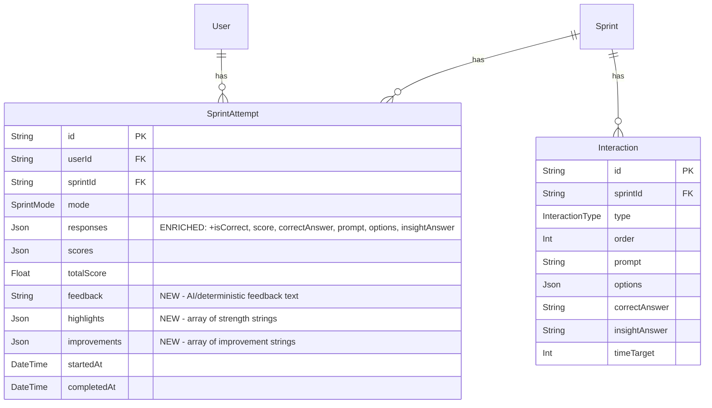

# Scoring Transparency & Attempt History

## Overview

Users can't understand why they scored what they scored, and they can't revisit past attempts. This plan fixes both: persist evaluation data that's currently generated but lost, surface per-interaction review, add attempt history to the profile, and show progress over time.

## Problem Statement

Five gaps compound into a fundamentally broken feedback loop:

1. **AI feedback is generated but never saved.** The evaluate API returns `feedback`, `highlights`, and `improvements` — but none are persisted to `SprintAttempt`. The results page tries to read `feedback` from the `scores` JSON field (`app/results/[attemptId]/page.tsx:51-54`), where it will always be `null`. The "AI Debrief" and "Dimension Insights" sections of `ResultsReveal` are dead code.

2. **Per-interaction scores are computed but discarded.** `scoreInteractionDeterministic()` in `lib/scoring/evaluate.ts` calculates a 0-100 score for each interaction, but only aggregate dimension scores are stored. Users can't see which questions they got right or wrong.

3. **The responses JSON is minimal.** `SprintAttempt.responses` stores `{ interactionId, answer, timeSpent }` — no correctness, no score, no question text. Replaying an attempt requires re-fetching interactions from the DB (which may be deleted or updated).

4. **No attempt history.** The profile page shows aggregate skill scores and career matches but zero history. Users complete 72 sprints with no way to revisit any of them.

5. **No progress tracking.** Users can't see if they're improving. The running average in `UserSkillScore` obscures individual performance trends.

## Proposed Solution

### Architecture Summary

```
┌─────────────────────────────────────────────────────────┐
│  Phase 1: Data Foundation                                │
│  Schema migration + evaluate route changes               │
│  → Persist feedback, enrich responses JSON               │
├─────────────────────────────────────────────────────────┤
│  Phase 2: Enhanced Results Page                          │
│  Per-interaction review + scoring explainer               │
│  → Users understand WHY they scored what they scored     │
├─────────────────────────────────────────────────────────┤
│  Phase 3: Attempt History                                │
│  New API + profile section + history UI                   │
│  → Users can revisit any past attempt                    │
├─────────────────────────────────────────────────────────┤
│  Phase 4: Progress Tracking                              │
│  Charts + trend lines + dimension comparison             │
│  → Users see improvement over time                       │
└─────────────────────────────────────────────────────────┘
```

### ERD: Schema Changes



## Technical Approach

### Phase 1: Data Foundation

**Goal:** Persist evaluation data that's currently generated and discarded.

#### 1a. Schema Migration

**File: `prisma/schema.prisma`**

Add three fields to `SprintAttempt`:

```prisma
model SprintAttempt {
  // ... existing fields ...
  feedback     String?   // AI-generated or deterministic feedback text
  highlights   Json?     // ["Strong analytical thinking in Q2", ...]
  improvements Json?     // ["Consider time management on tradeoff questions", ...]
  // ... existing relations and indexes ...
}
```

Migration: `npx prisma migrate dev --name add-attempt-feedback-fields`

**Decision: No `duelId` field.** Duel linkage already exists via `Duel.player1AttemptId` / `Duel.player2AttemptId`. Adding a reverse FK creates a circular dependency. Instead, query duels by attemptId when needed.

#### 1b. Enrich Responses JSON

**File: `lib/scoring/evaluate.ts`**

The `evaluateAttemptDeterministic()` function already iterates over interactions and computes per-interaction scores. Capture this data:

```typescript
// Current response shape:
{ interactionId: string; answer: string; timeSpent: number }

// Enriched response shape:
{
  interactionId: string;
  answer: string;
  timeSpent: number;
  isCorrect: boolean;
  score: number;          // 0-100 for this interaction
  correctAnswer: string;
  prompt: string;         // Snapshot for deletion-resistant replay
  options: Json;          // Snapshot of options array
  insightAnswer?: string; // Explanation text (if available)
  interactionType: string; // SPOT_THE_SIGNAL, FORCED_TRADEOFF, etc.
}
```

Storing `prompt`, `options`, and `insightAnswer` makes replay self-contained — if the sprint or interactions are later deleted or edited, the attempt history still renders.

**Files to modify:**
- `lib/scoring/evaluate.ts` — `evaluateAttemptDeterministic()` returns enriched responses alongside scores
- `app/api/evaluate/route.ts` — Save `feedback`, `highlights`, `improvements` to SprintAttempt; save enriched responses

#### 1c. Persist Feedback in Evaluate Route

**File: `app/api/evaluate/route.ts`**

Currently (~line 220):
```typescript
const newAttempt = await tx.sprintAttempt.create({
  data: {
    userId, sprintId, mode, responses, scores: evaluation.scores,
    totalScore: evaluation.totalScore, completedAt: new Date(),
  },
});
```

After:
```typescript
const newAttempt = await tx.sprintAttempt.create({
  data: {
    userId, sprintId, mode,
    responses: enrichedResponses,          // CHANGED: enriched version
    scores: evaluation.scores,
    totalScore: evaluation.totalScore,
    feedback: evaluation.feedback ?? null,  // NEW
    highlights: evaluation.highlights ?? [],// NEW
    improvements: evaluation.improvements ?? [], // NEW
    completedAt: new Date(),
  },
});
```

For LEARN/PRACTICE (deterministic): generate and save template feedback via `buildDeterministicFeedback()`.
For COMPETE (AI): save the AI-generated feedback, highlights, improvements.
For COMPETE (fallback): save deterministic feedback with note "AI evaluation unavailable."

---

### Phase 2: Enhanced Results Page

**Goal:** Users understand WHY they scored what they scored.

#### 2a. Fix Feedback Display

**File: `app/results/[attemptId]/page.tsx`**

Currently reads feedback from `scores` JSON (always null). Fix to read from the new `feedback` field:

```typescript
// BEFORE (broken):
const rawScores = attempt.scores as Record<string, unknown> | null;
const feedback = (rawScores?.feedback as string) ?? null;

// AFTER (correct):
const feedback = attempt.feedback;
const highlights = (attempt.highlights as string[]) ?? [];
const improvements = (attempt.improvements as string[]) ?? [];
```

Pass `highlights` and `improvements` as separate props to `ResultsReveal`.

#### 2b. Per-Interaction Review Section

**New component: `components/results/InteractionReview.tsx`**

An expandable "Review Your Answers" section on the results page showing each interaction:

```
┌─────────────────────────────────────────────────┐
│  ▼ Review Your Answers (6/8 correct)            │
├─────────────────────────────────────────────────┤
│  ✓ Q1 · Spot the Signal · 8.2s                 │
│  ┊  "Q3 revenue dropped 12%..."                │
│  ┊  Your answer: B ✓  Correct: B               │
│  ┊  ℹ "Revenue mix shift is the key signal..." │
├─────────────────────────────────────────────────┤
│  ✗ Q2 · Forced Tradeoff · 14.5s                │
│  ┊  "Ship Feature A or Feature B?"             │
│  ┊  Your answer: A ✗  Correct: B               │
│  ┊  ℹ "Long-term retention compounds..."       │
├─────────────────────────────────────────────────┤
│  ... (remaining interactions)                    │
└─────────────────────────────────────────────────┘
```

Features:
- Collapsed by default (accordion) — results page still leads with the score
- Each interaction shows: type badge, question prompt, user answer vs correct answer, correctness indicator, time spent, insight text
- For RANK_AND_PRIORITIZE: show user's ordering vs correct ordering
- Color-coded: green for correct, red for incorrect
- Time indicator: green if under timeTarget, amber if close, red if over
- **Graceful degradation:** If `isCorrect` field missing (old attempts), show message: "Detailed review not available for this attempt"

#### 2c. Scoring Methodology Explainer

**New component: `components/results/ScoringExplainer.tsx`**

A modal triggered by "How is this calculated?" link near the dimension breakdown:

Content:
1. **Dimension Definitions** — pull from `lib/scoring/dimensions.ts`
2. **Interaction → Dimension Mapping** — table showing which interaction types contribute to which dimensions (70% primary / 30% secondary)
3. **Time Bonuses** — "Answer within the target time for up to +15 bonus points"
4. **Partial Credit** — "Ranking questions award proportional credit for correctly placed items"
5. **COMPETE Mode** — "AI evaluates your responses holistically across all 6 dimensions"
6. **Total Score** — "Your total score is the average of all 6 dimension scores"

Implementation: Sheet/drawer component (mobile-friendly), static content referencing the constants in `lib/scoring/`.

#### 2d. Enhanced ResultsReveal Props

**File: `components/layout/ResultsReveal.tsx`**

Update props interface:

```typescript
interface ResultsRevealProps {
  attemptId: string;
  totalScore: number;
  scores: DimensionScores;
  feedback: string | null;
  highlights: string[];          // NEW (was dimensionFeedback)
  improvements: string[];        // NEW
  sprintTitle: string;
  skillName: string;
  skillSlug: string;
  mode: string;
  enrichedResponses?: EnrichedResponse[]; // NEW
}
```

Changes:
- Replace dead `dimensionFeedback` section with `highlights` / `improvements` lists
- Add "How is this calculated?" link that opens ScoringExplainer
- Add InteractionReview section at the bottom (above CTAs)
- Strengths section: show `highlights` array items (not just top 2 dimension names)
- Improvements section: show `improvements` array items

---

### Phase 3: Attempt History

**Goal:** Users can revisit any past attempt.

#### 3a. Attempt History API

**New file: `app/api/attempts/route.ts`**

```
GET /api/attempts?skill=guesstimation&mode=LEARN&limit=20&cursor=<completedAt_id>
```

Response:
```json
{
  "attempts": [
    {
      "id": "cuid...",
      "sprintTitle": "Market Sizing: Coffee Shops",
      "skillName": "Guesstimation",
      "skillSlug": "guesstimation",
      "skillIcon": "📊",
      "mode": "LEARN",
      "totalScore": 78,
      "completedAt": "2026-02-12T14:30:00Z"
    }
  ],
  "nextCursor": "2026-02-12T14:30:00Z_cuid..."
}
```

Query:
```typescript
const attempts = await prisma.sprintAttempt.findMany({
  where: {
    userId,
    completedAt: { not: null },
    ...(skillSlug && { sprint: { skill: { slug: skillSlug } } }),
    ...(mode && { mode }),
    ...(cursor && { completedAt: { lt: cursorDate } }),
  },
  orderBy: { completedAt: "desc" },
  take: limit + 1, // +1 to detect hasMore
  select: {
    id: true, mode: true, totalScore: true, completedAt: true,
    sprint: {
      select: {
        title: true,
        skill: { select: { name: true, slug: true, icon: true } },
      },
    },
  },
});
```

Cursor pagination: encode `completedAt_id` as cursor for stable pagination.

#### 3b. Profile Page: History Section

**File: `app/profile/page.tsx`** — Add initial attempt count + recent 5 attempts to server-side data.

**New component: `components/profile/AttemptHistory.tsx`**

Client component that:
1. Renders initial 5 attempts from server data (no loading flash)
2. Lazy-loads more via `/api/attempts` on "Show more" click or infinite scroll
3. Filter bar: Skill dropdown (All Skills + each skill) + Mode tabs (All, Learn, Practice, Compete)
4. Each attempt as a card:

```
┌─────────────────────────────────────────────────┐
│  📊 Guesstimation · LEARN                      │
│  Market Sizing: Coffee Shops                     │
│  Feb 12, 2026 · 2:30 PM                    78%  │
│  ████████████████████░░░░░░  Score bar           │
└─────────────────────────────────────────────────┘
```

Features:
- Score color: green (80+), amber (60-79), red (<60)
- Skill icon + name, mode badge with mode color
- Sprint title
- Relative date ("2 hours ago") with full date on hover
- Click navigates to `/results/[attemptId]`
- Empty state: "No attempts yet. Complete your first sprint to start tracking your progress." + CTA button to Learn mode

#### 3c. Bottom Nav Update

Add a history entry point. Two options:

**Option A (recommended):** Add "History" as a 5th tab replacing Profile's current position — Profile becomes accessible from Navbar only (UserButton already there).

**Option B:** Keep 4 tabs, add History as a section within Profile page with a prominent "View All History" link.

Recommendation: **Option B** to avoid disrupting the existing navigation. History lives inside Profile as a major section.

---

### Phase 4: Progress Tracking

**Goal:** Users see improvement over time.

#### 4a. Progress Data API

**New file: `app/api/progress/route.ts`**

```
GET /api/progress?skill=guesstimation
```

Response:
```json
{
  "skill": "Guesstimation",
  "dataPoints": [
    {
      "attemptId": "cuid...",
      "completedAt": "2026-02-10T10:00:00Z",
      "totalScore": 62,
      "scores": { "analyticalThinking": 70, "strategicReasoning": 55, ... }
    },
    {
      "attemptId": "cuid...",
      "completedAt": "2026-02-12T14:30:00Z",
      "totalScore": 78,
      "scores": { "analyticalThinking": 85, "strategicReasoning": 72, ... }
    }
  ],
  "summary": {
    "totalAttempts": 12,
    "averageScore": 71,
    "bestScore": 88,
    "improvementPercent": 26,
    "firstAttemptScore": 62,
    "latestAttemptScore": 78
  }
}
```

#### 4b. Progress Charts Component

**New component: `components/profile/ProgressCharts.tsx`**

Uses `recharts` (already in the project at v3.7.0).

**Score Trend Line Chart:**
- X-axis: attempt dates
- Y-axis: totalScore (0-100)
- Line color: primary
- Dots on each data point
- Tooltip showing date, score, sprint title

**Dimension Radar Comparison:**
- Overlay: first attempt radar (faded) vs latest attempt radar (solid)
- Shows growth per dimension visually
- Legend: "First Attempt" vs "Latest"

**Summary Stats Row:**
```
┌──────────┬──────────┬──────────┬──────────┐
│  12      │  71%     │  88%     │  +26%    │
│  Attempts│  Average │  Best    │  Growth  │
└──────────┴──────────┴──────────┴──────────┘
```

#### 4c. Profile Integration

Add ProgressCharts to the profile page between the Skill Graph and Attempt History sections. Default to the user's most-practiced skill (highest sprintCount). Dropdown to switch skills.

On mobile: stack charts vertically. Line chart full width, radar chart centered below.

---

## Acceptance Criteria

### Functional Requirements

- [x] `SprintAttempt` has `feedback`, `highlights`, `improvements` fields (nullable)
- [x] Evaluate API persists feedback for all modes (deterministic + AI)
- [x] Evaluate API enriches `responses` JSON with `isCorrect`, `score`, `correctAnswer`, `prompt`, `options`, `insightAnswer`, `interactionType`
- [x] Results page displays persisted feedback in "AI Debrief" section
- [x] Results page shows highlights and improvements as structured lists
- [x] Results page has "Review Your Answers" expandable section with per-interaction breakdown
- [x] Results page has "How is this calculated?" link opening scoring methodology explainer
- [x] Old attempts (pre-migration) show graceful "detailed review not available" message
- [x] Profile page has "Attempt History" section with skill/mode filters
- [x] Attempt history supports cursor pagination (20 per page)
- [x] Clicking an attempt in history navigates to `/results/[attemptId]`
- [x] Profile page has "Progress" section with score trend line chart
- [ ] Progress section shows dimension radar comparison (first vs latest)
- [x] Progress section shows summary stats (attempts, average, best, growth %)
- [x] Empty states render for users with 0 attempts

### Non-Functional Requirements

- [x] Attempt history API responds in < 200ms for 100 attempts
- [x] No N+1 queries in history or progress endpoints
- [x] All animations use Motion with `stiffness: 300, damping: 25`
- [x] All new components are mobile-first (375px min)
- [x] Touch targets are >= 44px
- [x] NaN/null scores handled gracefully (validation from eval-500 learnings)
- [x] Public profiles show aggregates only — no attempt history exposed

### Quality Gates

- [x] TypeScript strict mode passes
- [x] `npm run build` succeeds
- [ ] Enriched responses JSON validated with Zod schema
- [x] All 6 dimension keys validated as finite numbers before save

---

## Dependencies & Prerequisites

- Prisma migration for new fields (Phase 1 blocks everything else)
- `recharts` v3.7.0 already installed (needed for Phase 4 charts)
- `lib/scoring/dimensions.ts` constants used for ScoringExplainer content
- `lib/scoring/evaluate.ts` interaction-dimension mapping used for enrichment

## Risk Analysis & Mitigation

| Risk | Likelihood | Impact | Mitigation |
|------|-----------|--------|------------|
| Old attempts have no enriched data | Certain | Medium | Graceful degradation: detect missing fields, show message |
| Enriched responses JSON size growth | Low | Low | ~3KB per attempt (8 interactions × ~400 bytes). Acceptable. |
| Feedback generation adds latency to evaluate | Low | Low | Deterministic feedback is instant. AI feedback already generated. |
| Sprint deletion orphans attempt history | Medium | High | Enriched responses store prompt + options for self-contained replay |
| Progress charts slow for power users | Low | Medium | Limit to last 50 data points per skill, aggregate older data |

## Implementation Phases

| Phase | Scope | Files |
|-------|-------|-------|
| 1: Data Foundation | Schema + evaluate route | `prisma/schema.prisma`, `lib/scoring/evaluate.ts`, `app/api/evaluate/route.ts` |
| 2: Enhanced Results | Fix feedback + per-interaction review + explainer | `app/results/[attemptId]/page.tsx`, `components/layout/ResultsReveal.tsx`, `components/results/InteractionReview.tsx` (new), `components/results/ScoringExplainer.tsx` (new) |
| 3: Attempt History | API + profile section + cards | `app/api/attempts/route.ts` (new), `app/profile/page.tsx`, `components/profile/AttemptHistory.tsx` (new), `components/profile/AttemptCard.tsx` (new) |
| 4: Progress Tracking | Charts + stats + API | `app/api/progress/route.ts` (new), `components/profile/ProgressCharts.tsx` (new), `app/profile/ProfileClient.tsx` |

## References

### Internal References

- Scoring dimensions: `lib/scoring/dimensions.ts`
- Evaluation logic: `lib/scoring/evaluate.ts`
- AI eval prompt: `lib/ai/prompts/evaluate-attempt.ts`
- Evaluate API: `app/api/evaluate/route.ts:154-247` (running average + attempt creation)
- Results page: `app/results/[attemptId]/page.tsx:51-54` (broken feedback parsing)
- ResultsReveal: `components/layout/ResultsReveal.tsx` (dead dimensionFeedback code)
- Profile page: `app/profile/page.tsx`, `app/profile/ProfileClient.tsx`
- NaN guard pattern: `docs/solutions/runtime-errors/evaluation-500-nan-propagation-and-data-fixes.md`
- Timer cleanup pattern: `docs/solutions/security-issues/pr1-answer-leak-and-race-conditions.md`

### Institutional Learnings Applied

- **NaN propagation**: Validate all dimension scores are finite before saving (3-layer guard from eval-500 fix)
- **Answer leak**: Never expose `correctAnswer` in client-facing API responses for COMPETE mode (only in enriched responses for completed attempts)
- **Timer cleanup**: Use ref-based cleanup for animations in results components (not conditional returns)
- **Leaderboard data source**: Query `UserEloRating` not `LeaderboardEntry` for ranking data
