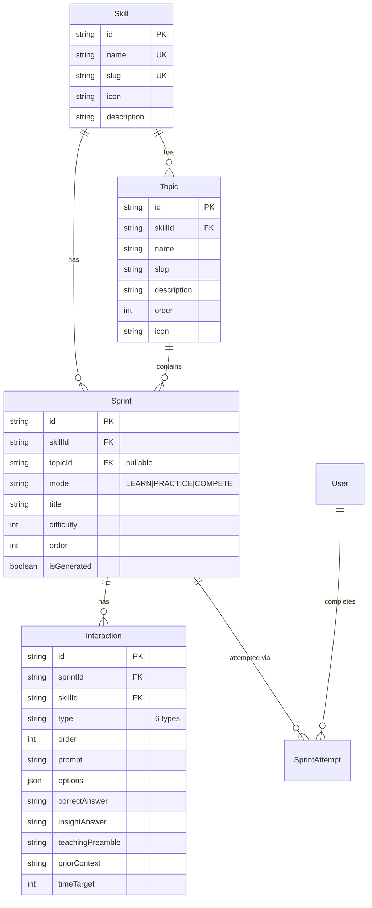

# Structured Content Architecture with Topic Hierarchy & AI Pipeline

## Overview

Restructure Praxel Arena's content from a flat Sprint list to a hierarchical **Skill > Topic > Sprint** model, and build an AI content generation pipeline that can rapidly produce structured, reviewed content across all 6 skills. This addresses three critical gaps: (1) only 3 of 6 skills have content, (2) no pedagogical structure or concept progression, and (3) no scalable content pipeline.

## Problem Statement

**Current state is critically thin:**

| Metric | Current | Target |
|---|---|---|
| Skills with content | 3 of 6 | 6 of 6 |
| LEARN sprints | 6 (48 interactions) | 48 (384 interactions) |
| PRACTICE sprints | 3 (24 interactions) | 24 (192 interactions) |
| Topic/module hierarchy | None | 4 topics per skill |
| Concept progression | None (flat list) | Suggested order within topics |
| Content pipeline | Inline in seed.ts (1,800 lines) | JSON files + AI generation script |
| LEARN interaction variety | TEACH_AND_TEST only | Mixed types per SKILL.md recipes |

A user opening Guesstimation LEARN sees 2 sprints in a flat list. Data Interpretation, Pricing & Monetization, and Stakeholder Communication show **zero content**. There is no sense of "where to start" or "what comes next."

## Proposed Solution

### Architecture: Skill > Topic > Sprint

```
Skill (e.g., "Guesstimation")
  -> Topic 1: "Market Sizing Fundamentals" (order: 1)
    -> LEARN Sprint 1: "Fermi Fundamentals" (difficulty 1)
    -> LEARN Sprint 2: "Population-Based Sizing" (difficulty 2)
    -> PRACTICE Sprint 1: "Market Sizing Gauntlet" (difficulty 2)
  -> Topic 2: "Unit Economics & Revenue Models" (order: 2)
    -> LEARN Sprint 1: "LTV, CAC & ARPU Essentials" (difficulty 2)
    -> LEARN Sprint 2: "Revenue Model Analysis" (difficulty 3)
    -> PRACTICE Sprint 1: "Unit Economics Battlefield" (difficulty 3)
  -> Topic 3: ...
  -> Topic 4: ...
  COMPETE: Dynamically generated, optionally scoped to a topic
```

### Content Volume

| | Per Topic | Per Skill | 3 Skills (Phase 1) | 6 Skills (Phase 2) |
|---|---|---|---|---|
| Topics | 1 | 4 | 12 | 24 |
| LEARN sprints | 2 | 8 | 24 | 48 |
| PRACTICE sprints | 1 | 4 | 12 | 24 |
| Total sprints | 3 | 12 | 36 | 72 |
| Total interactions | 24 | 96 | 288 | 576 |

### Key Decisions

1. **All topics open, suggested order** -- no hard prerequisites. Visual indicators show recommended progression.
2. **Topics replace the unused level system** -- `Sprint.level`/`Sprint.levelLabel` are deprecated; `Topic.order` provides structure.
3. **`topicId` on Sprint is nullable** -- COMPETE sprints may not belong to a topic. LEARN/PRACTICE always have one.
4. **URLs unchanged** -- Topics are a UI grouping, not a routing concern. `/learn/[skillSlug]/[sprintId]` stays.
5. **Pipeline-generated content uses `isGenerated: false`** -- it is reviewed and curated. Only live COMPETE generation uses `true`.
6. **LEARN sprints use mixed interaction types** per SKILL.md recipes (not all TEACH_AND_TEST).

---

## Technical Approach

### Phase 1: Schema & Migration

#### 1a. New Topic Model

Add to `prisma/schema.prisma`:

```prisma
model Topic {
  id          String   @id @default(cuid())
  skillId     String
  name        String
  slug        String
  description String?
  order       Int      @default(0) // suggested progression order within skill
  icon        String?
  createdAt   DateTime @default(now())

  skill       Skill    @relation(fields: [skillId], references: [id], onDelete: Cascade)
  sprints     Sprint[]

  @@unique([skillId, slug])
  @@index([skillId, order])
}
```

#### 1b. Sprint Model Changes

```prisma
model Sprint {
  // ... existing fields ...
  topicId     String?  // nullable for COMPETE sprints
  // level       Int      @default(1)     -- DEPRECATED, keep for backward compat
  // levelLabel  String?                  -- DEPRECATED

  topic       Topic?   @relation(fields: [topicId], references: [id], onDelete: SetNull)

  @@index([topicId, mode, order])
  @@index([skillId, mode, level, order]) // keep existing index
}
```

#### 1c. Skill Model Changes

```prisma
model Skill {
  // ... existing fields ...
  topics      Topic[]
}
```

#### 1d. Migration Strategy

```bash
npx prisma migrate dev --name add-topic-model
```

- Migration adds `Topic` table and `topicId` column on `Sprint` (nullable)
- Existing 10 sprints remain with `topicId: null` until seed reassignment
- No cascade risk -- existing `SprintAttempt` records are untouched
- Index `@@index([topicId, mode, order])` added for efficient topic-scoped queries

### Phase 2: Topic Taxonomy Definition

#### Guesstimation (4 Topics)

| # | Topic | Key Concepts | LEARN Difficulty | PRACTICE Difficulty |
|---|---|---|---|---|
| 1 | Market Sizing Fundamentals | TAM/SAM/SOM, population-based sizing, top-down vs bottom-up | 1, 2 | 2 |
| 2 | Unit Economics & Revenue Models | LTV, CAC, ARPU, revenue modeling, payback period | 2, 3 | 3 |
| 3 | Growth & Forecasting | Growth rates, trend extrapolation, cohort analysis, compounding | 3, 3 | 3 |
| 4 | Valuation & Investment Cases | DCF basics, multiples, investment sizing, market comparables | 3, 4 | 4 |

#### GTM Strategy (4 Topics)

| # | Topic | Key Concepts | LEARN Difficulty | PRACTICE Difficulty |
|---|---|---|---|---|
| 1 | Market Entry & Positioning | ICP definition, competitive positioning, value proposition | 1, 2 | 2 |
| 2 | Channel Strategy & Distribution | Channel selection, partnerships, CAC by channel, channel-market fit | 2, 3 | 3 |
| 3 | Launch Execution & Playbooks | Launch planning, beta programs, go-to-market timing, launch metrics | 3, 3 | 3 |
| 4 | Scaling & International Expansion | Market expansion, localization, scaling playbooks, unit economics at scale | 3, 4 | 4 |

#### Prioritization (4 Topics)

| # | Topic | Key Concepts | LEARN Difficulty | PRACTICE Difficulty |
|---|---|---|---|---|
| 1 | Frameworks & Mental Models | RICE, ICE, MoSCoW, weighted scoring, cost of delay | 1, 2 | 2 |
| 2 | Stakeholder Alignment | Stakeholder mapping, influence matrix, conflict resolution, buy-in | 2, 3 | 3 |
| 3 | Resource Allocation | Capacity planning, trade-off analysis, opportunity cost, sequencing | 3, 3 | 3 |
| 4 | Strategic Saying No | Feature request triage, scope management, sunk cost fallacy, debt tracking | 3, 4 | 4 |

#### Data Interpretation (4 Topics) -- Phase 2

| # | Topic | Key Concepts |
|---|---|---|
| 1 | Reading Charts & Dashboards | Chart types, axis interpretation, misleading visualizations, KPI dashboards |
| 2 | Statistical Thinking | Distributions, averages vs medians, correlation vs causation, sample size |
| 3 | A/B Testing & Experimentation | Hypothesis design, significance, confidence intervals, experiment pitfalls |
| 4 | Data Storytelling | Narrative structure, audience framing, insight extraction, recommendation |

#### Pricing & Monetization (4 Topics) -- Phase 2

| # | Topic | Key Concepts |
|---|---|---|
| 1 | Pricing Fundamentals | Cost-plus, value-based, competitive pricing, price sensitivity |
| 2 | Monetization Models | Subscription, freemium, usage-based, marketplace, hybrid models |
| 3 | Price Optimization | Elasticity, willingness-to-pay research, A/B pricing, anchoring |
| 4 | Packaging & Bundling Strategy | Tier design, feature gating, upsell paths, enterprise vs self-serve |

#### Stakeholder Communication (4 Topics) -- Phase 2

| # | Topic | Key Concepts |
|---|---|---|
| 1 | Executive Communication | BLUF method, data-driven narratives, status updates, decision memos |
| 2 | Cross-Functional Alignment | RACI matrices, working agreements, async communication, standups |
| 3 | Difficult Conversations | Delivering bad news, managing expectations, constructive feedback |
| 4 | Board & Investor Communication | Board decks, metrics storytelling, fundraising narratives, Q&A prep |

### Phase 3: AI Content Generation Pipeline

#### 3a. Pipeline Script

Create `scripts/generate-content.ts`:

```typescript
// Usage: npx tsx scripts/generate-content.ts --skill guesstimation --topic market-sizing-fundamentals --mode LEARN --sprint 1
// Output: prisma/seed-data/guesstimation/market-sizing-fundamentals/learn-1.json

interface PipelineArgs {
  skill: string;       // skill slug
  topic: string;       // topic slug
  mode: "LEARN" | "PRACTICE";
  sprint?: number;     // sprint number within topic (1-based)
  dryRun?: boolean;    // validate only, don't write
}
```

**Pipeline flow:**

```
1. Load skill definition (name, description, scoring weights)
2. Load topic definition (name, description, key concepts, order)
3. Load existing sprints for this topic (to avoid duplication)
4. Build mode-specific prompt with:
   - Skill context
   - Topic context + key concepts
   - Sprint number within topic (for progressive difficulty)
   - Previously generated sprints (to ensure concept variety)
   - LEARN recipe: mixed interaction types per SKILL.md
   - PRACTICE recipe: 5 mixed types, no TEACH_AND_TEST
5. Call Claude Opus 4.6 for generation
6. Validate with Zod schema
7. Write to prisma/seed-data/<skill>/<topic>/<mode>-<N>.json
8. Print summary (title, interaction types, difficulty)
```

**Batch mode:**

```bash
# Generate all content for a skill
npx tsx scripts/generate-content.ts --skill guesstimation --all

# Generate all content for all skills
npx tsx scripts/generate-content.ts --all

# Regenerate a specific sprint that failed validation
npx tsx scripts/generate-content.ts --skill guesstimation --topic market-sizing-fundamentals --mode LEARN --sprint 2
```

#### 3b. Seed File Structure

```
prisma/seed-data/
  topics.json                          # All topic definitions
  guesstimation/
    market-sizing-fundamentals/
      learn-1.json                     # LEARN sprint 1
      learn-2.json                     # LEARN sprint 2
      practice-1.json                  # PRACTICE sprint 1
    unit-economics-revenue-models/
      learn-1.json
      learn-2.json
      practice-1.json
    growth-forecasting/
      ...
    valuation-investment-cases/
      ...
  gtm-strategy/
    ...
  prioritization/
    ...
```

**Sprint JSON format:**

```json
{
  "skillSlug": "guesstimation",
  "topicSlug": "market-sizing-fundamentals",
  "mode": "LEARN",
  "title": "Fermi Fundamentals: Market Sizing from Scratch",
  "description": "Master the art of estimation...",
  "difficulty": 1,
  "sprintOrder": 1,
  "interactions": [
    {
      "type": "TEACH_AND_TEST",
      "order": 1,
      "prompt": "...",
      "options": [
        { "id": "a", "text": "..." },
        { "id": "b", "text": "..." },
        { "id": "c", "text": "..." },
        { "id": "d", "text": "..." }
      ],
      "correctAnswer": "b",
      "insightAnswer": "b",
      "teachingPreamble": "...",
      "priorContext": null,
      "timeTarget": 25
    },
    {
      "type": "SPOT_THE_SIGNAL",
      "order": 2,
      "prompt": "...",
      "options": [...],
      "correctAnswer": "c",
      "insightAnswer": "c",
      "teachingPreamble": null,
      "priorContext": null,
      "timeTarget": 10
    }
  ]
}
```

#### 3c. Zod Validation Schema

Create `lib/validation/content-schema.ts`:

```typescript
import { z } from "zod";

const optionSchema = z.object({
  id: z.enum(["a", "b", "c", "d"]),
  text: z.string().min(1).max(200),
});

const baseInteraction = z.object({
  order: z.number().int().min(1).max(8),
  prompt: z.string().min(1).max(500),
  options: z.array(optionSchema).length(4),
  correctAnswer: z.string().min(1),
  insightAnswer: z.string().min(1).nullable(),
  teachingPreamble: z.string().nullable(),
  priorContext: z.string().nullable(),
  timeTarget: z.number().int().min(5).max(60),
});

const interactionSchema = z.discriminatedUnion("type", [
  baseInteraction.extend({
    type: z.literal("TEACH_AND_TEST"),
    teachingPreamble: z.string().min(1),
    correctAnswer: z.enum(["a", "b", "c", "d"]),
  }),
  baseInteraction.extend({
    type: z.literal("SPOT_THE_SIGNAL"),
    correctAnswer: z.enum(["a", "b", "c", "d"]),
  }),
  baseInteraction.extend({
    type: z.literal("FORCED_TRADEOFF"),
    correctAnswer: z.enum(["a", "b", "c", "d"]),
  }),
  baseInteraction.extend({
    type: z.literal("FILL_THE_GAP"),
    correctAnswer: z.enum(["a", "b", "c", "d"]),
  }),
  baseInteraction.extend({
    type: z.literal("CURVEBALL"),
    priorContext: z.string().min(1),
    correctAnswer: z.enum(["a", "b", "c", "d"]),
  }),
  baseInteraction.extend({
    type: z.literal("RANK_AND_PRIORITIZE"),
    correctAnswer: z.string().regex(/^[a-d],[a-d],[a-d],[a-d]$/),
  }),
]);

export const sprintFileSchema = z.object({
  skillSlug: z.string().min(1),
  topicSlug: z.string().min(1),
  mode: z.enum(["LEARN", "PRACTICE"]),
  title: z.string().min(3).max(100),
  description: z.string().optional(),
  difficulty: z.number().int().min(1).max(5),
  sprintOrder: z.number().int().min(1),
  interactions: z.array(interactionSchema).length(8),
});

export const topicsFileSchema = z.array(z.object({
  skillSlug: z.string().min(1),
  slug: z.string().min(1),
  name: z.string().min(1),
  description: z.string().optional(),
  order: z.number().int().min(1),
  icon: z.string().optional(),
}));
```

#### 3d. Updated Seed Script

Rewrite `prisma/seed.ts` to:

1. Read `prisma/seed-data/topics.json` -> create Topics
2. Glob `prisma/seed-data/<skill>/<topic>/*.json` -> create Sprints with `topicId`
3. Reassign existing inline sprints to appropriate topics (backward compat)
4. Keep career outcomes, skills, skill-career maps, and demo opponent as-is
5. Use Zod validation on each JSON file before inserting

### Phase 4: UI Updates

#### 4a. SkillAccordion Refactor

`components/layout/SkillAccordion.tsx` -- Change from Skill > Level > Sprint to Skill > Topic > Sprint:

```
SkillAccordion
  ├── Skill Header (name, icon, progress ring)
  │   └── Topic Section (for each topic in order)
  │       ├── Topic Header (name, description, order badge, completion %)
  │       │   ├── Sprint Card (title, difficulty, status: locked/available/completed)
  │       │   ├── Sprint Card
  │       │   └── Sprint Card
  │       └── Topic Divider
  └── "Coming Soon" badge (for skills without content)
```

**Visual indicators for suggested order:**
- Numbered badges on topic headers (1, 2, 3, 4)
- "Start here" callout on Topic 1 for new users
- Checkmark on completed topics
- Subtle arrow connectors between topics

#### 4b. Mode Page Data Update

`lib/data/mode-page-data.ts` -- Include topic data:

```typescript
// Add topic query to the parallel Promise.all
const [skills, sprints, topics, attempts, careerMatch] = await Promise.all([
  prisma.skill.findMany({ orderBy: { name: "asc" } }),
  prisma.sprint.findMany({
    where: { mode, ...(mode !== "COMPETE" ? { isGenerated: false } : {}) },
    include: { topic: true, _count: { select: { interactions: true } } },
    orderBy: [{ topic: { order: "asc" } }, { order: "asc" }],
  }),
  prisma.topic.findMany({
    orderBy: [{ skillId: "asc" }, { order: "asc" }],
  }),
  // ... existing queries
]);
```

#### 4c. Results Page Enhancement

`components/layout/ResultsReveal.tsx` -- Add "Continue" navigation:

- After completing a sprint, show "Next sprint in this topic" button
- If all sprints in topic are done, show "Start next topic" button
- If all topics are done, show "Try Practice mode" or "Ready to Compete" CTA

#### 4d. Empty Skill States

For skills without content (Phase 1 gap): show topic names with "Coming soon" badges and a subtle locked state. Users can see the full curriculum even before content exists.

### Phase 5: COMPETE Mode Topic Awareness (Light Touch)

**Minimal changes for hackathon:**
- Add optional `topicId` to `Duel` model (nullable)
- When generating a COMPETE sprint, optionally include topic context in the AI prompt
- User selects a skill (not topic) to compete -- system picks a random topic from that skill
- No matchmaking changes

### Phase 6: Expand to Remaining 3 Skills

After Phase 1-5 is stable for the 3 existing skills:

1. Create SKILL.md files for Data Interpretation, Pricing & Monetization, Stakeholder Communication
2. Run the AI pipeline for each skill: `npx tsx scripts/generate-content.ts --skill data-interpretation --all`
3. Review generated JSON files
4. Run seed script
5. Content appears automatically in the UI (SkillAccordion picks up new topics)

---

## Pre-Existing Bugs to Fix

### CRITICAL: Scoring Rubric Dimension Name Mismatch

**The SKILL.md files use different dimension names than the codebase:**

| SKILL.md Dimension | Codebase Dimension |
|---|---|
| `strategicThinking` | `strategicReasoning` |
| `analyticalRigor` | `analyticalThinking` |
| `prioritization` | `decisionQuality` |
| `commercialAcumen` | `quantitativeReasoning` |
| `communication` | `communicationClarity` |
| `adaptability` | `creativeProblemSolving` |

**Impact:** Any content generated via the existing SKILL.md skills produces scoring rubrics with wrong keys. The evaluation pipeline would score against non-existent dimensions.

**Fix:** Update all 3 SKILL.md files to use the codebase dimension names before generating new content.

### LEARN Mode: All TEACH_AND_TEST

`lib/ai/prompts/learn-sprint.ts` currently forces all 8 interactions to be TEACH_AND_TEST. The SKILL.md files recommend a mixed sequence (TEACH_AND_TEST, SPOT_THE_SIGNAL, FILL_THE_GAP, etc.). Update the prompt to support mixed types for richer LEARN experiences.

### Interaction Order Mismatch

Seed data uses 0-indexed order (0-7). `generate.ts` validator expects 1-indexed (1-8). `sanitizeSprint()` silently fixes this. Standardize on 1-indexed everywhere.

---

## Acceptance Criteria

### Functional Requirements

- [ ] Topic model exists in Prisma schema with proper relations and indexes
- [ ] 3 skills (Guesstimation, GTM Strategy, Prioritization) have 4 topics each
- [ ] Each topic has 2 LEARN sprints + 1 PRACTICE sprint = 3 sprints per topic
- [ ] 36 total sprints, 288 total interactions for Phase 1
- [ ] AI generation pipeline script produces valid JSON seed files
- [ ] Zod validation catches malformed content before seeding
- [ ] Seed script reads JSON files and creates Topics + Sprints with proper relations
- [ ] Existing SprintAttempt records are preserved (no cascade deletes)
- [ ] SkillAccordion shows Skill > Topic > Sprint hierarchy
- [ ] Topics display suggested order (numbered badges)
- [ ] Empty skills show "Coming soon" state with topic names
- [ ] Results page suggests next sprint/topic after completion
- [ ] LEARN sprints use mixed interaction types (not all TEACH_AND_TEST)
- [ ] Scoring rubric dimension names match codebase in all SKILL.md files

### Non-Functional Requirements

- [ ] Pipeline generates a full skill's content (12 sprints) in under 10 minutes
- [ ] Seed script completes in under 30 seconds
- [ ] Mode page data query adds < 50ms with topic joins
- [ ] Mobile-first: topic headers are tappable (44px touch targets)

### Quality Gates

- [ ] All generated content passes Zod validation
- [ ] No broken foreign key references after migration
- [ ] SkillAccordion renders correctly on 375px width
- [ ] Existing demo flow (onboarding -> learn -> practice -> compete) still works

---

## Implementation Phases

### Phase 1: Foundation (Schema + Migration) -- ~1 hour

**Files:**
- `prisma/schema.prisma` -- Add Topic model, update Sprint
- Migration file (auto-generated)

**Tasks:**
- [x] Add Topic model to schema
- [x] Add `topicId` (nullable) to Sprint model
- [x] Add Topic relation to Skill model
- [x] Run migration
- [x] Verify existing data untouched

### Phase 2: Content Pipeline -- ~2 hours

**Files:**
- `scripts/generate-content.ts` -- New generation script
- `lib/validation/content-schema.ts` -- New Zod schemas
- `prisma/seed-data/topics.json` -- Topic definitions
- `.claude/skills/*/SKILL.md` -- Fix dimension names, add topicSlug to output

**Tasks:**
- [x] Create Zod validation schema
- [x] Create topic definitions JSON (all 24 topics across 6 skills)
- [x] Fix scoring dimension names in all SKILL.md files
- [x] Build generation pipeline script with batch mode
- [x] Test pipeline on 1 topic (3 sprints) end-to-end

### Phase 3: Content Generation -- ~3-4 hours

**Files:**
- `prisma/seed-data/<skill>/<topic>/*.json` -- Generated content

**Tasks:**
- [x] Generate all content for Guesstimation (4 topics, 12 sprints)
- [x] Generate all content for GTM Strategy (4 topics, 12 sprints)
- [x] Generate all content for Prioritization (4 topics, 12 sprints)
- [x] Review generated JSON files for quality
- [x] Fix any validation failures and regenerate

### Phase 4: Seed Script Rewrite -- ~1 hour

**Files:**
- `prisma/seed.ts` -- Rewrite to read JSON files

**Tasks:**
- [x] Refactor seed.ts to create Topics from topics.json
- [x] Read sprint JSON files from seed-data directories
- [x] Map existing inline sprints to appropriate topics
- [x] Test full seed cycle (drop + reseed)
- [x] Verify all 72 sprints + 576 interactions seeded correctly

### Phase 5: UI Updates -- ~2 hours

**Files:**
- `components/layout/SkillAccordion.tsx` -- Topic grouping
- `lib/data/mode-page-data.ts` -- Include topic data
- `components/layout/ResultsReveal.tsx` -- Next sprint navigation

**Tasks:**
- [x] Update getModePageData to include topic relations
- [x] Refactor SkillAccordion for Topic > Sprint hierarchy
- [x] Add suggested order visual indicators
- [x] Add empty skill "Coming soon" state
- [x] Add "Continue" navigation to ResultsReveal
- [ ] Test on mobile (375px)

### Phase 6: Expand to 6 Skills -- ~3 hours

**Files:**
- `.claude/skills/data-interpretation-master/SKILL.md` -- New
- `.claude/skills/pricing-monetization-master/SKILL.md` -- New
- `.claude/skills/stakeholder-communication-master/SKILL.md` -- New
- `prisma/seed-data/` -- New content files

**Tasks:**
- [x] Create SKILL.md for remaining 3 skills
- [x] Run pipeline for all 3 skills
- [x] Review and seed content
- [x] Verify full 72-sprint, 576-interaction library

---

## ERD: Updated Data Model



---

## Risk Analysis & Mitigation

| Risk | Impact | Mitigation |
|---|---|---|
| AI generates low-quality content | Bad demo impressions | Review all JSON files before seeding; regenerate failures |
| Migration breaks existing data | Lost user progress | `topicId` is nullable; no cascade risk; test on dev DB first |
| Content generation takes too long | Blocks demo prep | Batch generate in parallel (4 topics simultaneously) |
| SkillAccordion nested UI is confusing on mobile | Poor UX | Keep it simple: topic headers are just styled dividers, not full accordions |
| Scoring dimension mismatch produces NaN scores | 500 errors on eval | Fix SKILL.md dimensions BEFORE generating any content |
| 576 interactions overwhelm seed script | Slow seeding | Use bulk create where possible; target < 30s total |

---

## References

### Internal
- Current schema: `prisma/schema.prisma`
- Current seed: `prisma/seed.ts` (1,795 lines)
- AI generation: `lib/ai/generate.ts`
- Mode page data: `lib/data/mode-page-data.ts`
- SkillAccordion: `components/layout/SkillAccordion.tsx`
- LEARN prompt: `lib/ai/prompts/learn-sprint.ts`
- Skill definitions: `.claude/skills/*/SKILL.md`
- Hackathon strategy: `docs/plans/sub-plans/00-hackathon-strategy.md`
- AI engine plan: `docs/plans/sub-plans/02-ai-engine.md`

### External
- [Structuring Competency-Based Courses Through Skill Trees (2025)](https://arxiv.org/html/2504.16966)
- [Duolingo's AI Content Generation Pipeline](https://drphilippahardman.substack.com/p/duolingos-ai-revolution)
- [Quantic MBA Curriculum Structure](https://quantic.edu/mba/curriculum/)
- [Zod v4 Documentation](https://zod.dev/)
