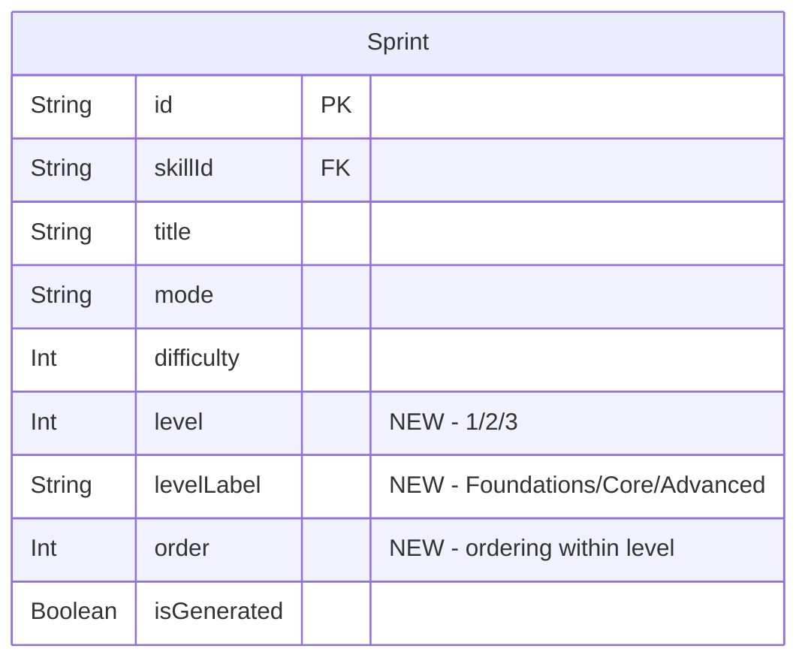

# Fix Evaluation 500 + Learn UX + Theme Toggle + Accordion Skills

## Overview

Six issues reported after PR #1 merge. Ordered by impact on the hackathon demo (Feb 16):

1. **Evaluation 500 error** — All sprint completions fail with "Failed to evaluate sprint"
2. **Post-onboarding dead end** — No career path progress, no leaderboard visible
3. **Skill browser scroll problem** — Users must scroll past all skills to find sprints
4. **Learn content unstructured** — Haphazard topics, no progressive curriculum
5. **Dark mode only** — Light mode CSS exists but is never activated
6. **UI underwhelming vs UXcel** — Needs structured levels, theory+quiz flow, cleaner design

## Issue 1: Evaluation 500 Error (CRITICAL — app is broken)

### Problem

Every sprint completion hits `POST /api/evaluate` and gets a 500 response: "Failed to evaluate sprint". This blocks all Learn, Practice, and Compete modes.

**Root cause candidates** (the catch-all at `app/api/evaluate/route.ts:203-208` swallows the real error):

1. **NaN propagation in scoring** — If `response.timeSpent` is undefined or NaN, `scoreInteractionDeterministic()` at `lib/scoring/evaluate.ts:109-116` computes `NaN / timeTarget = NaN`. This propagates through `distributeToDimensions()` into the Prisma transaction, which rejects NaN values with a DB error.

2. **Missing dimension scores** — If `evaluation.scores` has NaN for any DIMENSION_KEY, the transaction at `route.ts:128-146` computes `oldVal * count + NaN = NaN` and Prisma throws `PrismaClientValidationError`.

3. **JSON serialization failure** — `route.ts:102-103` does `JSON.parse(JSON.stringify(responses))` and `JSON.parse(JSON.stringify(evaluation.scores))`. If either contains undefined values, BigInt, or circular references, this throws.

4. **Prisma transaction timeout** — The transaction at route.ts:96-175 creates an attempt + updates/creates UserSkillScore. On cold Railway DB connections, this could timeout.

5. **Missing ANTHROPIC_API_KEY on Railway** — For COMPETE mode only, but the AI call failure is caught at `evaluate.ts:281-287` and falls back to deterministic. Not the primary cause since user says "any" evaluation fails.

### Proposed Solution

#### 1.1 Add detailed error logging

```typescript
// app/api/evaluate/route.ts — replace catch block at line 203
} catch (error) {
  console.error("Failed to evaluate sprint:", {
    error: error instanceof Error ? { message: error.message, stack: error.stack, name: error.name } : error,
    sprintId,
    userId: user.id,
    responseCount: responses?.length,
  });
  return NextResponse.json(
    { error: "Failed to evaluate sprint", details: process.env.NODE_ENV === "development" ? String(error) : undefined },
    { status: 500 }
  );
}
```

#### 1.2 Guard against NaN in scoring

```typescript
// lib/scoring/evaluate.ts — in scoreInteractionDeterministic(), add NaN guard
const timeSpent = Number(response.timeSpent) || 0;
const timeTarget = Number(interaction.timeTarget) || 10; // fallback 10s
```

#### 1.3 Validate responses array shape before processing

```typescript
// app/api/evaluate/route.ts — after line 40 validation
for (const r of responses) {
  if (typeof r.answer !== "string") {
    return NextResponse.json({ error: "Each response must have a string 'answer'" }, { status: 400 });
  }
  r.timeSpent = Number(r.timeSpent) || 0; // coerce to number
}
```

#### 1.4 Clamp all dimension scores before DB write

```typescript
// app/api/evaluate/route.ts — before the transaction
for (const key of DIMENSION_KEYS) {
  const val = evaluation.scores[key];
  if (typeof val !== "number" || isNaN(val)) {
    evaluation.scores[key] = 0;
  }
}
```

**Files to modify:**
- [ ] `app/api/evaluate/route.ts` — error logging, input validation, NaN guards
- [ ] `lib/scoring/evaluate.ts` — NaN guards in `scoreInteractionDeterministic()` and `distributeToDimensions()`

### Testing

- [ ] Complete a LEARN sprint locally → verify 200 response with valid scores
- [ ] Complete a PRACTICE sprint locally → verify 200 response
- [ ] Check Railway logs for the actual error message after deploying the enhanced logging
- [ ] Test with missing `timeSpent` field to confirm NaN guard works

---

## Issue 2: Post-Onboarding Dead End

### Problem

After onboarding (selecting career path + seeing recommended skills), the user is dumped on `/learn` with no context about:
- Where they are in their career path
- Which skills they should focus on
- What a leaderboard is or where to find it
- Their progress toward becoming a "Product Manager" (or whatever they selected)

**Root cause:** `OnboardingFlow.tsx:74-76` navigates to `/learn` with no query params, no pre-selection, no career context carried forward.

### Proposed Solution

#### 2.1 Navigate to first recommended skill after onboarding

```typescript
// components/onboarding/OnboardingFlow.tsx — handleStart()
const handleStart = () => {
  if (topSkill) {
    router.push(`/learn?skill=${topSkill.slug}`);
  } else {
    router.push("/learn");
  }
};
```

#### 2.2 Add career progress banner to Learn/Practice pages

Create a `CareerProgressBanner` component shown at the top of Learn/Practice pages:

```tsx
// components/layout/CareerProgressBanner.tsx
interface CareerProgressBannerProps {
  careerName: string;
  careerIcon: string | null;
  matchPercentage: number;
  completedSkills: number;
  totalSkills: number;
}
```

Shows: "Your path to **Product Manager** — 35% match · 2/5 skills started"

**Data source:** The career match computation already exists in `app/profile/page.tsx:82-108`. Extract it into a shared utility `lib/scoring/career-match.ts`.

#### 2.3 Pre-select skill from URL param

```typescript
// components/layout/SkillSprintBrowser.tsx — read initial selection from URL
const searchParams = useSearchParams();
const initialSkill = searchParams.get("skill");
const [selectedSlug, setSelectedSlug] = useState<string | undefined>(initialSkill ?? undefined);
```

#### 2.4 Add leaderboard link to bottom nav

The bottom nav already has 4 tabs (Learn, Practice, Compete, Profile). The leaderboard is accessible from `/compete` page but isn't obvious. Add a trophy icon or "Rankings" label to the Compete tab tooltip, or add a leaderboard link to the profile page.

**Files to modify:**
- [ ] `components/onboarding/OnboardingFlow.tsx` — navigate to `/learn?skill=<topSkill.slug>`
- [ ] `components/layout/CareerProgressBanner.tsx` (NEW) — career path progress display
- [ ] `lib/scoring/career-match.ts` (NEW) — extract career match computation from profile page
- [ ] `app/learn/page.tsx` — fetch user's career data, render CareerProgressBanner
- [ ] `app/practice/page.tsx` — same
- [ ] `components/layout/SkillSprintBrowser.tsx` — accept and use `initialSkill` from URL

---

## Issue 3: Skill Browser — Accordion/Collapsible Pattern

### Problem

The current UI shows a flat 2-column grid of ALL skills (`SkillPicker.tsx`). After selecting one, sprints appear below the grid, requiring scrolling. Users may not realize they need to scroll. With 6 skills, the grid takes up most of the viewport.

### Proposed Solution: Inline Accordion

Replace the flat grid + separate sprint list with an **accordion pattern** where each skill is a collapsible section:

```
┌─ 📊 Guesstimation ────────────────── ▼ ┐
│  3 sprints · Beginner to Advanced       │
│                                         │
│  ┌──────────────────────────────────┐  │
│  │ Sprint 1: Market Sizing Basics   │  │
│  │ ●●○ · 8 questions · ~3 min      │  │
│  └──────────────────────────────────┘  │
│  ┌──────────────────────────────────┐  │
│  │ Sprint 2: Revenue Estimation     │  │
│  │ ●●●○ · 8 questions · ~4 min     │  │
│  └──────────────────────────────────┘  │
└─────────────────────────────────────────┘

├─ 📈 Data Interpretation ──────── ▶ ┤
├─ 🎯 GTM Strategy ────────────── ▶ ┤
├─ 💰 Pricing & Monetization ──── ▶ ┤
├─ 📋 Prioritization ──────────── ▶ ┤
├─ 🗣️ Stakeholder Communication ─ ▶ ┤
```

**Key design decisions:**
- Only one skill open at a time (single-expand accordion)
- Opening a skill automatically fetches its sprints
- Smooth height animation using Motion's `AnimatePresence` + `layout` prop
- Collapsed state shows: icon + name + sprint count + difficulty range
- Expanded state shows: sprint cards inline (no separate section)
- Auto-scroll to expanded skill using `scrollIntoView({ behavior: "smooth" })`

**Implementation:**

Replace `SkillPicker` + `SprintList` composition with a unified `SkillAccordion` component.

```tsx
// components/layout/SkillAccordion.tsx
"use client";

interface SkillAccordionProps {
  skills: SkillPickerSkill[];
  mode: "LEARN" | "PRACTICE";
  basePath: string;
  initialSkill?: string; // from URL param
}
```

The `SkillSprintBrowser` becomes simpler — just renders the header + `SkillAccordion`.

**Files to modify:**
- [ ] `components/layout/SkillAccordion.tsx` (NEW) — accordion with inline sprints
- [ ] `components/layout/SkillSprintBrowser.tsx` — replace SkillPicker+SprintList with SkillAccordion
- [ ] `components/layout/SkillPicker.tsx` — DELETE or keep for other uses (onboarding)
- [ ] `components/layout/SprintList.tsx` — refactor for inline use within accordion

---

## Issue 4: Learn Mode Content Structure

### Problem

Learn mode content appears haphazard. Users see random topics without a progression path. Terms feel overwhelming with no structured introduction. UXcel solves this with **Levels → Lessons → Theory + Quiz** structure.

**Current structure:**
```
Skill → Flat list of sprints (no levels, no ordering, no prerequisites)
```

**Target structure (UXcel-inspired):**
```
Skill → Levels (beginner/intermediate/advanced)
  → Sprint (a "lesson")
    → Teaching preamble (theory phase)
    → Quiz interactions (practice phase)
    → Results (with streak/celebration)
```

### Proposed Solution

#### 4.1 Add `level` field to Sprint model

```prisma
model Sprint {
  // ... existing fields
  level       Int       @default(1)  // 1=Beginner, 2=Intermediate, 3=Advanced
  levelLabel  String?   // "Foundations", "Core Concepts", "Advanced Applications"
  order       Int       @default(0)  // ordering within a level
}
```

Migration: `npx prisma migrate dev --name add-sprint-levels`

#### 4.2 Update seed data with structured levels

Each skill gets 3 levels with sprints ordered progressively:

```
Guesstimation:
  Level 1 - Foundations (sprints 1-2): basic estimation, market sizing intro
  Level 2 - Core Techniques (sprints 3-4): segmentation, benchmarking
  Level 3 - Advanced (sprints 5-6): complex scenarios, multi-step estimates

Data Interpretation:
  Level 1 - Reading Data (sprints 1-2): charts, tables, basic stats
  Level 2 - Analysis (sprints 3-4): trends, correlations, anomalies
  Level 3 - Synthesis (sprints 5-6): multi-source analysis, recommendations
```

#### 4.3 Update the sprints API to return level-grouped data

```typescript
// app/api/sprints/route.ts — add level grouping
const sprints = await prisma.sprint.findMany({
  where: { skillId: skill.id, mode, isGenerated: false },
  orderBy: [{ level: "asc" }, { order: "asc" }],
  include: { interactions: { select: { id: true } } },
});

// Group by level
const levels = new Map<number, { label: string; sprints: typeof sprints }>();
for (const sprint of sprints) {
  if (!levels.has(sprint.level)) {
    levels.set(sprint.level, { label: sprint.levelLabel ?? `Level ${sprint.level}`, sprints: [] });
  }
  levels.get(sprint.level)!.sprints.push(sprint);
}
```

#### 4.4 Update accordion to show levels within each skill

```
┌─ 📊 Guesstimation ────────────────── ▼ ┐
│                                         │
│  LEVEL 1 · Foundations                  │
│  ┌──────────────────────────────────┐  │
│  │ ✅ Market Sizing Basics          │  │
│  └──────────────────────────────────┘  │
│  ┌──────────────────────────────────┐  │
│  │ → Revenue Estimation 101         │  │
│  └──────────────────────────────────┘  │
│                                         │
│  LEVEL 2 · Core Techniques  🔒         │
│  ┌──────────────────────────────────┐  │
│  │ 🔒 Segmentation Methods          │  │
│  └──────────────────────────────────┘  │
└─────────────────────────────────────────┘
```

Levels beyond the first are shown but not locked (this is a demo — no real gating). The visual hierarchy makes progression obvious.

#### 4.5 Regenerate Learn sprint content with better structure

Use the existing learn sprint generation skill (`.claude/skills/generate-all-content/`) to regenerate sprints with:
- Clear topic progressions within each level
- Theory preambles that build on previous concepts
- Terminology introduced gradually (define before use)
- Each sprint's TEACH_AND_TEST interactions follow a learn → practice → apply arc

**Files to modify:**
- [ ] `prisma/schema.prisma` — add `level`, `levelLabel`, `order` to Sprint
- [ ] `prisma/seed.ts` — restructure learn sprints with levels and progressive content
- [ ] `app/api/sprints/route.ts` — return level-grouped sprints
- [ ] `components/layout/SkillAccordion.tsx` — render level headings within expanded skill
- [ ] Sprint content regeneration via `/generate-all-content` skill

---

## Issue 5: Theme Toggle (Dark/Light Mode)

### Problem

`app/layout.tsx:39` has `className="dark"` hardcoded on `<html>`. Light mode CSS variables exist in `:root` (`globals.css:64-111`) but are never activated.

### Proposed Solution

Install `next-themes` and add a theme toggle.

#### 5.1 Install next-themes

```bash
npm install next-themes
```

#### 5.2 Create ThemeProvider wrapper

```tsx
// components/providers/ThemeProvider.tsx
"use client";

import { ThemeProvider as NextThemesProvider } from "next-themes";

export function ThemeProvider({ children }: { children: React.ReactNode }) {
  return (
    <NextThemesProvider
      attribute="class"
      defaultTheme="dark"
      enableSystem
      disableTransitionOnChange
    >
      {children}
    </NextThemesProvider>
  );
}
```

#### 5.3 Update root layout

```tsx
// app/layout.tsx — remove hardcoded "dark", wrap with ThemeProvider
<html lang="en" suppressHydrationWarning>
  <body className={...}>
    <ThemeProvider>{children}</ThemeProvider>
  </body>
</html>
```

#### 5.4 Add theme toggle button

Add a sun/moon toggle to the `AppShell` navbar:

```tsx
// components/layout/ThemeToggle.tsx
"use client";
import { useTheme } from "next-themes";
import { Sun, Moon } from "lucide-react";
import { Button } from "@/components/ui/button";

export function ThemeToggle() {
  const { theme, setTheme } = useTheme();
  return (
    <Button
      variant="ghost"
      size="icon"
      onClick={() => setTheme(theme === "dark" ? "light" : "dark")}
    >
      <Sun className="h-4 w-4 rotate-0 scale-100 transition-all dark:-rotate-90 dark:scale-0" />
      <Moon className="absolute h-4 w-4 rotate-90 scale-0 transition-all dark:rotate-0 dark:scale-100" />
    </Button>
  );
}
```

#### 5.5 Fix hardcoded dark-mode colors in components

Check for any components with hardcoded dark-mode assumptions:
- `components/skill-graph/RadarChart.tsx` — may have hardcoded dark colors for chart lines/fills
- Any inline `style` props with fixed colors
- Any `bg-[#...]` or `text-[#...]` patterns that don't use CSS variables

**Files to modify:**
- [ ] `package.json` — add `next-themes`
- [ ] `components/providers/ThemeProvider.tsx` (NEW)
- [ ] `app/layout.tsx` — remove hardcoded `dark`, add ThemeProvider + suppressHydrationWarning
- [ ] `components/layout/ThemeToggle.tsx` (NEW)
- [ ] `components/layout/AppShell.tsx` — add ThemeToggle to navbar
- [ ] `components/skill-graph/RadarChart.tsx` — use CSS variables instead of hardcoded colors

---

## Issue 6: UI Polish (UXcel-Inspired)

### Problem

The current UI feels basic compared to UXcel. Based on UXcel design analysis:

| UXcel Pattern | Current Praxel | Gap |
|---|---|---|
| Clean light mode with purple accent | Dark-only with cold grays | Fixed by Issue 5 |
| Course → Level → Lesson hierarchy | Flat skill → sprint list | Fixed by Issue 4 |
| Theory-first, then quiz | Teaching preamble exists but presentation is plain | Needs visual upgrade |
| Streaks + league gamification | Streak badge exists | Need visibility |
| Bottom tab navigation | Already implemented | Good |
| Bite-sized 5-min sessions | Sprints are 2-5 min | Good |
| Progress indicators per course/level | No progress tracking visible | Needs addition |

### Proposed Solution

#### 6.1 Sprint completion tracking visible in accordion

Show completion state on each sprint card:
- ✅ Completed (with score)
- → Current (highlighted, "Continue" CTA)
- ○ Not started (dimmed if previous level incomplete)

Requires fetching the user's SprintAttempts and cross-referencing with sprint IDs.

```typescript
// app/learn/page.tsx — also fetch user's attempts
const attempts = await prisma.sprintAttempt.findMany({
  where: { userId: baseUser.id, mode: "LEARN" },
  select: { sprintId: true, totalScore: true },
});

const completedSprintIds = new Map(
  attempts.map(a => [a.sprintId, a.totalScore])
);
```

Pass `completedSprintIds` to the SkillAccordion for rendering status.

#### 6.2 Improve TeachAndTest visual presentation

The `TEACH_AND_TEST` interaction already has `teachingPreamble` text. Upgrade the teaching phase presentation:
- Larger, styled teaching card with "CONCEPT" header badge
- Key terms highlighted in accent color
- Clear visual separation between theory and quiz phases
- "Got it, test me!" CTA button

This was partially done in PR #1 but needs further polish based on UXcel's theory+quiz flow pattern.

#### 6.3 Add sprint-level progress bar to SkillAccordion

Each skill section header shows:
```
📊 Guesstimation  [████░░] 4/6 sprints · Level 2
```

A simple progress bar or fraction showing completed/total sprints.

#### 6.4 Profile page: career match + skill radar improvements

The profile page already computes career match (lines 82-108). Make it more prominent:
- Large career match percentage with circular progress ring
- "You're on track to **Product Manager**" message
- Per-skill radar chart already exists — ensure it's responsive and uses semantic colors

**Files to modify:**
- [ ] `app/learn/page.tsx` — fetch user's sprint attempts, pass to SkillAccordion
- [ ] `app/practice/page.tsx` — same
- [ ] `components/layout/SkillAccordion.tsx` — render completion state per sprint
- [ ] `components/interactions/TeachAndTest.tsx` — improve theory card presentation
- [ ] Profile page components — career match prominence

---

## Implementation Priority

| # | Task | Impact | Effort | Priority |
|---|------|--------|--------|----------|
| 1 | Fix evaluation 500 (Issue 1) | CRITICAL | Small | P0 |
| 2 | Accordion skill browser (Issue 3) | High | Medium | P1 |
| 3 | Theme toggle (Issue 5) | High | Small | P1 |
| 4 | Post-onboarding navigation (Issue 2) | High | Small | P1 |
| 5 | Sprint levels + structured content (Issue 4) | High | Large | P1 |
| 6 | Sprint completion tracking (Issue 6.1) | Medium | Medium | P2 |
| 7 | TeachAndTest visual upgrade (Issue 6.2) | Medium | Medium | P2 |
| 8 | Career progress banner (Issue 2.2) | Medium | Medium | P2 |
| 9 | Profile polish (Issue 6.4) | Low | Small | P3 |

**Phase 1 (Ship immediately — ~2h):** Issues 1, 3, 5 — Fix critical bug, add accordion, add theme toggle
**Phase 2 (Next ~3h):** Issues 2, 4 — Navigation flow, structured content, levels
**Phase 3 (Polish ~2h):** Issue 6 — Completion tracking, visual upgrades, career progress

---

## Acceptance Criteria

### Must-have (Demo blocker)
- [ ] Sprint evaluation succeeds for LEARN mode (no 500 error)
- [ ] Sprint evaluation succeeds for PRACTICE mode
- [ ] Sprint evaluation succeeds for COMPETE mode (AI or fallback)
- [ ] Skills shown as accordion — tap to expand inline sprints
- [ ] Light mode toggle available and functional
- [ ] Post-onboarding navigates to recommended skill, pre-selected

### Should-have (Demo quality)
- [ ] Learn sprints organized into levels (Foundations / Core / Advanced)
- [ ] Sprint completion state visible (checkmark / score)
- [ ] Career progress banner on Learn page
- [ ] TeachAndTest theory phase visually polished

### Nice-to-have
- [ ] System theme detection (auto dark/light)
- [ ] Profile career match ring
- [ ] Level-gating visual (lock icons on advanced levels)

---

## ERD Changes



---

## Risk Analysis

| Risk | Impact | Mitigation |
|------|--------|------------|
| Evaluation 500 is a DB issue, not NaN | High | Enhanced logging will reveal true cause on first deploy |
| Accordion animation janky on mobile | Medium | Use Motion `layout` prop carefully; test on 375px viewport |
| next-themes SSR flash | Medium | `suppressHydrationWarning` + `disableTransitionOnChange` |
| Content regeneration takes too long | Medium | Regenerate incrementally — one skill at a time |
| Sprint level migration breaks existing data | Low | Default `level=1` means all existing sprints stay valid |

---

## References

- Existing plan (PR #1): `docs/plans/2026-02-12-fix-api-failures-and-ui-overhaul-plan.md`
- Solutions doc: `docs/solutions/security-issues/pr1-answer-leak-and-race-conditions.md`
- UXcel design patterns: Theory-first then quiz, course→level→lesson hierarchy, streaks+leagues
- Mobbin accordion patterns: Single-expand, smooth height animation, chevron indicator
- next-themes docs: https://github.com/pacocoursey/next-themes
