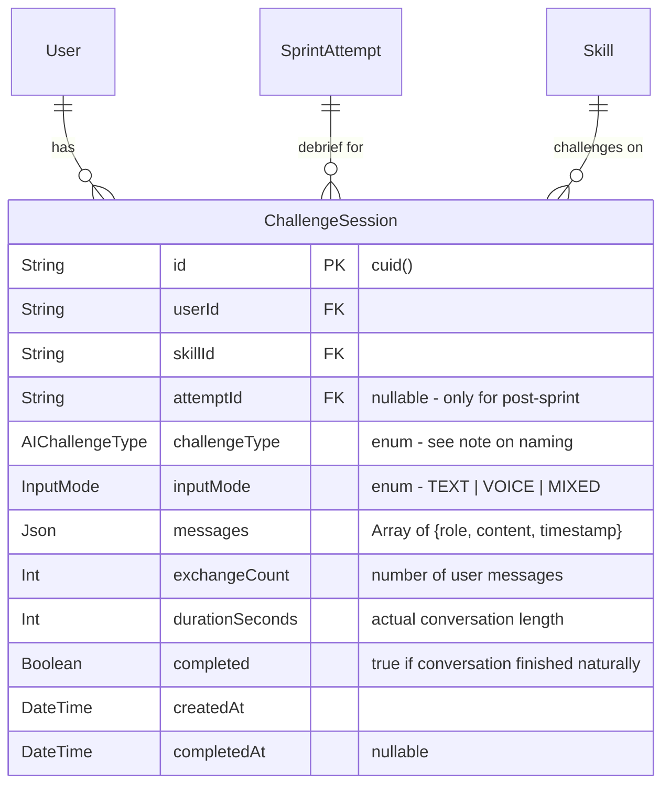

# AI Challenger - Real-Time Conversational AI Layer

## Enhancement Summary

**Deepened on:** 2026-02-13
**Sections enhanced:** All 5 phases + schema + alternatives
**Research agents used:** TypeScript reviewer, Security sentinel, Performance oracle, Architecture strategist, Race conditions reviewer, Code simplicity reviewer, 4 learnings researchers, Streaming chat UI researcher, Context7 (ElevenLabs + Vercel AI SDK)

### Key Improvements

1. **CRITICAL FIX: ChallengeType enum collision** - Existing schema has `ChallengeType { SPEED_ROUND, SCORE_ATTACK }`. Must rename new enum to `AIChallengeType`.
2. **CRITICAL FIX: Prompt injection vulnerability** - API route must validate messages with Zod, reject `system` role from client, fetch sprint context server-side by ID (never trust client).
3. **CRITICAL FIX: Vercel AI SDK API** - Use `toUIMessageStreamResponse()` not deprecated `toDataStreamResponse()`. Use `convertToModelMessages()` not raw `CoreMessage`.
4. **Race condition guards** - Replicate `SprintRunner.tsx` patterns: `endingRef`, `submittedRef`, `mountedRef`, `visibilitychange` handler, `AbortController` cleanup.
5. **Wall-clock timer** - Use `requestAnimationFrame` + `Date.now()` instead of `setInterval` (avoids drift when tab is backgrounded).
6. **Railway SSE headers** - Must set `X-Accel-Buffering: no` on streaming responses for Railway proxy.
7. **Hackathon scope recommendation** - Ship Phase 1+2 first (3 files, 0 migrations, ~8h). Defer Phase 3 (standalone) and Phase 4 (voice) unless time permits.

### New Considerations Discovered

- Missing Prisma relation fields on `User`, `Skill`, `SprintAttempt` for `ChallengeSession`
- `inputMode` should be a proper enum, not bare `String`
- Voice toggle needs a 6-state machine (idle/requesting/connecting/active/error/cooldown), not a boolean
- `ResultsReveal.tsx` is already 378 lines — extract `PostSprintDebrief` wrapper instead of embedding inline
- Need in-memory rate limiter on streaming route (DB-only check is bypassable)
- CSP headers for AI content rendering (never use `dangerouslySetInnerHTML`)

---

## Overview

Add a real-time conversational AI layer that directly engages users, challenging their thinking and building business judgment muscle. Two trigger points: **post-sprint debrief** (AI cross-examines your weakest answers, 60-90s, skippable) and **standalone Challenge mode** (4th mode with Mock Interview, Scenario Drill, Socratic Coaching). Text chat is default; ElevenLabs Voice Agent is an optional toggle with strict time limits.

This is the "aha" moment - the feature that makes AI visible, tangible, and impossible-without-AI.

## Problem Statement

Current experience is fundamentally pre-AI: users answer questions, get graded. AI generates and evaluates behind the scenes but the user never *feels* it. Every user gets the same static experience regardless of what they just did. This could run on a static question bank. The AI Challenger makes Opus 4.6 the visible, central experience.

## Proposed Solution

A unified `<AIChallenger>` component that adapts to all contexts (post-sprint vs standalone), all challenge types, all skills. Text streaming via Vercel AI SDK `useChat` hook. ElevenLabs Voice Agent as an optional toggle.

## Technical Approach

### Architecture

```
┌─────────────────────────────────────────────────────┐
│                    AIChallenger                       │
│  (unified component - adapts to context)             │
│                                                       │
│  ┌──────────┐  ┌──────────────┐  ┌───────────────┐  │
│  │ ChatPanel │  │ VoiceToggle  │  │ CountdownTimer│  │
│  │ (text)    │  │ (ElevenLabs) │  │ (wall-clock)  │  │
│  └──────────┘  └──────────────┘  └───────────────┘  │
│                                                       │
│  Context: post-sprint | standalone                    │
│  Type: interview | drill | socratic                   │
│  Skill: adapts AI persona per domain                  │
└─────────────────────────────────────────────────────┘
         │                          │
    ┌────┴────┐               ┌────┴────────┐
    │ SSE API │               │ ElevenLabs  │
    │ /api/   │               │ Voice Agent │
    │ challenge│              │ (WebSocket) │
    └────┬────┘               └─────────────┘
         │
    ┌────┴────┐
    │ Claude  │
    │ Sonnet  │
    │ 4.5     │
    └─────────┘
```

### Key Design Decisions

| Decision | Choice | Rationale |
|---|---|---|
| Streaming SDK | Vercel AI SDK (`ai` + `@ai-sdk/anthropic`) | `useChat` hook handles state, loading, errors. Zero boilerplate for streaming. |
| AI Model | `claude-sonnet-4-5-20250929` | Fast enough for real-time conversation. Opus for generation, Sonnet for interaction (existing pattern). |
| Voice SDK | `@elevenlabs/react` `useConversation` hook | Full duplex voice, custom LLM support, React-native, signed URLs for security. |
| Post-sprint trigger | Inline on results page | Not a separate screen. Appears below score reveal as "Debrief with AI" CTA. |
| Standalone mode | Repurpose `/challenges` route | Already in bottom nav. Rename tab icon label to "Challenge". Avoids adding 6th tab. |
| Scoring | No impact on sprint scores | Debrief is pure educational value. Challenge mode saves to separate `ChallengeSession` model. |
| Conversation persistence | Ephemeral (no resume) | Hackathon scope. Save completed transcripts only. |
| Weakness detection | Bottom 2 by score, tie-break by time | Simple, deterministic, no AI needed for selection. |

### Research Insights: Architecture

**Best Practices (from 13 parallel research agents):**

- **Dual SDK documentation**: Creating a second Anthropic client (`@ai-sdk/anthropic`) alongside existing `@anthropic-ai/sdk` in `lib/ai/client.ts` needs explicit documentation. Create `lib/ai/streaming-client.ts` with a comment explaining the dual-SDK situation.
- **Single timer owner**: Only ONE component should own the timer state. Pass `timeRemaining` down as a prop; never have both `AIChallenger` and `CountdownTimer` managing time independently (learning from SprintRunner patterns).
- **Server-side context fetching**: Client sends only `attemptId`; server fetches sprint data and verifies ownership. Never trust client-provided `correctAnswer`, `insightAnswer`, or scoring data.

**Anti-patterns to Avoid:**

- Do NOT use `dangerouslySetInnerHTML` for AI-generated content. Render as plain text or use a safe markdown renderer.
- Do NOT pass raw `messages` array from client to Claude without Zod validation.
- Do NOT use `setInterval` for timers — use wall-clock time via `requestAnimationFrame`.

---

### Implementation Phases

#### Phase 1: Streaming Infrastructure (Foundation)

**Goal:** Get Claude streaming working end-to-end in the existing stack.

**Tasks:**

- [x] Install Vercel AI SDK: `npm install ai @ai-sdk/anthropic`
- [x] Create streaming API route `app/api/challenge/route.ts`
  - Auth via `ensureUser()`
  - Rate limit: 10 AI conversations/user/hour (separate from sprint limit)
  - Accept: `{ messages, context }` — context validated with Zod schema
  - Return streaming response via `streamText()` from AI SDK
  - Set `X-Accel-Buffering: no` header for Railway proxy compatibility
- [x] Create `lib/ai/prompts/challenger.ts` - prompt builder
  - `buildPostSprintPrompt(attempt, weakInteractions)` - cross-examination prompt
  - `buildChallengePrompt(skill, type, userLevel)` - standalone challenge prompt
  - System prompt includes: skill domain context, challenge type persona, conversation rules, time awareness
- [x] Create `lib/ai/challenger.ts` - weakness detection utility
  - `findWeakestInteractions(responses: EnrichedResponse[], count: number)` - picks bottom N by score, tie-break by time
  - Handle edge cases: all perfect scores (pick most time-consuming), <2 interactions (use all), empty array guard

```typescript
// app/api/challenge/route.ts
import { streamText, convertToModelMessages, type UIMessage } from 'ai';
import { createAnthropic } from '@ai-sdk/anthropic';
import { z } from 'zod';
import { ensureUser } from '@/lib/auth';
import { prisma } from '@/lib/db';
import { buildPostSprintPrompt, buildChallengePrompt } from '@/lib/ai/prompts/challenger';

const anthropic = createAnthropic({ apiKey: process.env.ANTHROPIC_API_KEY });

// Zod schemas for input validation
const MessageSchema = z.object({
  role: z.enum(['user', 'assistant']), // Never allow 'system' from client
  content: z.string().max(2000),
});

const PostSprintContext = z.object({
  type: z.literal('post-sprint'),
  attemptId: z.string(), // Server fetches data by ID — never trust client-provided sprint data
});

const ChallengeContext = z.object({
  type: z.literal('standalone'),
  skillId: z.string(),
  challengeType: z.enum(['MOCK_INTERVIEW', 'SCENARIO_DRILL', 'SOCRATIC_COACHING']),
});

const RequestSchema = z.object({
  messages: z.array(MessageSchema).max(20),
  context: z.discriminatedUnion('type', [PostSprintContext, ChallengeContext]),
});

export async function POST(req: NextRequest) {
  const user = await ensureUser();
  if (!user) return NextResponse.json({ error: 'Unauthorized' }, { status: 401 });

  // Validate request body
  const body = RequestSchema.safeParse(await req.json());
  if (!body.success) {
    return NextResponse.json({ error: 'Invalid request', details: body.error.flatten() }, { status: 400 });
  }

  const { messages, context } = body.data;

  // Rate limit check (10/hour for challenges) — in-memory check + DB backup
  const oneHourAgo = new Date(Date.now() - 60 * 60 * 1000);
  const recentSessions = await prisma.challengeSession.count({
    where: { userId: user.id, createdAt: { gte: oneHourAgo } },
  });
  if (recentSessions >= 10) {
    return NextResponse.json({ error: 'Rate limit exceeded' }, { status: 429 });
  }

  // Build system prompt — server fetches all context data
  let systemPrompt: string;
  if (context.type === 'post-sprint') {
    // Fetch attempt + weak interactions server-side (never trust client data)
    const attempt = await prisma.sprintAttempt.findUnique({
      where: { id: context.attemptId, userId: user.id }, // Verify ownership
      include: { sprint: { include: { skill: true } }, interactions: true },
    });
    if (!attempt) return NextResponse.json({ error: 'Attempt not found' }, { status: 404 });
    systemPrompt = buildPostSprintPrompt(attempt);
  } else {
    const skill = await prisma.skill.findUnique({ where: { id: context.skillId } });
    if (!skill) return NextResponse.json({ error: 'Skill not found' }, { status: 404 });
    systemPrompt = buildChallengePrompt(skill, context.challengeType, 'intermediate');
  }

  const result = streamText({
    model: anthropic('claude-sonnet-4-5-20250929'),
    system: systemPrompt,
    messages: await convertToModelMessages(messages as UIMessage[]),
    maxTokens: 300, // Keep responses concise (< 15 seconds of reading)
    abortSignal: AbortSignal.timeout(15_000), // Hard 15s timeout per response
  });

  // Use toUIMessageStreamResponse (NOT deprecated toDataStreamResponse)
  const response = result.toUIMessageStreamResponse();
  // Railway proxy compatibility — prevents response buffering
  response.headers.set('X-Accel-Buffering', 'no');
  return response;
}
```

### Research Insights: Phase 1

**Vercel AI SDK (Context7 research):**

- `toDataStreamResponse()` is deprecated — use `toUIMessageStreamResponse()` for automatic UI message formatting
- `convertToModelMessages()` converts `UIMessage[]` to the format Claude expects. Do NOT pass raw `CoreMessage` arrays.
- `useChat({ api: '/api/challenge' })` on client manages messages state, loading, error, and streaming automatically
- `maxSteps` can enable multi-tool conversations if needed later

**Security (from Security Sentinel):**

- Always validate with Zod before any processing. The `z.enum(['user', 'assistant'])` on role prevents `system` role injection.
- `z.string().max(2000)` on content prevents payload bombs
- `z.array(...).max(20)` on messages prevents context window abuse
- Server-side context fetching + ownership check (`userId: user.id`) prevents data leakage
- Add `AbortSignal.timeout(15_000)` to prevent hanging connections consuming server resources

**Railway Deployment (from Performance Oracle):**

- SSE responses need `X-Accel-Buffering: no` header to prevent Railway's nginx proxy from buffering the entire response before sending
- Consider `Cache-Control: no-cache, no-store` on streaming responses
- Railway's default proxy timeout is 5 minutes — sufficient for 90-120s conversations

**Rate Limiting (from Architecture Strategist):**

- DB-only rate limiting has a race window (concurrent requests before count updates). For hackathon scope, DB check is acceptable. For production, add an in-memory counter with `Map<userId, { count, resetAt }>`.

**Files to create:**
- `app/api/challenge/route.ts`
- `lib/ai/prompts/challenger.ts`
- `lib/ai/challenger.ts`

---

#### Phase 2: Post-Sprint Debrief (Core Feature)

**Goal:** After completing any sprint, user sees an optional AI debrief that challenges their weakest answers.

**Tasks:**

- [x] Create `components/ai-challenger/AIChallenger.tsx` - unified chat component
  - Props: `context: PostSprintContext | ChallengeContext`, `onClose: () => void`
  - Uses `useChat` from Vercel AI SDK pointed at `/api/challenge`
  - Renders chat messages with streaming text
  - Shows exchange counter ("2 of 4")
  - Wall-clock countdown timer (90s for post-sprint)
  - Auto-sends first AI message on mount (AI opens with the challenge question)
  - "End conversation" button always visible
  - **Must include race condition guards** (see Research Insights below)
- [x] Create `components/ai-challenger/ChatMessage.tsx` - message bubble
  - AI messages: left-aligned, violet accent
  - User messages: right-aligned, muted background
  - Streaming indicator: animated dots while AI is generating
  - Spring animation on new message (Motion, match card physics)
  - **Render AI text as plain text, NOT dangerouslySetInnerHTML**
- [x] Create `components/ai-challenger/ChatInput.tsx` - text input
  - Single line input with send button
  - Enter to submit, Shift+Enter for newline
  - Disabled while AI is streaming
  - Character limit: 500 chars (concise responses)
  - 44px height (mobile touch target)
  - **`submittedRef` guard to prevent double-submit**
- [x] Create `components/ai-challenger/CountdownTimer.tsx` - visual timer
  - Circular progress ring (similar to CareerProgressBanner)
  - Shows seconds remaining
  - Warning state at 15s (amber), critical at 5s (red)
  - Auto-ends conversation at 0 with "Time's up" message
  - **Wall-clock implementation: `Date.now()` + `requestAnimationFrame`**, not `setInterval`
  - **`visibilitychange` handler: pause display updates when tab hidden, resume with correct time on return**
- [x] Create `components/ai-challenger/PostSprintDebrief.tsx` - wrapper component
  - Extracted from results page to keep `ResultsReveal.tsx` manageable (already 378 lines)
  - Handles CTA state (show/hide), AIChallenger mounting/unmounting
  - Fetches weak interactions and passes context to AIChallenger
- [x] Integrate into results page `app/results/[attemptId]/page.tsx`
  - After score reveal + radar chart, render `<PostSprintDebrief>` component
  - Pass `attemptId` as prop — component handles the rest
  - When debrief completes or user skips, show "Continue" to return to mode page

**Post-sprint debrief flow:**
```
Results page loads → Score reveal → Radar chart → AI feedback text
                                                        ↓
                              ┌─────────────────────────────────────┐
                              │  Want AI to challenge your thinking? │
                              │  [Challenge My Thinking]    [Skip]   │
                              └─────────────────────────────────────┘
                                        ↓ (click)
                              ┌─────────────────────────────────────┐
                              │  AI: "You chose to cut the marketing │
                              │  budget, but your competitor just    │
                              │  launched a new product..."          │
                              │                                      │
                              │  User: "I'd reallocate to digital..." │
                              │                                      │
                              │  AI: "Interesting, but what about    │
                              │  brand awareness in a new market?"   │
                              │                            [01:12]   │
                              │  ┌─────────────────────┐ [End]      │
                              │  │ Type your response...│ [Send]     │
                              │  └─────────────────────┘             │
                              └─────────────────────────────────────┘
```

**Weakness detection logic:**
```typescript
// lib/ai/challenger.ts
export function findWeakestInteractions(
  responses: EnrichedResponse[],
  count: number = 2
): EnrichedResponse[] {
  // Guard: empty array
  if (responses.length === 0) return [];
  if (responses.length <= count) return responses;

  const allPerfect = responses.every(r => r.isCorrect);
  if (allPerfect) {
    // Pick slowest (most time-consuming = most uncertain)
    return [...responses]
      .sort((a, b) => b.timeSpent - a.timeSpent)
      .slice(0, count);
  }

  return [...responses]
    .sort((a, b) => {
      // Primary: score ascending (weakest first)
      if (a.score !== b.score) return a.score - b.score;
      // Tie-break: time descending (slower = more struggle)
      return b.timeSpent - a.timeSpent;
    })
    .slice(0, count);
}
```

### Research Insights: Phase 2

**Race Condition Guards (from Race Conditions Reviewer + SprintRunner patterns):**

These patterns are MANDATORY — copied from the existing `SprintRunner.tsx` which already solves these problems:

```typescript
// Inside AIChallenger.tsx — required guards
const endingRef = useRef(false);     // Prevents timer-end + user-send race
const mountedRef = useRef(false);    // Prevents auto-send in React Strict Mode double-mount
const submittedRef = useRef(false);  // Prevents double-tap on send

useEffect(() => {
  mountedRef.current = true;
  const controller = new AbortController();

  // Auto-send initial AI message only if still mounted
  if (mountedRef.current) {
    // Trigger initial AI message
  }

  return () => {
    mountedRef.current = false;
    controller.abort(); // Cancel any in-flight requests
  };
}, []);

// Timer + send race: check endingRef before processing user message
const handleSend = useCallback((content: string) => {
  if (endingRef.current || submittedRef.current) return;
  submittedRef.current = true;
  // ... send message
  submittedRef.current = false; // Reset after processing
}, []);

const handleTimerEnd = useCallback(() => {
  if (endingRef.current) return;
  endingRef.current = true;
  // ... end conversation
}, []);
```

**Wall-Clock Timer (from Performance Oracle):**

`setInterval` drifts when the browser throttles background tabs. Use wall-clock time:

```typescript
// Inside CountdownTimer.tsx
const startTimeRef = useRef(Date.now());
const [remaining, setRemaining] = useState(totalSeconds);

useEffect(() => {
  startTimeRef.current = Date.now();

  const tick = () => {
    const elapsed = Math.floor((Date.now() - startTimeRef.current) / 1000);
    const left = Math.max(0, totalSeconds - elapsed);
    setRemaining(left);
    if (left > 0) rafId = requestAnimationFrame(tick);
    else onExpire();
  };

  let rafId = requestAnimationFrame(tick);

  // Pause display when tab hidden, correct on return
  const handleVisibility = () => {
    if (document.hidden) cancelAnimationFrame(rafId);
    else rafId = requestAnimationFrame(tick);
  };
  document.addEventListener('visibilitychange', handleVisibility);

  return () => {
    cancelAnimationFrame(rafId);
    document.removeEventListener('visibilitychange', handleVisibility);
  };
}, [totalSeconds, onExpire]);
```

**Component Extraction (from Code Simplicity Reviewer):**

`ResultsReveal.tsx` is already 378 lines. Do NOT embed AIChallenger directly. Create `PostSprintDebrief.tsx` as a wrapper:

```typescript
// components/ai-challenger/PostSprintDebrief.tsx
// Handles: CTA display, AIChallenger mounting, context preparation
// ResultsReveal only needs: <PostSprintDebrief attemptId={attemptId} />
```

**Chat UX Best Practices (from Streaming Chat UI researcher):**

- Use `useOptimistic` (React 19) for instant message display before server ack
- Scroll to bottom on new message with `scrollIntoView({ behavior: 'smooth' })`
- `memo()` each `ChatMessage` to prevent re-renders during streaming
- Show "AI is thinking..." indicator only after 500ms delay (avoids flicker on fast responses)

**Files to create:**
- `components/ai-challenger/AIChallenger.tsx`
- `components/ai-challenger/ChatMessage.tsx`
- `components/ai-challenger/ChatInput.tsx`
- `components/ai-challenger/CountdownTimer.tsx`
- `components/ai-challenger/PostSprintDebrief.tsx` (NEW — extracted wrapper)

**Files to modify:**
- `app/results/[attemptId]/page.tsx` - add `<PostSprintDebrief>` (minimal change to existing file)

---

#### Phase 3: Standalone Challenge Mode (New Mode)

**Goal:** A dedicated page where users pick a skill + challenge type and enter a focused AI conversation.

> **Hackathon scope note:** This phase is DEFERRABLE. Phase 1+2 delivers the core "aha" moment. Only proceed here if Phase 2 ships cleanly and time permits.

**Tasks:**

- [x] Create `app/challenge/page.tsx` - challenge mode selector
  - Skill picker (reuse existing skill cards/list)
  - Challenge type selector: 3 cards (Mock Interview, Scenario Drill, Socratic Coaching)
  - Each card: icon, title, 1-line description, estimated time (2 min)
  - "Start Challenge" button → navigates to challenge session
- [x] Create `app/challenge/[sessionId]/page.tsx` - challenge session page
  - Full-screen chat experience (no results panel, just conversation)
  - AIChallenger component with `context: ChallengeContext`
  - Timer: 2 minutes
  - On completion: show summary card with AI's assessment
  - "Try Another" and "Back to Challenge" CTAs
- [x] Create `app/api/challenge/sessions/route.ts` - create session
  - POST: Create ChallengeSession record, return session ID
  - Validates skill exists, challenge type is valid
  - Returns initial AI message (first challenge prompt)
- [x] Update bottom nav: Rename "Challenges" label/route
  - Change `href: "/challenges"` to `href: "/challenge"`
  - Keep Trophy icon (fits both concepts)
  - Or use a new icon like `Brain` or `MessageSquare` from lucide-react
- [x] Add `ChallengeSession` model to Prisma schema (see ERD below)
- [x] Create `lib/ai/prompts/challenge-types.ts` - per-type system prompts
  - `MOCK_INTERVIEW_PROMPT` - interviewer persona, structured Q&A
  - `SCENARIO_DRILL_PROMPT` - pressure-cooker with escalating twists
  - `SOCRATIC_COACHING_PROMPT` - probing questions only, never gives answers

**Challenge type prompt differentiation:**

| Type | AI Persona | Opening Style | Follow-up Style | Never Does |
|---|---|---|---|---|
| Mock Interview | Senior interviewer | "Walk me through how you'd..." | "Good. Now tell me about..." | Give answers or hints |
| Scenario Drill | Crisis narrator | "You're the PM. It's Monday morning and..." | "Plot twist: now [escalation]..." | Stay predictable |
| Socratic Coaching | Thoughtful mentor | "I noticed you struggled with X. Why do you think that happened?" | "What if [assumption] changed?" | Give direct answers |

### Research Insights: Phase 3

**Schema Design (from Data Integrity Guardian):**

- Use `AIChallengeType` enum name to avoid collision with existing `ChallengeType { SPEED_ROUND, SCORE_ATTACK }`
- `inputMode` should be a proper enum `InputMode { TEXT, VOICE, MIXED }`, not a bare `String`
- Add `onDelete: Cascade` on userId relation (matches existing pattern on SprintAttempt)
- Add `onDelete: SetNull` on attemptId (debrief survives if attempt is deleted)

**Simplification Option (from Code Simplicity Reviewer):**

For hackathon scope, consider skipping the `ChallengeSession` model entirely. Instead:
- Store debrief transcript as optional JSON on `SprintAttempt` (`debriefMessages Json?`)
- Only create `ChallengeSession` model if Phase 3 (standalone) is actually built
- This eliminates migration risk and reduces Phase 2 scope to 0 schema changes

**Files to create:**
- `app/challenge/page.tsx`
- `app/challenge/[sessionId]/page.tsx`
- `app/api/challenge/sessions/route.ts`
- `lib/ai/prompts/challenge-types.ts`

**Files to modify:**
- `components/layout/BottomNav.tsx` - update challenges → challenge
- `prisma/schema.prisma` - add ChallengeSession model + AIChallengeType enum

---

#### Phase 4: ElevenLabs Voice Integration (Wow Layer)

**Goal:** Optional voice toggle that switches the conversation to full-duplex voice via ElevenLabs.

> **Hackathon scope note:** This phase is DEFERRABLE. Voice is the "wow" layer but carries the highest demo risk. Only proceed if Phases 1-3 are solid and you have 4+ hours remaining.

**Tasks:**

- [x] Install ElevenLabs SDK: `npm install @elevenlabs/react`
- [x] Create `app/api/elevenlabs/signed-url/route.ts` - server-side URL generation
  - Auth via `ensureUser()`
  - Rate limit: 5 voice sessions/user/hour (voice costs more)
  - Fetches signed URL from ElevenLabs API
  - Build prompt SERVER-SIDE, pass via `overrides.agent.prompt`
  - Never exposes API key to client
- [x] Create `components/ai-challenger/VoiceToggle.tsx` - voice mode switch
  - **State machine with 6 states** (see Research Insights below)
  - Toggle button with mic icon
  - When activated: requests signed URL, starts ElevenLabs session
  - When deactivated: ends ElevenLabs session, returns to text
  - Shows "Voice mode" indicator when active
  - Handles permission denied gracefully (auto-fallback to text with info banner)
- [ ] Create `components/ai-challenger/VoiceOverlay.tsx` - voice mode UI
  - Replaces chat input with voice visualization
  - Shows: speaking/listening indicator, waveform animation, time remaining
  - "Switch to Text" button always visible
  - Auto-transcribes conversation into chat history (messages appear as bubbles)
- [ ] Configure ElevenLabs agent with Claude as brain
  - Create agent in ElevenLabs dashboard (or via API)
  - Set custom LLM: Claude Sonnet 4.5 via `overrides.agent.prompt`
  - Set `max_duration_seconds`: 90 (post-sprint) or 120 (standalone)
  - Choose voice: professional, clear, slightly warm tone
- [ ] Add environment variables
  - `ELEVENLABS_API_KEY` - server-side only
  - `ELEVENLABS_AGENT_ID` - server-side only
  - **Remove `NEXT_PUBLIC_` prefix** — voice ID should also be server-side, passed via signed URL

**Voice toggle integration in AIChallenger:**
```typescript
// Inside AIChallenger.tsx
const [inputMode, setInputMode] = useState<'text' | 'voice'>('text');

return (
  <div>
    <div className="flex items-center justify-between">
      <CountdownTimer seconds={timeLimit} onExpire={handleEnd} />
      <VoiceToggle
        active={inputMode === 'voice'}
        onToggle={() => setInputMode(m => m === 'text' ? 'voice' : 'text')}
      />
    </div>
    <div className="flex-1 overflow-y-auto">
      {messages.map(msg => <ChatMessage key={msg.id} {...msg} />)}
    </div>
    {inputMode === 'text' ? (
      <ChatInput onSend={handleSend} disabled={isLoading} />
    ) : (
      <VoiceOverlay onTranscript={handleVoiceTranscript} />
    )}
  </div>
);
```

### Research Insights: Phase 4

**Voice State Machine (from Race Conditions Reviewer):**

A boolean `isVoiceActive` is insufficient. Voice needs 6 states to handle the async lifecycle:

```typescript
type VoiceState =
  | 'idle'         // Voice off, text mode active
  | 'requesting'   // Fetching signed URL from server
  | 'connecting'   // ElevenLabs WebSocket connecting
  | 'active'       // Voice session live
  | 'error'        // Failed, showing error + fallback
  | 'cooldown';    // Just ended, prevent rapid re-toggle (1s debounce)

// Transitions:
// idle → requesting → connecting → active → idle
// requesting|connecting → error → idle (auto-fallback to text)
// active → cooldown → idle
```

**ElevenLabs Integration (from Context7 research):**

```typescript
// Key patterns from ElevenLabs Conversational AI SDK:
import { useConversation } from '@elevenlabs/react';

const conversation = useConversation({
  onConnect: () => setVoiceState('active'),
  onDisconnect: () => setVoiceState('cooldown'),
  onError: (error) => {
    console.error('Voice error:', error);
    setVoiceState('error');
    // Auto-fallback to text after 2s
    setTimeout(() => setInputMode('text'), 2000);
  },
  onMessage: ({ message, source }) => {
    // Append to chat transcript for visual record
    if (source === 'ai') appendMessage({ role: 'assistant', content: message });
  },
});

// Start with signed URL (never expose API key)
const startVoice = async () => {
  setVoiceState('requesting');
  const { signedUrl } = await fetch('/api/elevenlabs/signed-url').then(r => r.json());
  setVoiceState('connecting');
  await conversation.startSession({
    signedUrl,
    overrides: {
      agent: {
        prompt: { prompt: systemPrompt }, // Server builds this
      },
      tts: { voiceId: selectedVoiceId },
    },
  });
};
```

**Security (from Security Sentinel):**

- ALL ElevenLabs env vars must be server-side only (no `NEXT_PUBLIC_` prefix)
- Signed URLs have a TTL — generate fresh for each session
- Build the entire system prompt server-side and pass via `overrides.agent.prompt`
- Never allow client to override the system prompt or agent configuration

**Files to create:**
- `app/api/elevenlabs/signed-url/route.ts`
- `components/ai-challenger/VoiceToggle.tsx`
- `components/ai-challenger/VoiceOverlay.tsx`

**Files to modify:**
- `components/ai-challenger/AIChallenger.tsx` - add voice toggle integration
- `.env.local` - add ElevenLabs env vars (server-side only)

---

#### Phase 5: Polish & Demo Safety (Ship It)

**Goal:** Make it demo-ready, handle errors, add gamification hooks.

**Tasks:**

- [x] Pre-cache demo conversations
  - Generate 3 sample post-sprint debriefs (one per skill domain)
  - Generate 3 sample standalone challenges (one per type)
  - Store in `prisma/seed-data/demo-challenges/` as JSON
  - Fallback: if streaming takes >5s for first token, serve cached response
- [x] Error states UI
  - Rate limit hit: "You've had a great session! Come back in [time] for more challenges."
  - API timeout: "AI is taking a moment. [Retry] or [Skip]"
  - Network loss: "Connection lost. [Retry]" (auto-retry 2x first)
  - Voice connection failed: "Voice unavailable. Continuing in text mode." (auto-fallback)
- [x] Gamification integration
  - Award XP for completing AI debrief: +15 XP base
  - Award XP for completing standalone challenge: +20 XP base
  - Track engagement: `challengeSessionsCompleted` counter on User
  - Achievement hook: "Curious Mind" badge after 5 challenge sessions
- [ ] Analytics events (PostHog)
  - `challenge_started` (type, skill, input_mode)
  - `challenge_exchange` (exchange_number, input_mode, response_length)
  - `challenge_completed` (type, duration, exchanges, input_mode)
  - `challenge_skipped` (trigger: post-sprint)
  - `voice_toggled` (from, to)
  - `voice_error` (error_type)
- [x] Mobile polish
  - Keyboard-aware chat input (doesn't get hidden behind keyboard)
  - 44px touch targets on all buttons
  - Safe area insets for bottom nav overlap
  - Voice button large enough for thumb (56px)
- [x] Accessibility
  - Chat messages in ARIA live region for screen readers
  - Voice toggle clearly labeled
  - Timer announced at warning thresholds
  - Focus management when debrief panel opens

### Research Insights: Phase 5

**Demo Safety (from Architecture Strategist):**

- Pre-cache fallback should use the EXACT same message format as live streaming so the UI component doesn't need conditional rendering
- Use a simple `isDemo` flag or `NEXT_PUBLIC_DEMO_MODE=true` env var to force cached responses
- Cache format: `{ messages: Array<{ role, content }>, metadata: { skill, type, duration } }`
- Test the demo path 5x before presenting — the fallback IS the demo safety net

**Mobile Keyboard Handling (from Streaming Chat UI researcher):**

```typescript
// Prevent iOS keyboard from pushing chat off-screen
useEffect(() => {
  const viewport = window.visualViewport;
  if (!viewport) return;

  const handleResize = () => {
    // Scroll chat container to keep input visible
    chatContainerRef.current?.scrollTo({
      top: chatContainerRef.current.scrollHeight,
      behavior: 'instant',
    });
  };

  viewport.addEventListener('resize', handleResize);
  return () => viewport.removeEventListener('resize', handleResize);
}, []);
```

**Correlation ID Error Pattern (from learnings researcher — PR #2 fix):**

Apply the existing error pattern from the evaluation pipeline:

```typescript
const correlationId = `challenge-${Date.now()}-${Math.random().toString(36).slice(2, 8)}`;
console.error(`[${correlationId}] Challenge API error:`, error);
return NextResponse.json({ error: 'Challenge failed', correlationId }, { status: 500 });
```

**Files to create:**
- `prisma/seed-data/demo-challenges/` (JSON files)

**Files to modify:**
- `lib/gamification/xp.ts` - add challenge XP constants
- `lib/gamification/constants.ts` - add challenge achievements

---

### Database Schema Changes



```prisma
// Add to prisma/schema.prisma
// NOTE: Named AIChallengeType to avoid collision with existing ChallengeType enum
// (which has SPEED_ROUND | SCORE_ATTACK for compete mode)

enum AIChallengeType {
  MOCK_INTERVIEW
  SCENARIO_DRILL
  SOCRATIC_COACHING
  POST_SPRINT_DEBRIEF
}

enum InputMode {
  TEXT
  VOICE
  MIXED
}

model ChallengeSession {
  id              String           @id @default(cuid())
  userId          String
  skillId         String
  attemptId       String?          // Only for POST_SPRINT_DEBRIEF
  challengeType   AIChallengeType
  inputMode       InputMode        @default(TEXT)
  messages        Json             // [{role: "user"|"assistant", content: string, timestamp: string}]
  exchangeCount   Int              @default(0)
  durationSeconds Int?
  completed       Boolean          @default(false)
  createdAt       DateTime         @default(now())
  completedAt     DateTime?

  user    User           @relation(fields: [userId], references: [id], onDelete: Cascade)
  skill   Skill          @relation(fields: [skillId], references: [id])
  attempt SprintAttempt? @relation(fields: [attemptId], references: [id], onDelete: SetNull)

  @@index([userId, createdAt])
  @@index([userId, challengeType])
  @@index([skillId, challengeType])
}

// REQUIRED: Add relation fields to existing models
// User model: add `challengeSessions ChallengeSession[]`
// Skill model: add `challengeSessions ChallengeSession[]`
// SprintAttempt model: add `challengeDebriefs ChallengeSession[]`
```

### Research Insights: Schema

**Simplification Alternative (from Code Simplicity Reviewer):**

For Phase 2 only (post-sprint debrief), you can skip the ChallengeSession model entirely:

```prisma
// Alternative: Add to SprintAttempt model
model SprintAttempt {
  // ... existing fields ...
  debriefMessages  Json?     // [{role, content, timestamp}] — nullable, only if debrief was done
  debriefCompleted Boolean   @default(false)
}
```

This eliminates the need for a new model, migration, and relation fields. Only create `ChallengeSession` when Phase 3 (standalone mode) is actually being built.

**Recommendation:** Use the simplified approach for hackathon. Create full model only if standalone mode is built.

---

## Alternative Approaches Considered

**1. Build streaming from scratch (Native Anthropic SDK + ReadableStream)**
- Rejected: More boilerplate, no built-in state management, `useChat` handles 80% of the work.

**2. Client-side Claude streaming (no server route)**
- Rejected: Exposes API key to client. No server-side rate limiting.

**3. Voice-first experience (ElevenLabs as primary)**
- Rejected: Fragile for demo, adds latency, text is more reliable. Voice is the "wow" layer, not the backbone.

**4. Separate debrief and challenge components**
- Rejected: Same chat UI, same streaming logic. Unified component with context prop is DRY.

**5. Add Challenge as 6th bottom nav tab**
- Rejected: Too crowded. Repurpose existing Challenges tab (which serves time-limited challenges that can coexist on the same page).

### Research Insights: Alternatives

**Additional approach considered during deepening:**

**6. Skip ChallengeSession model for hackathon**
- Store debrief as optional JSON on SprintAttempt
- Only create full model if standalone mode is built
- **Recommended for hackathon** — reduces scope, eliminates migration risk

**7. Use `useCompletion` instead of `useChat`**
- Vercel AI SDK offers `useCompletion` for single-turn. Rejected because multi-turn conversation needs `useChat` with message history.

---

## Acceptance Criteria

### Functional Requirements

- [ ] After completing any sprint, user sees "Challenge My Thinking" CTA on results page
- [ ] Clicking CTA opens inline AI chat that references user's specific weak answers
- [ ] AI cross-examines user with 3-4 exchanges, streaming text token-by-token
- [ ] Countdown timer shows time remaining (90s post-sprint, 120s standalone)
- [ ] User can skip debrief at any point
- [ ] Challenge mode page shows skill picker + 3 challenge type cards
- [ ] Starting a challenge opens full-screen AI conversation
- [ ] Mock Interview, Scenario Drill, and Socratic Coaching feel distinctly different
- [ ] Voice toggle switches to ElevenLabs full-duplex voice (when available)
- [ ] Voice auto-falls back to text if connection fails or permission denied
- [ ] Conversation transcript is saved on completion
- [ ] Rate limited to 10 text sessions/hour and 5 voice sessions/hour

### Non-Functional Requirements

- [ ] First AI token appears within 2 seconds of starting conversation
- [ ] Streaming feels smooth (no visible buffering or jumping)
- [ ] Voice response latency under 3 seconds
- [ ] Works on mobile Safari, Chrome Android, desktop Chrome
- [ ] Touch targets minimum 44px
- [ ] Timer announcements accessible to screen readers
- [ ] **No `dangerouslySetInnerHTML` for AI content** (XSS prevention)
- [ ] **All API inputs validated with Zod** (injection prevention)
- [ ] **Server-side context fetching with ownership verification** (data leak prevention)
- [ ] **Wall-clock timer implementation** (accuracy guarantee)

### Quality Gates

- [ ] AI responses are contextually relevant (reference actual sprint content)
- [ ] Challenge types are distinguishable (blind test: can user tell which type they're in?)
- [ ] Demo runs successfully 3x without failures
- [ ] Pre-cached fallback works if streaming is slow
- [ ] **Race condition guards match SprintRunner patterns** (endingRef, submittedRef, mountedRef)

## Success Metrics

| Metric | Target | Measurement |
|---|---|---|
| Debrief adoption | >30% of sprint completions | PostHog: `challenge_started` / `sprint_completed` |
| Challenge mode engagement | >2 sessions/user/week | DB: ChallengeSession count per user |
| Conversation completion rate | >60% | DB: completed=true / total sessions |
| Voice toggle adoption | >15% of challenge sessions | PostHog: `voice_toggled` events |
| Demo reliability | 100% success | Manual testing before presentation |

## Dependencies & Prerequisites

| Dependency | Status | Risk |
|---|---|---|
| Vercel AI SDK (`ai` + `@ai-sdk/anthropic`) | New install needed | LOW - well-maintained, compatible with our stack |
| ElevenLabs account + API key | Need to set up | MEDIUM - requires account creation, API key |
| `@elevenlabs/react` package | New install needed | LOW - React hook, straightforward |
| Claude Sonnet 4.5 streaming | Available via Anthropic SDK | LOW - already using this model |
| Results page refactor | Need to add CTA section | LOW - additive change via extracted component |
| Bottom nav update | Rename one tab | LOW - trivial change |

## Risk Analysis & Mitigation

| Risk | Likelihood | Impact | Mitigation |
|---|---|---|---|
| Streaming latency in demo | Medium | High | Pre-cache 3-5 demo conversations as fallback |
| ElevenLabs API unreliable | Low | Medium | Text-first design means voice failure degrades gracefully |
| AI responses off-topic | Medium | Medium | Strict system prompts with conversation rules + max exchange count |
| Voice permission denied on demo device | Low | High | Test on exact demo device beforehand; text is the default |
| Rate limit confusion | Low | Low | Clear messaging with countdown to next available session |
| **ChallengeType enum collision** | **Certain** | **High** | **Rename to AIChallengeType** |
| **Timer drift on background tab** | **Medium** | **Medium** | **Wall-clock timer with visibilitychange handler** |
| **Prompt injection via messages** | **Medium** | **High** | **Zod validation, reject system role, server-side context** |
| **SSE buffering on Railway** | **Medium** | **High** | **X-Accel-Buffering: no header** |

## Hackathon Priority Order

Based on research synthesis, here is the recommended build order:

| Priority | Phase | Scope | Time Est | Demo Impact |
|---|---|---|---|---|
| **P0** | Phase 1 + 2 | Streaming + Post-Sprint Debrief | ~8h | HIGH - core "aha" moment |
| **P1** | Phase 5 (partial) | Demo safety + error states only | ~2h | HIGH - prevents demo failures |
| **P2** | Phase 3 | Standalone Challenge Mode | ~4h | MEDIUM - extends the feature |
| **P3** | Phase 4 | ElevenLabs Voice | ~4h | WOW but risky for demo |

**Recommendation:** Ship P0 + P1 first. That's the post-sprint debrief with cached fallback — the single highest-impact feature for the hackathon demo. Only proceed to P2/P3 if time permits and P0 is solid.

## File Summary

### New Files (14)

| File | Phase | Description |
|---|---|---|
| `app/api/challenge/route.ts` | 1 | Streaming AI conversation endpoint |
| `lib/ai/prompts/challenger.ts` | 1 | Post-sprint and challenge prompt builders |
| `lib/ai/challenger.ts` | 1 | Weakness detection utility |
| `components/ai-challenger/AIChallenger.tsx` | 2 | Unified chat component |
| `components/ai-challenger/ChatMessage.tsx` | 2 | Message bubble with streaming |
| `components/ai-challenger/ChatInput.tsx` | 2 | Text input with send button |
| `components/ai-challenger/CountdownTimer.tsx` | 2 | Circular countdown timer (wall-clock) |
| `components/ai-challenger/PostSprintDebrief.tsx` | 2 | Wrapper for results page integration |
| `app/challenge/page.tsx` | 3 | Challenge mode selector page |
| `app/challenge/[sessionId]/page.tsx` | 3 | Challenge session page |
| `app/api/challenge/sessions/route.ts` | 3 | Create challenge session endpoint |
| `lib/ai/prompts/challenge-types.ts` | 3 | Per-type system prompt templates |
| `app/api/elevenlabs/signed-url/route.ts` | 4 | ElevenLabs signed URL generator |
| `components/ai-challenger/VoiceToggle.tsx` | 4 | Voice mode toggle button (6-state machine) |

### Modified Files (5)

| File | Phase | Change |
|---|---|---|
| `app/results/[attemptId]/page.tsx` | 2 | Add `<PostSprintDebrief>` component |
| `prisma/schema.prisma` | 3 | Add ChallengeSession model + AIChallengeType + InputMode enums |
| `components/layout/BottomNav.tsx` | 3 | Update challenges → challenge route/label |
| `lib/gamification/xp.ts` | 5 | Add challenge XP constants |
| `.env.local` | 4 | Add ElevenLabs env vars (server-side only) |

### New Packages (3)

```bash
npm install ai @ai-sdk/anthropic @elevenlabs/react
```

## References & Research

### Internal
- Brainstorm: `docs/brainstorms/2026-02-13-ai-challenger-brainstorm.md`
- Hackathon strategy: `docs/plans/sub-plans/00-hackathon-strategy.md`
- SprintRunner patterns: `components/interactions/SprintRunner.tsx` (race condition guards)
- AI client: `lib/ai/client.ts`
- Evaluation pipeline: `lib/scoring/evaluate.ts`
- Results page: `app/results/[attemptId]/page.tsx`
- Gamification: `lib/gamification/xp.ts`

### External
- [Vercel AI SDK docs](https://sdk.vercel.ai/docs) — `useChat`, `streamText`, `toUIMessageStreamResponse`
- [ElevenLabs React SDK](https://elevenlabs.io/docs/agents-platform/libraries/react) — `useConversation`, signed URLs
- [ElevenLabs Conversational AI](https://elevenlabs.io/docs/conversational-ai/libraries/conversational-ai-sdk-js)
- [Anthropic streaming API](https://docs.anthropic.com/en/api/messages-streaming)

### Applied Learnings (from institutional knowledge)
- **Eval 500 fix (PR #2)**: NaN guards on numeric fields, correlation ID error pattern
- **Answer leak fix (PR #2)**: Never send `correctAnswer` to client; fetch server-side only
- **Timer patterns (SprintRunner)**: Single timer owner, visibilitychange handler, endingRef guard
- **Double-submit prevention**: submittedRef pattern from SprintRunner
- **Input validation**: Validate before expensive AI calls (Zod schemas on all API inputs)
