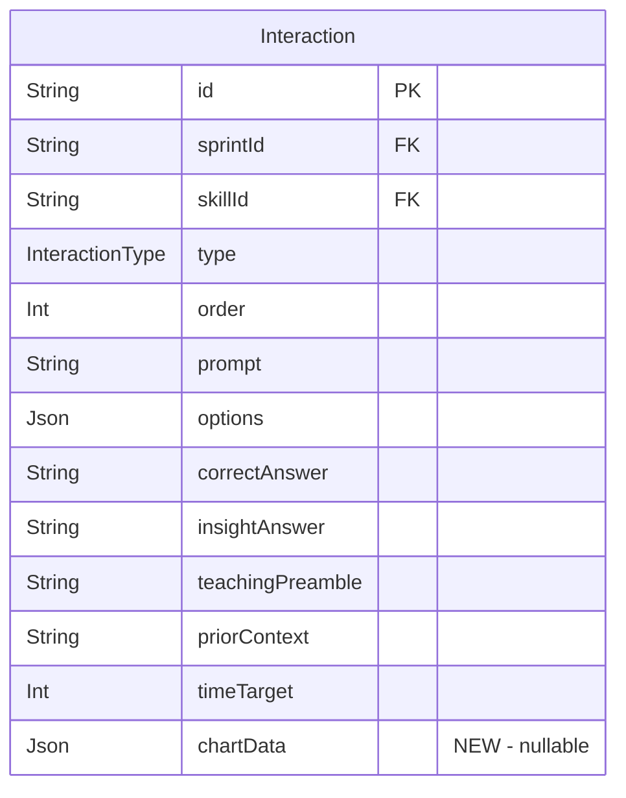
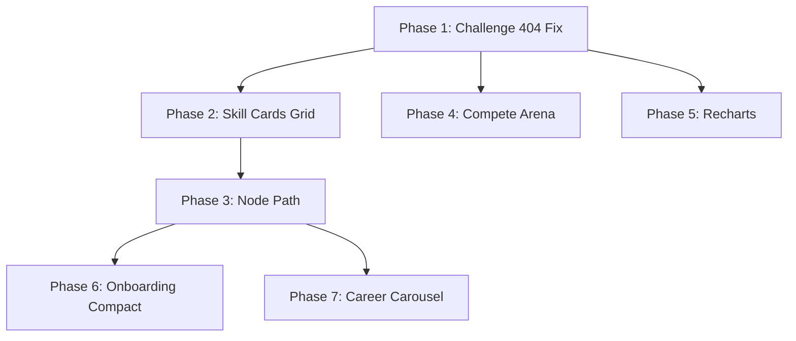

# feat: No-Scroll UX Overhaul + Visual Polish

## Overview

Comprehensive UX overhaul that eliminates unnecessary scrolling, introduces a Duolingo-inspired skill path for Learn/Practice, gives Compete an arena personality, fixes the Challenge 404 bug, adds dynamic chart rendering to interactions, and cleans up career path display. Hackathon demo is Feb 16 — 3 days remaining.

## Problem Statement

1. **Scroll overload**: Learn/Practice pages stack ~250px of banners before actionable content
2. **Uninspiring progression**: SkillAccordion is functional but flat — no game-like feel
3. **Compete lacks personality**: Disconnected layout, double headers, basic skill grid
4. **Challenge 404 bug**: Timed challenges route to `/compete/${skill.slug}` hitting `[duelId]` dynamic route
5. **No visual data**: 576 interactions are text-only — no charts for data-interpretation questions
6. **Career display issues**: Only shows top career match, bad icons, no swipe

## Proposed Solution

Six workstreams executed in dependency order, each fitting within the "no-scroll" principle — all navigation pages fit in viewport, content pages may scroll internally.

---

## Technical Approach

### Architecture

#### New Routes

```
/learn/[skillSlug]           → NEW: Duolingo-style node path for a skill
/practice/[skillSlug]        → NEW: Same component, practice mode
/challenges/[challengeId]    → NEW: Timed challenge player (replaces broken /compete/slug)
```

#### Modified Files (Key)

| File | Change |
|------|--------|
| `app/learn/page.tsx` | Replace SkillAccordion with SkillCardsGrid |
| `app/practice/page.tsx` | Same as learn |
| `app/compete/page.tsx` | Replace CompeteLobby with ArenaLobby |
| `app/challenges/ChallengesHub.tsx:259` | Fix routing from `/compete/slug` → `/challenges/[challengeId]` |
| `components/layout/SkillAccordion.tsx` | Retired (kept for reference, unused) |
| `components/onboarding/OnboardingFlow.tsx` | Compact all 4 steps to viewport-fit |
| `components/onboarding/CareerSelector.tsx` | Grid → horizontal swipeable cards |
| `components/layout/CareerProgressBanner.tsx` | Full banner → compact strip + multi-career swipe |
| `prisma/schema.prisma` | Add `chartData Json?` to Interaction model |
| `lib/data/mode-page-data.ts` | Return full `careerMatches[]` not just top match |
| `components/arena/CompeteLobby.tsx` | Retired, replaced by ArenaLobby |

#### New Components

| Component | Location | Description |
|-----------|----------|-------------|
| `SkillCardsGrid` | `components/layout/SkillCardsGrid.tsx` | 2-col grid of skill cards with progress rings |
| `SkillNodePath` | `components/layout/SkillNodePath.tsx` | Duolingo-style S-curve path with topic dividers |
| `SprintNodePopup` | `components/layout/SprintNodePopup.tsx` | Bottom sheet popup for node tap (title, desc, Start) |
| `ArenaLobby` | `components/arena/ArenaLobby.tsx` | Compete redesign with dark gradients, hero CTA |
| `InteractionChart` | `components/interactions/InteractionChart.tsx` | Recharts renderer for chartData JSON |
| `CareerCarousel` | `components/layout/CareerCarousel.tsx` | Horizontal swipeable career cards |

#### Schema Change (ERD)



### Implementation Phases

---

#### Phase 1: Challenge 404 Fix [~30 min] [CRITICAL]

**Root cause**: `app/challenges/ChallengesHub.tsx:259` calls `router.push('/compete/${challenge.skill.slug}')` — the `/compete/[duelId]` route expects a duel UUID, not a skill slug.

**Tasks:**

- [ ] Create `app/challenges/[challengeId]/page.tsx` — new timed challenge player page
  - Server component, `await params` to get `challengeId`
  - Fetch challenge config from DB, create or reuse a SprintAttempt
  - Render `SprintRunner` with the challenge's skill sprints
  - On completion, navigate to `/results/[attemptId]`

- [ ] Fix `app/challenges/ChallengesHub.tsx:259` — change routing
  ```typescript
  // BEFORE (broken):
  router.push(`/compete/${challenge.skill.slug}`);
  // AFTER (fixed):
  router.push(`/challenges/${challenge.id}`);
  ```

- [ ] Remove dead code: `app/challenge/page.tsx` and `app/challenge/ChallengeSelector.tsx` (duplicates ChallengesHub)

- [ ] Keep `app/challenge/[sessionId]/` — this is the AI challenge session route (still needed)

**Acceptance criteria:**
- [ ] Tapping "Start Challenge" on a timed challenge card navigates to `/challenges/[challengeId]`
- [ ] The challenge loads and the user can play through interactions
- [ ] No 404 errors

---

#### Phase 2: Skill Cards Grid (Learn/Practice Main) [~2 hrs]

Replace SkillAccordion on Learn/Practice main pages with a compact 2-column skill cards grid.

**Tasks:**

- [ ] Create `components/layout/SkillCardsGrid.tsx`
  ```typescript
  interface SkillCardsGridProps {
    skills: ModePageSkill[];
    sprints: SprintMeta[];
    completedSprints: Record<string, number>;
    mode: "LEARN" | "PRACTICE";
    basePath: string; // "/learn" or "/practice"
  }
  ```
  - 2-col grid (`grid-cols-2 gap-3`), 3 rows for 6 skills
  - Each card: skill icon (emoji, 32px) + name + SVG progress ring (completed/total sprints)
  - Card tap → `router.push('/${basePath}/${skill.slug}')`
  - Stagger entrance animation (`delay: index * 0.05`)
  - Card spring: `whileTap={{ scale: 0.96 }}` per CARD_SPRING

- [ ] Create compact `CareerStrip` inline in the grid page (not a separate component)
  - Single-line: career icon + "Path to {name}" + match% badge
  - Only shown if `topCareerMatch` exists
  - Replaces the 90px CareerProgressBanner

- [ ] Update `app/learn/page.tsx`
  - Remove SkillAccordion import
  - Remove ModeWelcomeBanner (or make it a one-time dismissible tooltip)
  - Render: page title (compact, h2 not h1) → CareerStrip → SkillCardsGrid
  - Everything must fit in `100vh - 48px (navbar) - 60px (bottomnav)` = ~560px min

- [ ] Update `app/practice/page.tsx` — same changes as learn

- [ ] Update `lib/data/mode-page-data.ts`
  - Return full `careerMatches: CareerMatch[]` array (not just `topCareerMatch`)
  - Keep `topCareerMatch` for backward compat, add `allCareerMatches`

**Acceptance criteria:**
- [ ] Learn and Practice main pages show 6 skill cards in a 2-col grid
- [ ] Each card shows skill icon, name, and progress ring
- [ ] No scrolling required on the main page (375px viewport)
- [ ] Tapping a card navigates to `/learn/[skillSlug]` or `/practice/[skillSlug]`

---

#### Phase 3: Duolingo-Style Node Path (Drill-Down) [~4 hrs]

The hero component — a winding S-curve path of sprint nodes per skill.

**Tasks:**

- [ ] Create `app/learn/[skillSlug]/page.tsx` (new intermediate route)
  - Server component with `params: Promise<{ skillSlug: string }>`
  - Fetch: skill by slug, topics for skill, sprints for skill, completion states
  - Render: back header + `SkillNodePath`
  - Back arrow header: skill icon + skill name + back button → `/learn`

- [ ] Create `app/practice/[skillSlug]/page.tsx` — same structure, practice mode

- [ ] Create `components/layout/SkillNodePath.tsx`
  ```typescript
  interface SkillNodePathProps {
    skill: { name: string; slug: string; icon: string };
    topics: TopicMeta[];        // ordered by topic.order
    sprints: SprintMeta[];      // ordered by topic, then sprint.order
    completedSprints: Record<string, number>; // sprintId -> score
    mode: "LEARN" | "PRACTICE";
    basePath: string;
  }
  ```

  **S-curve rendering approach:**
  - Container: `relative w-full` with vertical scroll
  - Each sprint node: absolutely positioned circle (48px, `rounded-full`)
  - Horizontal position follows sinusoidal wave: `x = centerX + amplitude * sin(index * frequency)`
    - `amplitude`: ~80px (adjust for 375px viewport: center at ~170px, swing 80px each way)
    - `frequency`: `Math.PI / 2.5` (creates ~5 nodes per full wave cycle)
  - Vertical spacing: 80px between nodes
  - Connecting lines: SVG `<path>` with cubic bezier curves between consecutive node centers
  - Topic dividers: full-width horizontal divider with topic name label between topic groups

  **Three visual states:**
  - **Completed** (green): `bg-emerald-500` fill, checkmark icon, subtle glow
  - **Active** (pulsing): `bg-primary` with `animate-pulse` ring, slightly larger (56px), brighter
  - **Locked** (gray): `bg-muted` fill, lock icon, `opacity-50`

  **Node interaction:**
  - Completed node tap → `SprintNodePopup` with score + "Retry" button
  - Active node tap → `SprintNodePopup` with "Start" button → navigates to `/${basePath}/${skillSlug}/${sprintId}`
  - Locked node tap → brief toast: "Complete previous sprint first"

- [ ] Create `components/layout/SprintNodePopup.tsx`
  - Bottom sheet pattern (slides up from bottom on mobile)
  - Content: sprint title, description, difficulty badge, level label
  - For completed: score display + "Retry" button
  - For active: "Start Sprint" primary CTA
  - Dismiss: tap outside or swipe down
  - Animate with Motion: `initial={{ y: "100%" }} animate={{ y: 0 }}`

- [ ] Auto-scroll to active node on mount
  - `useEffect` with `ref.current.scrollIntoView({ behavior: 'smooth', block: 'center' })`
  - Floating "jump back" button (bottom-right, circular arrow icon) appears when active node leaves viewport
  - Uses `IntersectionObserver` on the active node ref

- [ ] Handle stale data after sprint completion
  - In the sprint completion API route (`/api/sprints/[sprintId]/evaluate` or similar), call `revalidatePath('/learn/${skillSlug}')` and `revalidatePath('/practice/${skillSlug}')`
  - Alternatively: use `router.refresh()` after navigating back from results page

**Acceptance criteria:**
- [ ] `/learn/analytical-thinking` shows a winding S-curve path with 12 nodes (4 topics × 3 sprints)
- [ ] Topic names appear as section dividers
- [ ] Three visual states render correctly
- [ ] Tap active node → popup → Start → sprint plays
- [ ] After completing sprint, node turns green on return
- [ ] Auto-scrolls to active node on load
- [ ] Back button returns to skill grid

---

#### Phase 4: Compete Arena Redesign [~2 hrs]

Transform Compete from a basic list into a dark, tournament-feel arena.

**Tasks:**

- [ ] Create `components/arena/ArenaLobby.tsx`
  ```typescript
  interface ArenaLobbyProps {
    skills: Skill[];
    userId: string;
  }
  ```

  **Layout (top to bottom, all viewport-fit):**
  1. Arena header: "Compete" with subtle gradient text (violet → white)
  2. Skill pill selector: horizontal scroll row of pill buttons (skill icon + name)
     - Selected pill: filled primary, unselected: outline/ghost
     - `overflow-x-auto flex gap-2 pb-2` with snap scrolling
  3. Hero CTA: "Find Opponent" large button (full-width, gradient bg violet→indigo)
     - Only enabled when a skill pill is selected
     - `POST /api/duels` with selected `skillSlug`, navigate to `/compete/${duelId}`
  4. "Your Duels" section: horizontal scroll card strip
     - Each card: skill icon + opponent name (or "Waiting...") + status badge + date
     - Status badges: colored chips (WAITING=amber, IN_PROGRESS=blue, COMPLETED=green, CANCELLED=gray)
     - Card tap → `/compete/${duel.id}`
     - Empty state: "No duels yet. Challenge someone!" with illustration
     - `overflow-x-auto flex gap-3 snap-x snap-mandatory`

  **Visual treatment:**
  - Background: dark gradient overlay (`bg-gradient-to-b from-violet-950/30 to-background`)
  - Cards: glass-morphism (`backdrop-blur-sm bg-card/80 border border-border/50`)
  - Animated entrance: cards slide in from right with stagger

- [ ] Update `app/compete/page.tsx`
  - Remove separate ModeWelcomeBanner div
  - Replace `<CompeteLobby>` with `<ArenaLobby>`
  - Single `<AppShell>` > `<ArenaLobby>` (no intermediate padding divs)

- [ ] Remove duplicate header issue
  - ArenaLobby owns the "Compete" heading, page.tsx does not render its own

**Acceptance criteria:**
- [ ] Compete page has dark gradient arena feel
- [ ] Skill selection via horizontal pill selector
- [ ] "Find Opponent" creates duel and navigates correctly
- [ ] Active duels shown as horizontal scroll cards
- [ ] No scrolling needed on the lobby (fits viewport)

---

#### Phase 5: Recharts in Interactions [~2 hrs]

Add dynamic chart rendering to data-heavy interaction types.

**Tasks:**

- [ ] Prisma migration: add `chartData` to Interaction model
  ```prisma
  model Interaction {
    // ... existing fields ...
    chartData Json? // { type, title, data, ...config }
  }
  ```
  - Run: `npx prisma migrate dev --name add-interaction-chart-data`

- [ ] Define Zod schema for chartData in `lib/schemas/chart-data.ts`
  ```typescript
  const BaseChartSchema = z.object({
    title: z.string().optional(),
    data: z.array(z.record(z.union([z.string(), z.number()]))),
  });

  const BarChartSchema = BaseChartSchema.extend({
    type: z.literal("bar"),
    xKey: z.string(),
    yKey: z.string(),
    color: z.string().optional(), // CSS variable or hex
  });

  const LineChartSchema = BaseChartSchema.extend({
    type: z.literal("line"),
    xKey: z.string(),
    yKey: z.string(),
  });

  const PieChartSchema = BaseChartSchema.extend({
    type: z.literal("pie"),
    nameKey: z.string(),
    dataKey: z.string(),
  });

  const AreaChartSchema = BaseChartSchema.extend({
    type: z.literal("area"),
    xKey: z.string(),
    yKey: z.string(),
  });

  export const ChartDataSchema = z.discriminatedUnion("type", [
    BarChartSchema, LineChartSchema, PieChartSchema, AreaChartSchema
  ]);
  ```

- [ ] Create `components/interactions/InteractionChart.tsx`
  - Takes `chartData: ChartData | null` prop
  - Returns `null` if no chartData
  - Renders appropriate recharts chart based on `type`
  - Uses `ResponsiveContainer` with `width="100%" height={180}`
  - Theme-aware: uses CSS variables for colors (`var(--primary)`, `var(--muted)`)
  - Dark/light mode compatible via `stroke` and `fill` props
  - Minimal chrome: no legend (space-constrained), tooltip on tap, axis labels small (10px)

- [ ] Integrate into `SpotTheSignal.tsx`
  - Add `chartData` to the component props (passed through from SprintRunner)
  - Render `<InteractionChart>` above the prompt text
  - Chart appears between the type badge and the prompt

- [ ] Integrate into `TeachAndTest.tsx`
  - Show chart during the teaching preamble phase

- [ ] Update `SprintRunner.tsx` to pass `chartData` from interaction data to child components

- [ ] Update `scripts/generate-content.ts` prompt to include chartData generation
  - For SpotTheSignal interactions: always request chartData
  - Zod validation on generated chartData
  - Fallback: if chartData validation fails, sprint still generates without chart (graceful degradation)

- [ ] Add sample chartData to a few seed data files for demo
  - Pick 3-4 SpotTheSignal interactions in `prisma/seed-data/`
  - Manually add chartData JSON to demonstrate the feature

**Acceptance criteria:**
- [ ] SpotTheSignal interactions with chartData show a rendered chart
- [ ] Charts are responsive at 375px
- [ ] Charts respect dark/light theme
- [ ] Interactions without chartData render normally (no regression)
- [ ] At least 3 demo-ready interactions have charts

---

#### Phase 6: Onboarding Compact [~1.5 hrs]

Make all 4 onboarding steps fit in viewport without scrolling.

**Tasks:**

- [x] Update `components/onboarding/CareerSelector.tsx` → swipeable cards
  - Replace grid with horizontal scroll + snap: `overflow-x-auto snap-x snap-mandatory flex gap-4`
  - Each card: `min-w-[280px] snap-center` with large Lucide icon + career name + description
  - Selection indicator: checkmark overlay badge on selected cards
  - Persistent counter below: "X/3 selected" with dot indicators
  - "Continue" button always visible at bottom (not pushed off-screen)

- [x] Update `components/onboarding/OnboardingFlow.tsx` Step 3 (How It Works)
  - Replace 3 stacked mode cards with compact row
  - 3 items side-by-side: icon (24px) + label ("Learn" / "Practice" / "Compete")
  - Connecting arrows between them (→ or chevron)
  - One-line subtitle below the row: "Master skills through structured learning"
  - Total height: ~120px max

- [x] Update `components/onboarding/OnboardingFlow.tsx` Step 4 (Skill Map)
  - Limit to top 3 recommended skills (slice the array)
  - Render as horizontal pills/chips: `inline-flex gap-2 flex-wrap`
  - Each pill: skill icon + name, compact padding
  - "Start here" badge on first pill
  - Remove full list rendering

- [x] Standardize career outcome icons to Lucide
  - Map each career outcome to a Lucide icon name in the DB or a mapping constant
  - Create `lib/utils/career-icons.ts`:
    ```typescript
    export const CAREER_ICONS: Record<string, LucideIcon> = {
      "product-management": Layers,
      "data-analytics": BarChart3,
      "marketing-strategy": Megaphone,
      "financial-planning": PiggyBank,
      "operations": Settings2,
      "consulting": Briefcase,
      // ... map all career outcomes
    };
    ```
  - Use these icons in CareerSelector, CareerStrip, and CareerCarousel

**Acceptance criteria:**
- [ ] All 4 onboarding steps fit in viewport at 375px without scrolling
- [ ] Career selection uses horizontal swipeable cards with selection counter
- [ ] How It Works is a compact horizontal indicator
- [ ] Skill Map shows only top 3 skills as pills
- [ ] Career icons are consistent Lucide style throughout

---

#### Phase 7: Career Swipeable Cards on Mode Pages [~1 hr]

Replace single CareerProgressBanner with multi-career swipeable cards.

**Tasks:**

- [x] Create `components/layout/CareerCarousel.tsx`
  ```typescript
  interface CareerCarouselProps {
    careers: Array<{
      name: string;
      icon: string | null;
      matchPercentage: number;
      completedSkills: number;
      totalSkills: number;
    }>;
  }
  ```
  - Horizontal scroll with snap: `overflow-x-auto snap-x snap-mandatory`
  - Each card: career Lucide icon + name + match% ring + mini progress bar
  - Card size: `min-w-[260px]` with peek of next card
  - Dot indicators below (active dot = primary color)
  - Tap card → navigate to `/profile` (same as current banner)
  - If only 1 career: show single card without dots/scroll

- [x] Wire into Learn/Practice pages
  - Replace `CareerProgressBanner` with `CareerCarousel`
  - Pass `data.allCareerMatches` from `getModePageData`
  - Only render if user has career selections

- [x] Ensure independent state between Learn and Practice pages
  - Each page manages its own scroll position (no shared state)

**Acceptance criteria:**
- [ ] Multiple selected careers shown as swipeable cards
- [ ] Dot indicators for multi-career navigation
- [ ] Consistent Lucide icons on all career cards
- [ ] Single career renders as a static card (no carousel chrome)

---

## Dependencies & Build Order



**Parallelizable:** Phases 4, 5 can run in parallel with Phase 3. Phases 6, 7 can run in parallel after Phase 3.

**Critical path:** Phase 1 → Phase 2 → Phase 3 (highest demo impact)

## Risk Analysis & Mitigation

| Risk | Impact | Mitigation |
|------|--------|------------|
| S-curve rendering complexity | Phase 3 scope creep | Start with hardcoded 12-node prototype, iterate |
| Stale data after sprint completion | Broken node states | Use `revalidatePath` in completion API |
| Chart data validation failures | Broken interactions | Graceful fallback — render without chart if invalid |
| Onboarding swipe + multi-select UX | Confusing selection | Persistent "X/3 selected" counter, colored dots |
| Motion conflicts with scroll-snap | Jank on carousel | Test on real device, use CSS scroll-snap not JS |

## Institutional Learnings to Apply

From `docs/solutions/`:

1. **Never combine Motion `layout` prop with dnd-kit transforms** — they fight for CSS `transform`. Relevant if any drag interactions near the node path.
2. **Touch targets must be 44px minimum** — node circles at 48px are fine, but popup dismiss areas need attention.
3. **`Number.isFinite(val)` not `isNaN()`** — for any scoring math in the challenge fix.
4. **SprintRunner owns all auto-advance timers** — don't add timers in child components when integrating charts.
5. **Use `select` (whitelist) not `include` (blacklist)** on API responses to prevent answer leakage.

## References

### Internal
- Brainstorm: `docs/brainstorms/2026-02-13-no-scroll-ux-overhaul-brainstorm.md`
- Hackathon strategy: `docs/plans/sub-plans/00-hackathon-strategy.md`
- Prior UX plan: `docs/plans/2026-02-12-feat-ux-polish-overhaul-plan.md`
- Bug fixes omnibus: `docs/solutions/2026-02-12-build-review-omnibus-fixes.md`
- DnD + timing fixes: `docs/solutions/ui-bugs/rank-prioritize-dnd-and-feedback-timing-fixes.md`

### Key Files
- `components/layout/SkillAccordion.tsx` — being replaced
- `components/arena/CompeteLobby.tsx` — being replaced
- `app/challenges/ChallengesHub.tsx:259` — 404 bug location
- `lib/data/mode-page-data.ts` — data fetching, needs career matches update
- `prisma/schema.prisma:174` — Interaction model, needs chartData field
- `lib/utils/constants.ts:32` — CARD_SPRING physics
